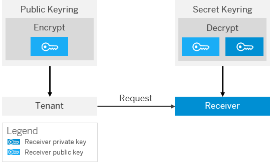

<!-- loiob97e2690094c4610bcb58e66af40c1b7 -->

# Creating PGP Keys for Encryption \(Tenant Is Sender\)

## Prerequisites

You have installed gpg4win, created the tenant-specific directory, and created a key pair.

## Context

For this use case, the following key artifact has to be deployed on the tenant:

A **PGP Public Keyring** that contains the **receiver’s** public key \(required by the tenant to encrypt the payload\)

The following figure shows the required entities to be configured for the tenant \(on the left\).

## Procedure

1.  Obtain the public key from the receiver.

    We recommend using a secure channel to ensure that the information originates from the correct source and that it has not been changed on its way. A signed email would be suitable, for example.

2.  Import the receiver's public key into the PGP Public Keyring.

3.  If a secure channel has not been used to obtain the public key from the receiver, verify the fingerprint of the public key.

    One option is to phone the owner of the public key and compare the fingerprint.

## Next Steps

Deploy the **PGP Public Keyring** on the tenant.

**Related Information**  

[Installing gpg4win](installing-gpg4win-b55c025.md "We recommend that you use gpg4win to create OpenPGP key material.")

[Creating Tenant-Specific File Directories](creating-tenant-specific-file-directories-8cd3232.md "A PGP Secret Keyring and a PGP Public Keyring have to be maintained for each tenant that uses OpenPGP. The GPA tool cannot maintain several PGP Secret or Public Keyrings at the same time. Therefore, you have to create a separate directory for each tenant, where you have to configure GPA and the launching of GPA separately (otherwise, keys from different tenants will be stored in the same keyring).")

[Starting the GPA Tool](starting-the-gpa-tool-a3e8e13.md "Start the GPA tool to manage keys.")

[Creating a Key Pair](creating-a-key-pair-bb416c5.md "")

[Importing a Public Key](importing-a-public-key-651b1c5.md "You can import public keys provided by your communication partner.")

[Securely Exchanging Key Material](securely-exchanging-key-material-908d93e.md "In many cases, communication partners need to exchange public keys in order to establish a secure connection.")

