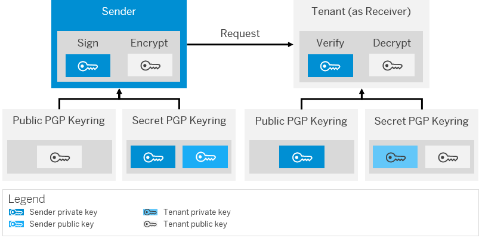

<!-- loiod2acb9f74a284ee4b0ba4493b4d1f4ff -->

# Inbound: Message-Level Security with OpenPGP

On top of a secure transport channel \(for example, based on HTTPS\), you have the option to implement message-level security capabilities. That way, you can protect the message by applying digital signing or encryption. Asymmetric key technology is used in the following way to implement these features:

<a name="loiod2acb9f74a284ee4b0ba4493b4d1f4ff__d201e21"/>Keys for Message-Level Security

<table>
<tr>
<th valign="top">

Key Type

</th>
<th valign="top">

Usage

</th>
</tr>
<tr>
<td valign="top" rowspan="2">

 **Private key** 

</td>
<td valign="top">

Used by a sender to sign a message

</td>
</tr>
<tr>
<td valign="top">

Used by a receiver to decrypt a message \(that has been encrypted by a sender\)

</td>
</tr>
<tr>
<td valign="top" rowspan="2">

 **Public key** 

</td>
<td valign="top">

Used by a receiver to verify a message \(signed by a sender\)

</td>
</tr>
<tr>
<td valign="top">

Used by a sender to encrypt a message

</td>
</tr>
</table>

In the inbound case, the tenant acts as receiver that either decrypts or verifies a message.

To implement message-level security for OpenPGP, you use PGP keys.

## Configuring the Sender

1.  Generate and configure the PGP keys and the storage locations \(PGP secret and public keyrings\) for the sender system.

2.  Import the related public keys from the tenant into the public PGP keyring of the sender and finish the configuration of the sender system.

Provide the tenant administrator with the public key \(is used to verify messages sent to the tenant\).

## Configuring the Integration Flow Steps for Message-Level Security

Configure the security-related integration flow steps.

Configure the **Decryptor** \(PGP\) and **Verifyer** \(PGP\) step.

When signatures are expected, make sure that you specify the *Signer User ID of Key\(s\) from Public Keyring* for all expected senders.

Based on the signer user ID of key\(s\) parts, the public key \(for message verification\) is looked up in the PGP public keyring. The signer user ID of key\(s\) key parts specified in this step restrict the list of expected senders and, in this way, act as an authorization check

**Related Information**  

[How OpenPGP Works](how-openpgp-works-29bc188.md "You can use Open Pretty Good Privacy (Open PGP) to digitally sign and encrypt messages.")

[Creating OpenPGP Keys](creating-openpgp-keys-6c5846b.md "You use the tool gpg4win to create the required keys for the usage of OpenPGP.")

[Define PGP Decryptor](../50-Development/define-pgp-decryptor-d0dc511.md "")

