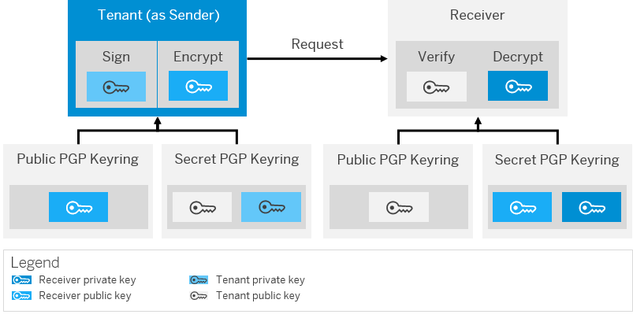

<!-- loio8641a15cff7e4dbd83528556aba1660c -->

# Outbound: Message-Level Security with OpenPGP

On top of a secure transport channel \(for example, based on HTTPS\), you have the option to implement message-level security capabilities. That way, you can protect the message by applying digital signing or encryption. Asymmetric key technology is used in the following way to implement these features:

<a name="loio8641a15cff7e4dbd83528556aba1660c__d201e21"/>Keys for Message-Level Security

<table>
<tr>
<th valign="top">

Key Type

</th>
<th valign="top">

Usage

</th>
</tr>
<tr>
<td valign="top" rowspan="2">

 **Private key** 

</td>
<td valign="top">

Used by a sender to sign a message

</td>
</tr>
<tr>
<td valign="top">

Used by a receiver to decrypt a message \(that has been encrypted by a sender\)

</td>
</tr>
<tr>
<td valign="top" rowspan="2">

 **Public key** 

</td>
<td valign="top">

Used by a receiver to verify a message \(signed by a sender\)

</td>
</tr>
<tr>
<td valign="top">

Used by a sender to encrypt a message

</td>
</tr>
</table>

In the outbound case, the tenant acts as sender that either encrypts or signs a message.

To implement message-level security for OpenPGP, you use PGP keys.

## Configuring the Receiver

1.  Generate the PGP keys and the storage locations \(PGP secret and public keyrings\) for the receiver system.

2.  Import the related public keys from the tenant into the public PGP keyring of the receiver and finish the configuration of the receiver system.

Provide tenant administrator with the public key \( used to encrypt messages sent to the receiver\).

## Configuring the Integration Flow Steps for Message-Level Security

Depending on the desired option, configure the security-related integration flow steps.

Configure the **Encryptor** \(PGP\) step.

-   Specify the *User ID of Key\(s\) from Public Keyring* in order to select the relevant public receiver keys from the PGP public keyring.

-   If you want to sign the payload, specify the *Signer User ID of Key\(s\) from Secret Keyring* in order to select the relevant private key from the PGP secret keyring. The private key is used to sign the message.

**Related Information**  

[How OpenPGP Works](how-openpgp-works-29bc188.md "You can use Open Pretty Good Privacy (Open PGP) to digitally sign and encrypt messages.")

[Creating OpenPGP Keys](creating-openpgp-keys-6c5846b.md "You use the tool gpg4win to create the required keys for the usage of OpenPGP.")

[Define PGP Encryptor](../50-Development/define-pgp-encryptor-7a07766.md "")

