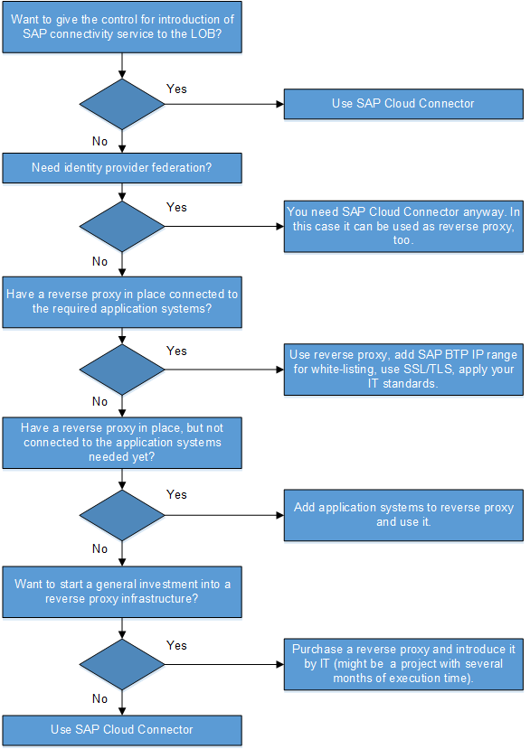

<!-- loio14567e1c8618433c9f003e70f0681141 -->

# Outbound/On-Premise: Reverse Proxy or SAP Cloud Connector

When you connect an on-premise \(receiver\) system to the integration platform, you need to interconnect either a reverse proxy or an SAP Cloud Connector between the on-premise system and the integration platform in the SAP Cloud.

## Overview

To decide which option is the best one for your use case, refer to the following table.

**Decision Matrix: Reverse Proxy versus SAP Cloud Connector**

<table>
<tr>
<th valign="top">

Advantages When Using Reverse Proxy

</th>
<th valign="top">

Advantages When Using SAP Cloud Connector

</th>
</tr>
<tr>
<td valign="top">

Existing reverse proxy and demilitarized zone \(DMZ\) infrastructure can be reused for cloud scenarios: No additional components need to be operated on-premise.

</td>
<td valign="top">

-   No inbound ports pointing to the on-premise network need to be opened.

-   Firewall and DMZ remain unchanged \(for example, no additional IP white-listing\).

-   Direct attacks \(for example, DDOS\) from the Internet are not possible.

</td>
</tr>
<tr>
<td valign="top">

IT-based, centralized approach with more re-use potential, independent of SAP BTP cockpit or Cloud Integration infrastructure

</td>
<td valign="top">

De-central, simple solution that can be administered by LOBs and subsidiaries

</td>
</tr>
<tr>
<td valign="top">

Usage for other cloud scenarios besides SAP BTP cockpit/Cloud Integration-connectivity of backends

</td>
<td valign="top">

Usage for other SAP BTP cockpit-related scenarios, for example, extension apps, possible

</td>
</tr>
<tr>
<td valign="top">

Additional capabilities might be provided by the reverse proxy \(load balancing, application gateway, rules, and so forth, depending on the used product\).

</td>
<td valign="top">

Synchronous native RFC-client call from SAP BTP cockpit supported in addition \(that means, outside Cloud Integration\)

</td>
</tr>
<tr>
<td valign="top">

Several reverse proxy instances per target landscape in one Cloud Integration tenant

</td>
<td valign="top">

Propagation of cloud user identity to on-premise system is supported.

</td>
</tr>
<tr>
<td valign="top">

Monitoring and control included in the IT processes, tools and concepts.

</td>
<td valign="top">

Monitoring and control native on SAP BTP cockpit \(for example, SAP BTP cockpit, User, Security\)

</td>
</tr>
<tr>
<td valign="top">

Re-use of existing license, but separate license needed of a reverse proxy is not used yet.

</td>
<td valign="top">

License comes with Cloud Integration Standard/Professional Edition.

</td>
</tr>
<tr>
<td valign="top">

Third party support needed, except if the SAP Netweaver Web Dispatcher is used as reverse proxy.

</td>
<td valign="top">

SAP support in case of issues or feature requests.

</td>
</tr>
</table>

## Decision Graph

To decide whether to use a reverse proxy or SAP Cloud Connector, you can follow the decision graph as outlined in the following figure and described further below.

1.  Independent of your current IT infrastructure setup, you want to give the control for introduction of SAP connectivity service to the line of business \(LOB\) - for example, because of timing, or special solution in a subsidiary or segment.

    -   Yes: Use SAP Cloud Connector.

    -   No: Go to next question.

2.  Need identity provider federation?

    For example, users are managed via on-premise ldap servers like Microsoft Active Directory.

    -   You need SAP Cloud Connector anyway. In this case it can be used as reverse proxy, too.

    -   No: Go to next question.

3.  Have a reverse proxy in place connected to the required application systems?

    -   Use reverse proxy, add SAP BTP cockpit IP range for white-listing, use SSL/TLS, apply your IT standards.

    -   No: Go to next question.

4.  Have a reverse proxy in place, but not connected to the application systems needed yet?

    -   Add application systems to reverse proxy and use it.

    -   No: Go to next question.

5.  Want to start a general investment into a reverse proxy infrastructure?

    -   Purchase a reverse proxy and introduce it by IT.

        > ### Caution:  
        > This might be a project with several months of execution time.

    -   No: Use SAP Cloud Connector.

## More Information

**SAP Cloud Connector**

[Outbound: SAP Cloud Connector](outbound-sap-cloud-connector-642e87f.md)

[SAP Cloud Connector](https://help.hana.ondemand.com/help/frameset.htm?e6c7616abb5710148cfcf3e75d96d596.html) \(product documentation\)

[Technical connectivity between cloud and on-premise systems via the SAP Cloud Connector](https://blogs.sap.com/2016/03/17/technical-connectivity-between-cloud-and-on-premise-systems-via-the-sap-cloud-connector/) \(SAP Community article\)

**SAP Web Dispatcher**

[SAP Web Dispatcher](https://help.sap.com/saphelp_nw75/helpdata/en/48/8fe37933114e6fe10000000a421937/content.htm?original_fqdn=help.sap.de) \(product documentation\)

