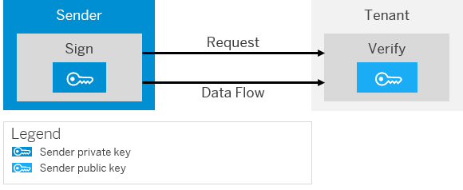

<!-- loioc573538de00f484a94a6eb7d640736f7 -->

# Renewal of Keys for CMS/PKCS\#7 Verifier - Inbound

This use case covers all situations where private keys used by a sender to sign messages sent to the tenant \(in our terminology: inbound messages\) are changed. The renewal process ensures that the related public verification key is changed at the tenant side that way that no downtime is required.

The verifier \(specified in the integration flow to use the CMS/PKCS\#7 standard\) uses a public key to verifiy a payload signed by the sender. This public key has been imported into the tenant keystore as X509 certificate during the onboarding process. The verifier uses an alias configured in the corresponding integration flow step to locate the public key in the keystore. The renewal process depends on whether the sender system can send signed data with signatures from several keys. The CMS/PKCS\#7 specification does allow this.

The following figure illustrates the communication path that is relevant for this use case.

## Sender is able to Send Payload Signed by Old and New Key

1.  Sender administrator: Creates a new key pair.
2.  Sender administrator: Configures the sender system that from now on it sends signed data with two signatures, from the old and new key.
3.  Sender administrator: Provides new public key \(certificate\) to the tenant administrator.
4.  Tenant administrator: Exchanges the old public key with the new one in the keystore, keeping the old alias. \(From now on the avatar verifies hte signature of the new key.\)
5.  Tenant administrator: Informs the sender administrator that the key has been exchanged.
6.  Sender administrator: Configures the sender system that way that a payload with one signature from the new key is being sent.
7.  Sender administrator: Removes the old key pair.

## Sender is Only able to Send Payload Signed by One Key

This procedure applies for Integration Designer as of Version 1.7.

For the renewal process it is assumed that the verifier integration flow step contains two aliases, one for the current certificate and one for the new certificate.

If the alias for the new certificate does not yet exist, the integration developer must add such an alias.

1.  Sender administrator: Creates a new key pair.
2.  Sender administrator: Provides the new public key to the tenant administrator.
3.  Tenant administrator: Adds the new public key \(certificate\) to the keystore, taking into account that the alias is used which is specified in the verifier step for the new certificate.
4.  Tenant administrator: Informs the sender administrator that payloads signed with the new key can be sent.
5.  Sender administrator: Configures the sender system that way that from now on it sends payloads signed with the new key.
6.  Sender administrator: Removes the old key pair.
7.  Sender administrator: Informs the tenant administrator about the fact that the old key pair has been removed.
8.  Tenant administrator: Removes the old public key \(certificate\) from the keystore after a time period which corresponds to the guaranteed delivery time \(to make sure that payloads signed with the old key are no longer in the SAP cloud system\).

**Related Information**  

[How PKCS\#7 Works](how-pkcs-7-works-21325d5.md "You have the option to sign and encrypt message payloads based on PKCS#7/CMS Enveloped Data and Signed Data (PKCS stands for Public Key Cryptography Standards).")

[Involved Roles](involved-roles-3968091.md "The security artifact renewal process requires that different persons perform a sequence of steps in a coordinated way on each side of the communication. The exact sequence depends on the kind of security material which is renewed and on the use case.")

