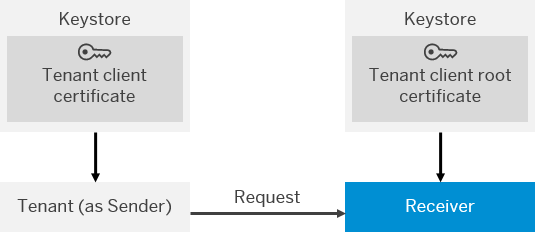

<!-- loio6ec6824ad0e340ba8a8bc8a68a25db31 -->

# Renewal of the Tenant Client Certificate

In this use case, the tenant client certificate has to be renewed. In the renewal process, the tenant administrator \(managing the tenant cluster\) and the integration developer \(managing the integration flow deployed on the tenant\) collaborate with the administrator of the receiver back-end system.

The following figure illustrates the communication path that is relevant for this use case.

  

## Receiver Accepts Different Certificates at the same Time

Certificate renewal has to be performed in the following sequence:

1.  Tenant administrator: Creates new certificate with a new key pair and gets the certificate signed by a CA.
2.  Tenant administrator: Provides receiver administrator with the new certificate and root certificate \(if the CA had changed\).
3.  Receiver administrator: Configures receiver \(server\) that way that the old and the new client certificate are accepted by the server.

    In case the receiver administrator also has received a new root certificate, this root certificate also has to be imported into the server keystore.

4.  Receiver administrator: Informs the tenant administrator that the receiver system \(server\) now accepts both the old and the new client certificate.
5.  Tenant administrator: Exchanges the old key pair/certificate with the new key pair/certificate - keeping the old alias in the tenant client keystore.

    This is done by importing the new signed certificate into the tenant client keystore.

6.  Tenant administrator: Informs the integration developer that the integration flow can be restarted.
7.  Integration developer: Restarts the integration flow which sends data via HTTPS to the receiver system.

    This is necessary because the SSL socket caches the keystore for 24 hours.

    If your tenant cluster contains multiple runtime nodes, make sure that you restart your integration flow on all nodes. If you start the integration flow on only one runtime node, message processing might fail on the other nodes.

8.  Tenant administrator: Informs the receiver administrator that the new client certificate is now used.
9.  Receiver administrator: Removes the old client certificate and \(if required\) also the old root certificate \(assumed that it is not longer used in any other communication\).

## Receiver does not Accept Different Certificates at the same Time

Certificate renewal has to be performed in the following sequence:

1.  Tenant administrator: Creates new certificate with a new key pair and gets the certificate signed by a CA.
2.  Tenant administrator and Receiver administrator: Aggree on a downtime window.
3.  At start of the downtim window, the tenant administrator informs the integration developer that the integration flow which uses the client certificate for outbound HTTPS communication has to be stopped.
4.  Integration developer: Stops the integration flow.
5.  Integration developer: Informs the tenant administrator that the integration flow has been stopped.
6.  Tenant administrator: Exchanges key pair/certificate in the keystore keeping the old alias.

    This is done by importing the new signed certificate into the tenant client keystore.

7.  Tenant administrator: Provides receiver administrator with the new certificate and the root \(CA\) certificate if the latter has been changed.

    The tenant administrator informs the receiver administrator that the HTTPS client has been stopped.

8.  Receiver administrator: Exchanges the certificate and imports the new root \(CA\) certificate into the truststore \(in case a new root certificate has been received\).
9.  Receiver administrator: Informs the tenant administrator that the certificate has been exchanged.
10. Tenant administrator: Informs the integration developer that the integration flow can be restarted.
11. Integration developer: Restarts the integration flow which sends data via HTTPS to the receiver system.

    This is necessary because the SSL socket caches the keystore for 24 hours.

    If your tenant cluster contains multiple runtime nodes, make sure that you restart your integration flow on all nodes. If you start the integration flow on only one runtime node, message processing might fail on the other nodes.

> ### Note:  
> It is not expected that this case occurs very often.

**Related Information**  

[Involved Roles](involved-roles-3968091.md "The security artifact renewal process requires that different persons perform a sequence of steps in a coordinated way on each side of the communication. The exact sequence depends on the kind of security material which is renewed and on the use case.")

