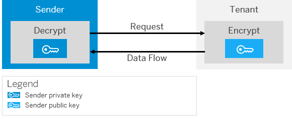

<!-- loiofdea96052c874504864ca832d2c1b98c -->

# Security Artifact Renewal for WS-Security \(Tenant Encrypts Inbound Response\)

This use case covers all situations where a private key used to decrypt a response message \(of an inbound request\) is changed on the side of the sender of the response. The renewal process ensures that the related public encryption key is changed on the tenant side so that no or minimum downtime is required.

The WS-Security encryptor uses a public key to encrypt the payload of the inbound response message.

The following figure illustrates the communication path for this use case.

  

## Sender is Able to Decrypt Payloads Encrypted by the Old Key and Payloads Encrypted by the New Key at the Same Time

1.  Sender administrator: Creates a new key pair/certificate.
2.  Sender administrator: Configures the sender system so that it can decrypt payloads encrypted by the old key and payloads encrypted by the new key.
3.  Sender administrator: Provides the tenant administrator with the new certificate and informs the tenant administrator that the sender system can verify payloads signed by the old key and payloads signed by the new key.
4.  Tenant administrator: Exchanges the old key pair/certificate with the new key pair/certificate in the keystore, keeping the old alias.

    From now on, data is encrypted with the new key.

5.  Tenant administrator: Informs the sender administrator that the certificate has been exchanged.
6.  Sender administrator: Removes the old certificate so that from now on the sender system can only verify payloads signed by the new key.

## Sender is Only Able to Decrypt Payloads Encrypted by the Same Key at One Time

1.  Sender administrator: Creates a new key pair/certificate.
2.  Tenant administrator: Agrees a downtime with the sender administrator so that no encrypted messages are sent during the certificate exchange.
3.  Sender administrator: Stops sending messages at the start of the agreed downtime.
4.  Sender administrator: Exchanges the old key pair/certificate with the new key pair/certificate.
5.  Sender administrator: Provides the tenant administrator with the new certificate and informs the tenant administrator that message sending has been stopped and that the key pair/certificate has been exchanged.
6.  Tenant administrator: Ensures that there are no messages encrypted with the old key in the system.
7.  Tenant administrator: Exchanges the old certificate with the new certificate, keeping the old alias in the keystore.

    From now on, data is encrypted with the new key.

8.  Tenant administrator: Informs the sender administrator that the key pair/certificate has been exchanged.
9.  Sender administrator: Starts sending messages.

The participants have to make sure that old keys are kept for at least 90 days after they have been exchanged for new ones. This is to ensure that messages can still be decrypted with the old keys for a period of time.

**Related Information**  

[How WS-Security Works](how-ws-security-works-2f9a038.md "Messages can be protected according to the WS-Security standard.")

[Involved Roles](involved-roles-3968091.md "The security artifact renewal process requires that different persons perform a sequence of steps in a coordinated way on each side of the communication. The exact sequence depends on the kind of security material which is renewed and on the use case.")

