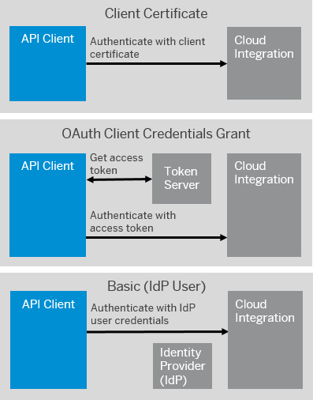

<!-- loio8db3d5141cd644019f0cf244e2a6763f -->

# Setting Up Inbound HTTP Connections \(for API Clients\)

An application programming interface \(API\) allows you to access Cloud Integration data, for example, monitoring data.

When configured, an API client sends an HTTP request to the OData API of Cloud Integration to access certain resources. For example, you can access message processing logs stored on the Cloud Integration tenant.

For more information on the available Cloud Integration API resources, see [API Details](../50-Development/api-details-014d6ad.md).

There are different options for the API client to authenticate itself against Cloud Integration.

### Client Certificate Authentication

API client is authenticated based on a client certificate.

You can either use an SAP-generated certificate created with a service key or a certificate created with an external tool.

At runtime, the system checks if a service key is available that contains the client certificate provided by the API client. If a service key is available, the system then checks if the associated service instance has a role specified that grants permissions to call the addressed API resource.

**More Information:**

-   How to configure: [Client Certificate Authentication for API Clients](client-certificate-authentication-for-api-clients-d9ca0ac.md)

-   How it works \(concept\): [Client Certificate Authentication \(Inbound\)](client-certificate-authentication-inbound-4ec6192.md) 

### OAuth Client Credentials Grant

In a 1st call, the API client requests an access token from a token server. In a 2nd call, the API client calls the API resource.

In the 2nd call, the API client is authenticated based on the OAuth access token.

There are 2 options to authenticate the API client against the token server:

-   Using clientId and clientsecret from the service key

-   Using a client certificate

    You can either use an SAP-generated certificate created with a service key or a certificate created with an external tool.

More information:

-   How to configure: [OAuth with Client Credentials Grant for API Clients](oauth-with-client-credentials-grant-for-api-clients-20e26a8.md)

-   How it works \(concept\): [OAuth Authentication with Client Credentials Grant \(Inbound\)](oauth-authentication-with-client-credentials-grant-inbound-b9df724.md) 

### Basic Authentication with IdP User

The API client is authenticated based on user credentials associated with a user registered at an identity provider \(IdP\).

More information: [Basic Authentication of an IdP User for API Clients](basic-authentication-of-an-idp-user-for-api-clients-57f104d.md)

**Related Information**  

[Configuration Checklist for Inbound Authentication](configuration-checklist-for-inbound-authentication-4a428fd.md "")

[Creating Service Instance and Service Key for Inbound Authentication](creating-service-instance-and-service-key-for-inbound-authentication-19af5e2.md "With a service instance, you define how to access a certain SAP BTP service. In the context of SAP Integration Suite , a service instance is the definition of an OAuth client.")

[OData API](../50-Development/odata-api-a617d6f.md "An application programming interface (API) allows you to access data, for example, monitoring data.")

[Tutorial: Set Up Inbound OAuth Client Credentials Grant Authentication for API Clients with SAP-Generated Certificate](https://developers.sap.com/tutorials/btp-integration-suite-oauth-client-certificate.html)

