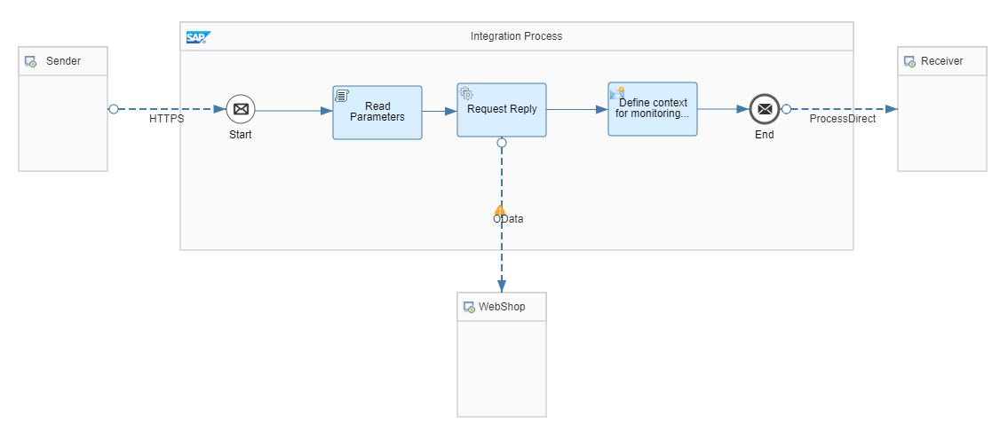
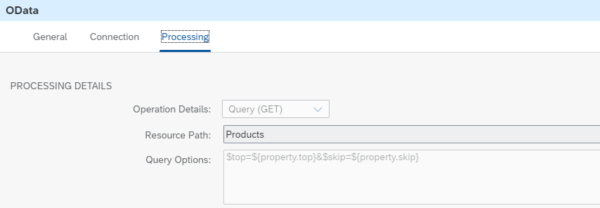

<!-- loio7ad2ac9848f24b80a13c811e2fec7885 -->

# Access URL Get Parameters in Scripts

The integration flow *Scripting – Read Url Get Parameters* reads the individual query string parameters of an incoming request \(for example, https://.../...?param1=value1&param2=value2...\) and uses them to modify the call to an external OData service.

 

> ### Note:  
> A typical use case is the combination of the logic of the 2 integration flows to access the elements of an incoming request:
> 
> -   *Scripting – Read URL Path* 
> 
> -   *Scripting – Read URL Get Parameters* 
> 
> 
> In the Script step *Read Parameters*, the script is responsible for reading the query string of the incoming request and for saving the parameters in properties. The query can be found in the standard header `CamelHttpQuery`. Then, the retrieved string can be split by the key-value pair. For each parameter, a property with the right name and value is created.

> ### Sample Code:  
> ```
> import com.sap.gateway.ip.core.customdev.util.Message;
> import java.util.HashMap;
> 
> def Message extractUrlGetParameters(Message message) {
> 
>        //get url 
>        def map = message.getHeaders();
>        def queryString = map.get("CamelHttpQuery");
> 
>        //split url
>        String[] vQuery;
>        vQuery = queryString.split('&');
> 
>        //set properties
>        for( String pair : vQuery ) {
>            String[] vPairs = pair.split('=')
>            message.setProperty(vPairs[0].replace("\$",""), vPairs[1]);
>        }
>        
>        return message;
>     } 
> ```

As a next step, the WebShop example application \([https://help.sap.com/viewer/DRAFT/368c481cd6954bdfa5d0435479fd4eaf/DEV/en-US/767d8ef11b0f4e04819f9fe03d76c4a2.html](https://help.sap.com/viewer/DRAFT/368c481cd6954bdfa5d0435479fd4eaf/DEV/en-US/767d8ef11b0f4e04819f9fe03d76c4a2.html)\) is called and given the corresponding properties to build the right query options.

The *Address* parameter of the OData receiver channel is specified in the following way:


The *Resource Path* parameter of the OData receiver channel is specified in the following way:



In the Postman collection, you can find the POST request *ReadUrlGetParameters* to execute the integration flow. You can use the following parameters, for example:

-   `$top = 2`

-   `$skip = 3`

-   `Param1 = value1` 

-   ...


The response is saved in the data store *Scripting-ReadUrlGetParameters* by the ** integration flow.

