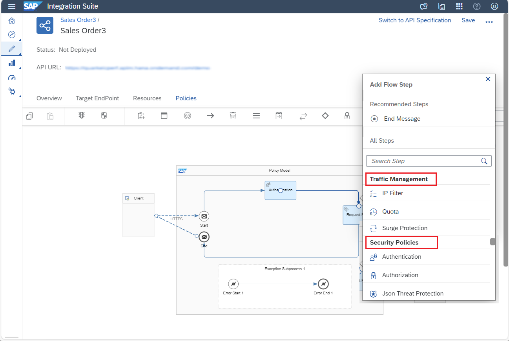
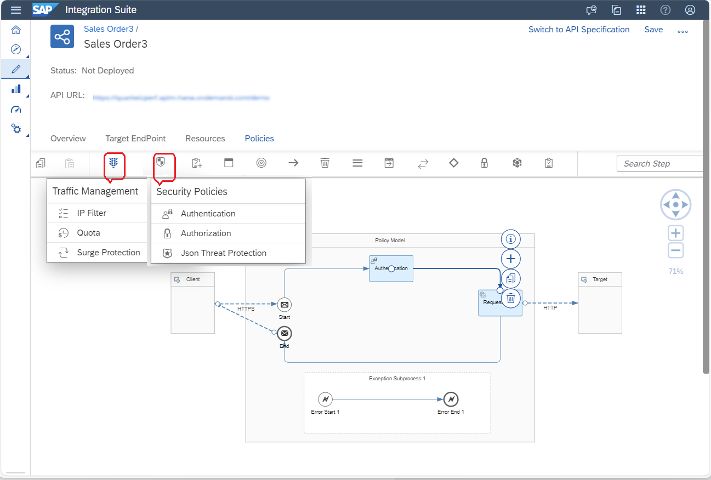
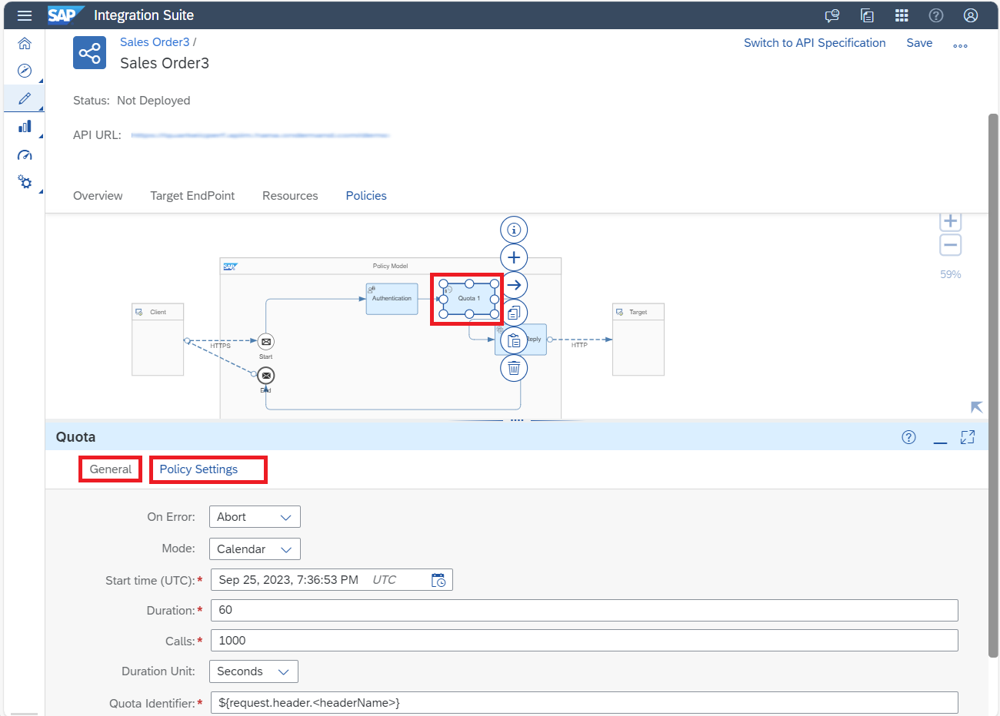

<!-- loioc2b3e56272d14ff58a626ba7d390f501 -->

<link rel="stylesheet" type="text/css" href="../css/sap-icons.css"/>

# Adding Policy Steps to the API Artifact

To enforce security or control API traffic, you can set rules on the API by adding policy steps and integration steps to the API artifact.

<a name="loioc2b3e56272d14ff58a626ba7d390f501__prereq_xyg_4s2_jxb"/>

## Prerequisites

-   You have a thorough understanding on policies and the various flows it can be attached to. For more information, see [Policy Definition and Types of Policies Supported by Edge Integration Cell](policy-definition-and-types-of-policies-supported-by-edge-integration-cell-c744df5.md).

## Context

You're adding policy steps to the API artifact you've created.

You can also add integration-related flow steps to the artifacts. To know more about the available flow steps for Edge Integration Cell, see [Supported Features and Limitations of Edge Integration Cell](../supported-features-and-limitations-of-edge-integration-cell-144c64a.md). To know more about configuring the flow steps, see [Configure Integration Flow Components](https://help.sap.com/docs/integration-suite/sap-integration-suite/configure-integration-flow-components?version=CLOUD&q=Configure%20Integration%20Flow%20Components).

## Procedure

1.  Log on to the Integration Suite.

2.  From the left navigation pane, choose *Design* \> *Integrations and APIs* to view the list of integration packages.

3.  Select the *<integration package\>* where you want to add an API artifact and choose *Edit*.

4.  On the*<integration package\>* details page, choose *Artifacts* and under the *Add* option, select *API*.

5.  The *Create API* dialog opens.

    Create an API artifact using one of the following methods:

    -   [Create an API Artifact Using URL](create-an-api-artifact-using-url-914f57e.md) 

    -   [Create an API Using an Imported API Definition](create-an-api-using-an-imported-api-definition-fb99a7d.md)

    -   [Create an API Using API Specification](create-an-api-using-api-specification-39c2b30.md)

6.  To define the policy steps for the API artifact, navigate to *Policies* tab on the details screen.

    Use *Policy Model* to add policy steps to the API artifact.

    You can add both traffic management and security policies to the API artifact.

    > ### Remember:  
    > -   Policy steps are allowed only on request flow and not on response flow.
    > 
    > -   The position of the authentication policy step on the flow is immutable and it is the first policy on the flow.
    > 
    > -   Authentication policy step is a mandatory policy step and is added to request flow by default. Neither you can remove this step, nor you can add another authentication policy step to the flow.
    > 
    > -   All other policy steps can be added to the flow multiple times except authentication policy.
    > 
    > -   Only policy steps can be added between two policy steps. You can't add integration steps between two policy steps.
    > 
    > -   Policy steps must precede integration steps.

7.  To add a policy step, click on the request flow and choose :heavy_plus_sign: .

    

8.  Select the necessary policy steps from the *Add Flow Step* dialog.

    

    Alternatively, select the :shield: icon from the palette and choose from the following options:

    -   Authorization

    -   Authentication

    -   JSON Threat Protection

    Similarly, select the  Traffic Management policies icon from the palette and choose from the following options:

    -   Quota Policy

    -   Surge Protection

    -   IP Filter

    

9.  Configure the policies that you've added to the *Policy Model*.

    Double-click on the policy, and fill in all the necessary details under the *General* and the *Policy Settings* tab. For more information on the *Policy Settings* , see [Traffic Management Policies](traffic-management-policies-165db68.md) and [Security Policies](security-policies-aebf968.md).

    

10. Once you’ve added and configured all the required policy steps for the API, you can select one of the following actions for the API:

    <table>
    <tr>
    <th valign="top">

    Action

    
    </th>
    <th valign="top">

    Description

    
    </th>
    </tr>
    <tr>
    <td valign="top">
    
    *Save* 

    
    </td>
    <td valign="top">
    
    Saves the artifact as *Draft* version.

    
    </td>
    </tr>
    <tr>
    <td valign="top">
    
    *Save as version* 

    
    </td>
    <td valign="top">
    
    Creates a new version of the artifact.

    Specify the version in the *Version Information* dialog. In the *Comment* section, you can add additional information specific to the artifact for later reference. This helps you determine the purpose of each version.

    
    </td>
    </tr>
    <tr>
    <td valign="top">
    
    *Deploy* 

    
    </td>
    <td valign="top">
    
    Deployes the API artifact.

    
    </td>
    </tr>
    <tr>
    <td valign="top">
    
    *Delete* 

    
    </td>
    <td valign="top">
    
    Deletes the API artifact from the package.

    
    </td>
    </tr>
    <tr>
    <td valign="top">
    
    *Cancel* 

    
    </td>
    <td valign="top">
    
    Ends your edit session without saving any of the changes you have made.

    
    </td>
    </tr>
    </table>
    

