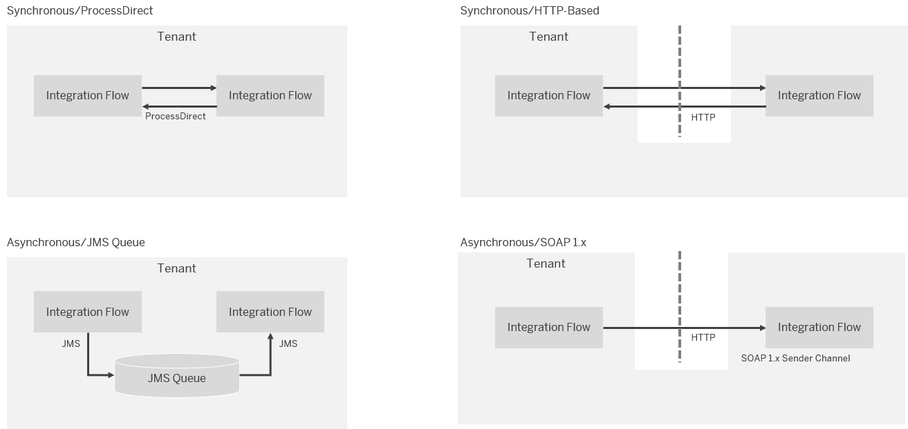

<!-- loioab5db7bc67c1429ab3b14a724344efce -->

# Communication between Integration Flows

Cloud Integration allows you to connect different integration flows deployed on the same tenant and to establish communication between them.

Decomposing an integration scenario into multiple integration flows can have various reasons. It can be the case that you like to reuse a certain process step sequence in multiple integration flows. Another reason is that you like to break down a complex integration scenario into smaller pieces.

If you like to establish communication between integration flows, consider the following general recommendation: Make sure that message processing remains within the boundaries of your Cloud Integration tenant instead of setting up calls through the public Internet. Calling integration flows on the same tenant saves performance and reduces the load on the network infrastructure.

However, both options are technically possible. To give guidance about which one to select, the following section provides information on the advantages and disadvantages of each option.

Furthermore, consider that there are two types of calls:

-   Asynchronous call

    The client isn't expecting a business response from the called endpoint.

-   Synchronous call

    The client waits for the response of the called endpoint before continuing with the next step.

<a name="loioab5db7bc67c1429ab3b14a724344efce__table_yvh_tpw_bsb"/>

<table>
<tr>
<th valign="top">

 

</th>
<th valign="top">

Within Cloud Integration tenant

</th>
<th valign="top">

Through public Internet

</th>
</tr>
<tr>
<td valign="top">

Synchronous

</td>
<td valign="top">

ProcessDirect adapter

</td>
<td valign="top">

HTTP-based call

</td>
</tr>
<tr>
<td valign="top">

Asynchronous

</td>
<td valign="top">

JMS queue

</td>
<td valign="top">

SOAP 1.x adapter

</td>
</tr>
</table>

> ### Tip:  
> The general recommendation is:
> 
> -   Use the ProcessDirect adapter for synchronous integration flow-to-integration flow communication.
> 
> -   Use JMS queues for asynchronous integration flow-to-integration flow communication.

The following figure illustrates the options.

  

<a name="loioab5db7bc67c1429ab3b14a724344efce__section_av2_bqw_bsb"/>

## ProcessDirect Adapter

You can use the ProcessDirect adapter to synchronously connect 2 integration flows. The calling integration flow waits for the called integration flow to finish processing and then continues with the response. If an exception is raised by the called integration flow, the calling integration flow handles the error.

-   Advantages

    -   The called integration flow has no time limit to process the message.

    -   The call doesn't exceed the boundaries of the runtime unit \(worker node\). Consequently, this option is very performant.

        > ### Note:  
        > A worker node is the component that processes messages at runtime.
        > 
        > More information: [Runtime in Detail](https://help.sap.com/viewer/368c481cd6954bdfa5d0435479fd4eaf/IAT/en-US/bdbc3f0224864ad5b163355ec537f6c6.html "For different customers, separate resources (in terms of: memory, CPU, file system) of the cloud-based integration platform are allocated – although all customers share the same hardware. This concept is also referred to as tenant isolation.") :arrow_upper_right:

-   Disadvantage

    The system can't distribute the load across all available worker nodes.

More information:

-   [ProcessDirect Adapter](processdirect-adapter-7445718.md)

-   [Outsource Integration Logic into Separate Integration Flows](outsource-integration-logic-into-separate-integration-flows-0bcf78d.md)

<a name="loioab5db7bc67c1429ab3b14a724344efce__section_p1c_cqw_bsb"/>

## HTTP-Based Call

A remote component can call an integration flow through the public internet using one of the various sender channels based on the HTTP protocol. You can likewise set up a scenario where an integration flow calls another integration flow using the corresponding receiver channel. The load balancer of the datacenter routes the incoming call to one of the available worker nodes of the tenant. The calling integration flow waits for the HTTP response and then continues with the response. If an exception is raised, it handles the error.

-   Advantage

    -   Parallel calls \(for example, triggered by a parallel multicast or parallel splitter\) can be distributed across all available worker nodes. However, there's no guarantee that each worker node receives the same number of calls.

-   Disadvantages

    -   Processing time is limited because of the involved network components. If their timeout is exceeded, the calling integration flow receives an HTTP error response.

    -   Using the network makes this approach slower and more expensive.

More information:

-   [Configure Adapter in Communication Channels](configure-adapter-in-communication-channels-1f06633.md)

<a name="loioab5db7bc67c1429ab3b14a724344efce__section_bpc_cqw_bsb"/>

## JMS Queue

In an asynchronous scenario, the calling integration flow doesn't wait for the response. Instead of this, it only initiates another process or some action. By storing a message in a JMS queue using the JMS receiver channel, the calling integration flow invokes the called one.

-   Advantages

    -   If an error is raised in the called integration flow, the system can reprocess the message \(as it's stored in the JMS queue\).

    -   Load is distributed homogeneously across all worker nodes.

More information:

-   [JMS Adapter](https://help.sap.com/viewer/987273656c2f47d2aca4e0bfce26c594/IAT/en-US/0993f2aa14124376a4adc7c5ba95d3f8.html "You configure the JMS adapter to enable asynchronous messaging using message queues.") :arrow_upper_right:

-   [Apply the Retry Pattern with JMS Queue](apply-the-retry-pattern-with-jms-queue-da17d2d.md)

-   [Decouple Sender and Flows Using JMS Message Queues](decouple-sender-and-flows-using-jms-message-queues-3c26902.md)

<a name="loioab5db7bc67c1429ab3b14a724344efce__section_njd_cqw_bsb"/>

## SOAP 1.x Adapter

The SOAP 1.x sender channel with *Message Exchange Pattern* set to *One-Way* and *Processing Settings* set to *Robust* offers the ability to respond to incoming messages with an immediate acknowledgment response. That means, an HTTP code 201 is returned, even though the called integration flow processing isn't finished yet.

-   Advantage

    Integration flows are decoupled even if no JMS capability is available on the Cloud Integration tenant.

-   Disadvantage

    There's the risk that if an error occurs in the called integration flow the message is lost. No persistency is involved from where reprocessing can happen.

More information:

-   [Configure the SOAP \(SOAP 1.x\) Sender Adapter](configure-the-soap-soap-1-x-sender-adapter-a178913.md)
-   [Decouple Sender and Flows Without Persistence](decouple-sender-and-flows-without-persistence-31d4dec.md)

