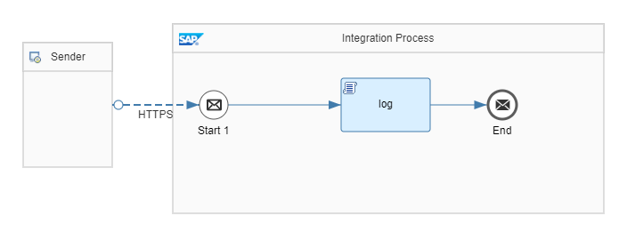
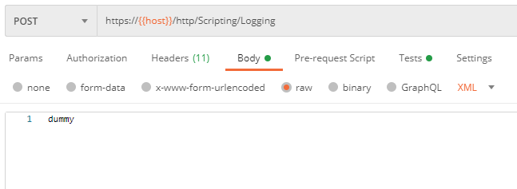
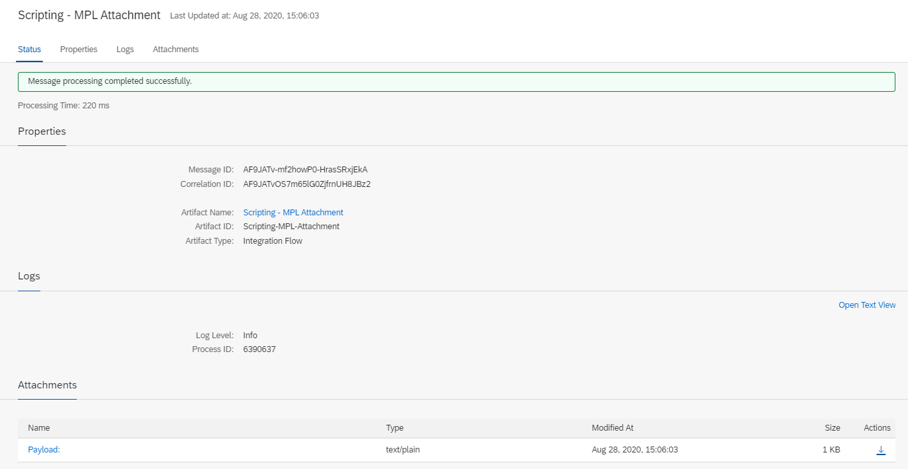

<!-- loio17dba92e6ed4402f8cb0f05093a34269 -->

# Create MPL Attachments in Scripts

To illustrate this rule, see the *Scripting - MPL Attachment* integration flow. This integration flow represents the use case in which the message processing log is extended with an attachment, specifically in this example, with the incoming message.



To call this integration flow, use the corresponding request from the Postman collection \(via an https adapter\) which provides a dummy payload, that can be changed at any time:



The integration flow writes the incoming payload into a log attachment in a *Script step*. The Script step contains the following Groovy code:

> ### Sample Code:  
> ```
> import com.sap.gateway.ip.core.customdev.util.Message
> import java.util.HashMap
> 
> def Message processData(Message message) {
>     def body = message.getBody(java.lang.String) 
>     def messageLog = messageLogFactory.getMessageLog(message)
>     if (messageLog != null) {
>         messageLog.addAttachmentAsString('Payload', body, 'text/plain')
>     }
>     return message
> }
> 
> ```

Once executed, the attachment with the incoming payload can be viewed in the *Message Processing* monitor:



> ### Note:  
> Due to the limited storage size of your Cloud Integration tenant, avoid writing the payload as message processing log attachment, if possible. Especially, if you expect high message volumes and your integration flow contains many persistency steps, you can easily reach the upper limit of the disk space and run into situations where the circuit breaker is opened, see [Persist Messages](persist-messages-8c35f3f.md). Depending on your use case, you can opt for alternative approaches, see [Using Data Storage Features When Designing Integration Flows](using-data-storage-features-when-designing-integration-flows-a836b4e.md).

