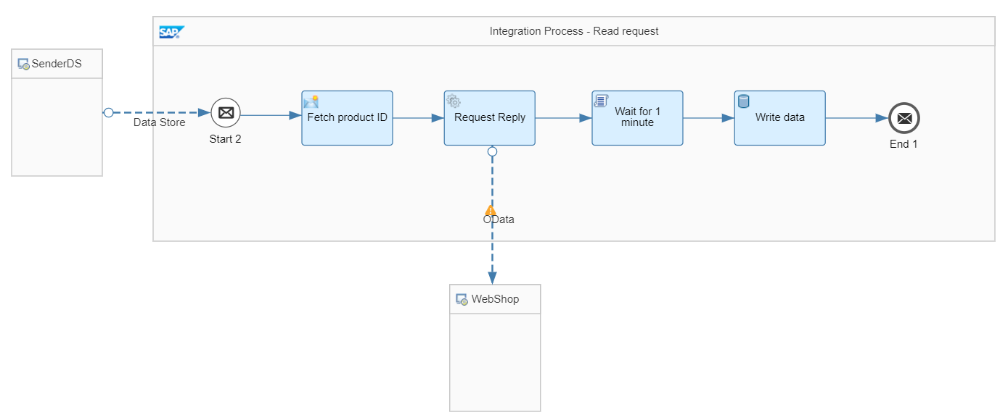
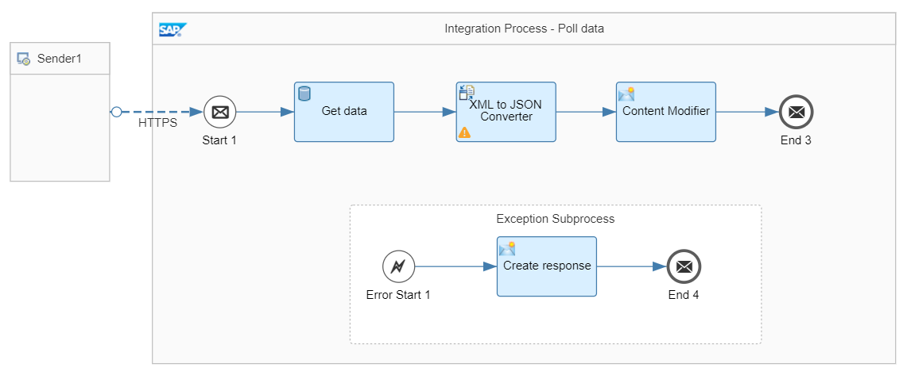

<!-- loiob77bbdfac4e4441cbd94fc75eba39c4b -->

# Decouple Sender and Flows Using Data Store and Polling Consumer


<a name="loiob77bbdfac4e4441cbd94fc75eba39c4b__section_ews_fvf_ynb"/>

## Definition

In the previous use case, *Decouple Sender and Flows Using Data Store*, two integration processes are decoupled in order to not block the sender of a request while its service request is still being processed. As we use a data store to persist the original request, it’s ensured that the service request is processed even in case of interruptions like network issues, etc. However, the sender doesn’t have any possibility to check on the outcome of the service request as the message was removed once it has been processed successfully. In the current use case, the integration flow should now be enhanced to provide the sender of the request a unique ID with which the outcome, that is, the response data of the service request, can be retrieved.


<a name="loiob77bbdfac4e4441cbd94fc75eba39c4b__section_qsj_3vf_ynb"/>

## Implementation

To illustrate this rule, see the *Modeling Basics – Decouple Flows With Polling Consumer* integration flow.

The integration flow consists of three integration processes:

-   The *Integration Process - Write request* integration process receives the request from the client, writes the request in a data store, and sends back a response to the calling client. Both, request and response will contain a unique identifier.

-   The *Integration Process - Read request* integration process reads the request from the very same data store and then performs the actual long running service call and \(eventually\) further message orchestration steps. Once done, the response of the service is stored in a data store with the unique identifier that was sent back to the client as entry ID of the data store entry.

-   The *Integration Process - Poll data* integration process can be called by the client by using the unique identifier to retrieve the response of the service request.


### Write integration process

The Write integration process is defined as follows:


The integration flow receives a message through an HTTP sender adapter from the external client. In the message header, a product identifier is provided.

In a content modifier step, *Define request*, the message body is defined by using the provided product identifier header. Furthermore, a request ID is added holding a unique ID. Here, we simply use the message processing log ID:

> ### Sample Code:  
> ```
> <request>
>   <productId>${header.productId}</productId>
>   <requestId>${header.SAP_MessageProcessingLogID}</requestId>
> </request>
> 
> ```

In a Write data store operations step, *Write payload*, the message is then stored in a data store with the name **ModelingBasics-DecouplingPoll-Request**, Global visibility, and empty entry ID. In this case, a unique entry ID is automatically generated.

Once the message has been stored, a response is created and sent back to the calling client.

Hence, in a content modifier step, *Define response*, the body of the response is defined as follows whereas the unique request ID is passed back to the original sender:

> ### Sample Code:  
> ```
> {
>       "info": "product ID ${header.productId} has been saved and will be picked up soon for processing",
>       "requestId": "${header.SAP_MessageProcessingLogID}"
> }
> 
> ```

Furthermore, on tab Message Header of the content modifier, we create a new header with name `CamelHttpResponseCode` and a constant value 202. This ensures that an http response code 202 Accepted is sent back instead of an http 200 OK.

> ### Note:  
> In the previous use cases we have chosen XML as format for the response to the sender. Here, we have chosen JSON just for convenience reasons when working with the provided Postman collection, see below.


### Read integration process

The Read integration process is defined as follows:



The integration process starts with a timer start event. The scheduler is set to run every 5 minutes.

In a *Select data store operations step*, a message is then picked up from the very same data store with name `ModelingBasics-DecouplingPoll-Request`. The visibility is set to Global so that we can access it from multiple integration flows. The number of polled messages is set to 1 so that only one single message is processed at once. Furthermore, the Delete on Completion flag is selected to ensure the message gets removed after a successful processing to ensure that the message is processed only once.

> ### Note:  
> -   You may poll more than one message to ensure a better performance behavior. In this case you need to enhance the integration process with a splitter step right after the Select. For reasons of simplicity, we kept the number of polled messages to 1.
> 
> -   The integration process needs to hold a JDBC transaction to guarantee data consistency. To achieve this, in the integration process configuration, set the transaction handling parameter to Required for JDBC. By this, if an error happens during message processing, the deletion of the message from the data store will be rolled back, and in the next scheduler run the message is polled from the data store again.

After the Select step, the integration process would carry out a couple of processing steps or service calls. Since the timer start event runs frequently, there will be situations where the message store is empty. To ensure that the message processing steps won’t be carried out with an empty message, we stop the processing in this case. To do this, a router step needs to be added right after the Select step. In the routing condition, we check if the number of messages is greater than zero. The routing condition of the first route is of expression type XML and is defined as follows: `/messages[count(message) > 0]`. The second route which applies if no messages have been picked up is defined as default route and ends at a message end event which will cause the message processing to complete immediately.

In our sample scenario, in a *Request Reply* step, product data is read from an external source through the OData protocol \(using the OData receiver adapter\). For our scenario, we use the ESPM WebShop, which is based on the Enterprise Sales and Procurement Model \(ESPM\) provided by SAP. The demo application can be accessed at the following address: [https://refapp-espm-ui-cf.cfapps.eu10.hana.ondemand.com/webshop/index.html](https://refapp-espm-ui-cf.cfapps.eu10.hana.ondemand.com/webshop/index.html).

The query is defined as follows:

> ### Sample Code:  
> ```
> $select=ProductId,Category,Name,DimensionDepth,DimensionHeight,DimensionUnit,DimensionWidth&$filter=ProductId eq '${property.productId}'
> ```

Too simulate further processing steps, the flow is put to sleep for one minute. This gives us the chance to see that the response does not take one minute to get back to the actual sender from the Write integration process, but rather almost immediately.

For delaying the receiver flow processing, we use the following Groovy script:

> ### Sample Code:  
> ```
> import com.sap.gateway.ip.core.customdev.util.Message;
> import java.util.HashMap;
> def Message processData(Message message) {
> Thread.sleep(1*60*1000); //sleep for 1 minute
> return message;
> }
> 
> ```

At the end of the flow \(*Write data*\), meaning, at the end of the processing, the response of the OData call is written to the data store with name **ModelingBasics-DecouplingPoll-Response**, and Global visibility. As entry ID, the unique request identifier `${property.requestId}` is set.


### Poll data integration process

The Poll data integration process is defined as follows:



The integration process can be called via an HTTP sender adapter from the external client that wants to pick up the result. In the message header of the GET request, the ID which has been returned by the Write integration flow process needs to be provided.

In a *Get data store operations step*, the data is picked up from the data store with name `ModelingBasics-DecouplingPoll-Response`. The visibility is set to Global so that we can access it from multiple integration flows. As entry ID, the unique request identifier `${header.requestId}` is set.

The Delete on Completion flag is deselected so that the data can be polled multiple times.

If you try to poll the data while the message processing of the original request is still ongoing, the entry with the requested ID won’t be available yet and hence the data store access will fail. In this case, we would like to provide an information to the sending client. So, the Throw Exception on Missing Entry is selected to trigger an error. An exception subprocess is added which fetches the error. Within the exception subprocess, we add a content modifier where the body of the response is defined as follows:

> ### Sample Code:  
> ```
> {
>       "info": "data for request ID ${header.requestId} not available yet",
>       "action": "please try again at a later point of time",
> }
> 
> ```

To call the overall integration scenario, provide a productId header together with the HTTP request \(from the HTTP client\) and give it any value for a product published in the WebShop catalog \(for example, the value HT-2000\). A custom response as defined above is sent back right away containing the unique request ID. Use the unique request ID in order to poll the product data. You get informed to give it a try at a later point in time if the original request is still in progress. Otherwise, the data is returned.

> ### Note:  
> When you use the provided Postman collection, the request ID is stored within a Postman collection variable when doing the actual POST, and automatically used in the header of the GET request when polling the data. In order to fill the collection variable, the response needs to be parsed which obviously is only supported by Postman when using JSON as format. This is the reason that in this case JSON instead of XML is used. For sure, the overall scenario works with XML as well.

**Related Information**  


[Define Data Store Operations](define-data-store-operations-79f63a4.md "You can use the data store to temporarily store messages.")

[Define a Timer Start Event](define-a-timer-start-event-ae14ad7.md "You can configure an integration flow to automatically start and run on a particular schedule.")

[Define Router](define-router-d7fddbd.md "")

[Define Exception Subprocess](define-exception-subprocess-690e078.md "")

