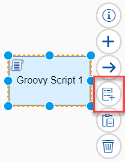

<!-- loio03b32eb2c5c249f0a59bcd27c44d1e4e -->

<link rel="stylesheet" type="text/css" href="../css/sap-icons.css"/>

# Define a Local Script Step

You can create a script step that is specific to an integration artifact to execute custom scripts \(JavaScript or Groovy Script\).

<a name="loio03b32eb2c5c249f0a59bcd27c44d1e4e__prereq_ulb_qjf_2jb"/>

## Prerequisites

Groovy Script and JavaScript are supported with the following versions.

**Version Details**

<table>
<tr>
<th valign="top">

Software

</th>
<th valign="top">

Version

</th>
</tr>
<tr>
<td valign="top">

Groovy Runtime

</td>
<td valign="top">

2.4.21

</td>
</tr>
<tr>
<td valign="top">

JavaScript Engine \(Rhino\)

</td>
<td valign="top">

1.7 R4

</td>
</tr>
</table>

## Context

Cloud Integration provides a Java API to support this use case.

> ### Note:  
> The Java standard libraries of Java 8 can be used.
> 
> Cloud Integration supports the XML Document Object Model \(DOM\) to process XML documents.

## Procedure

1.  If the Script step is present in the integration flow, select it to edit the properties.

2.  If you want to add a Script step to the integration flow, perform the following substeps:

    1.  In the palette, choose  \(Message Transformers\)and then choose  \(Script\).

    2.  Choose *Groovy Script* or *JavaScript*.

    3.  Place *Script* step in the integration process.

3.  To open the script editor, click the *Create* icon next to the Script step shape.

    

4.  In the script editor, specify the script according to the requirements of your scenario.

    For an overview of the classes and interfaces supported by the Script step, see [SDK API](sdk-api-c5c7933.md).

    For more information on how to use the dedicated interfaces and methods for specific use cases, refer to [Script Use Cases](script-use-cases-148851b.md).

    You can also check out the design guidelines for using scripts at [Use Scripting Appropriately](use-scripting-appropriately-d4dc13c.md).

5.  When you've finished the definition of your script, click *OK*.

6.  Save the integration flow.

    > ### Note:  
    > When having selected the Script step shape in the integration flow model, you can do the following in the property sheet:
    > 
    > -   In the *General* tab, you can edit the name of the Script step shape.
    > 
    > -   In the *Processing* tab, choose *Select* to browse and upload a script file.
    > 
    >     You can add external jar files using the *Resource* view. You can then invoke functions from these external jar files in the script. You can also upload a script from your computer using *Upload from File System*.
    > 
    > -   In the *Script Function* field, enter the name of the function that you want to call from the script by default. Make sure that you enter the function name without any arguments.
    > 
    >     The field helps you define a default function when there are multiple functions defined in the script file. However, if the script contains the function *processData*, which is the default function created in the script, you can leave the field empty.

<a name="loio03b32eb2c5c249f0a59bcd27c44d1e4e__postreq_drj_gs4_p4b"/>

## Next Steps

When using the Script step, make sure that you follow guidelines about secure usage of the related script programming language.

To make sure that your scenario meets highest standards with regard to security and other aspects, follow the design guidelines, in particular, the following ones:

-   [Apply the Highest Security Standards](apply-the-highest-security-standards-201fd43.md)

-   [Use Scripting Appropriately](use-scripting-appropriately-d4dc13c.md)

To mention one particular aspect of scripting, note the following:

Any application that parses XML data is prone to the risk of XML External Entity \(XXE\) Processing attacks. More information can be found [here](https://owasp.org/www-community/vulnerabilities/XML_External_Entity_(XXE)_Processing).

To overcome this issue, you must take one of the following measures:

-   Don't use XML parsing \(for example, DocumentBuilderFactory\) at all.

-   Switch off the processing of external entities as explained [here](https://cheatsheetseries.owasp.org/cheatsheets/XML_External_Entity_Prevention_Cheat_Sheet.html).

**Related Information**  

[Script Use Cases](script-use-cases-148851b.md "")

