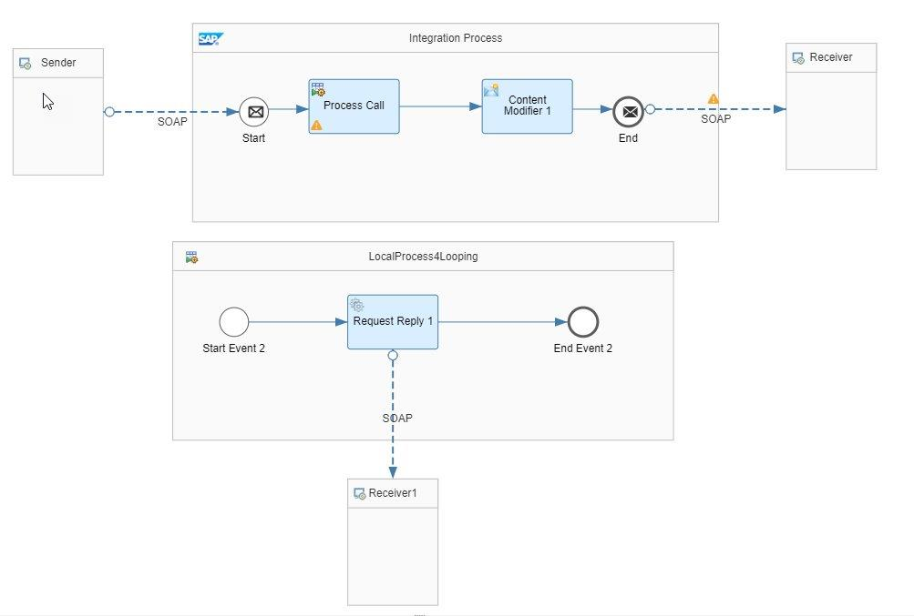

<!-- loiof58c2ba1c8d345fab64c565c18727183 -->

# Define Looping Process Call

Execute a local integration process in a loop.


<a name="loiof58c2ba1c8d345fab64c565c18727183__context_nfh_pty_byb"/>

## Context

This step uses generates the following property: `CamelLoopIndex` \(see also [Headers and Exchange Properties Provided by the Integration Framework](headers-and-exchange-properties-provided-by-the-integration-framework-d0fcb09.md)\).


## Procedure

1.  From the palette, choose *Call* \> *Local Call* \> *Looping Process Call*.

2.  Click anywhere inside the *Integration Process* box of the integration flow model.

3.  Specify the following attributes in the *General tab*.


    <table>
    <tr>
    <th valign="top">

    Parameter
    
    </th>
    <th valign="top">

    Description
    
    </th>
    </tr>
    <tr>
    <td valign="top">
    
    *Name*
    
    </td>
    <td valign="top">
    
    Specify a name.
    
    </td>
    </tr>
    </table>
    
4.  Specify the following attributes in the *Processing tab*.


    <table>
    <tr>
    <th valign="top">

    Parameter
    
    </th>
    <th valign="top">

    Description
    
    </th>
    </tr>
    <tr>
    <td valign="top">
    
    *Local Integration Process*
    
    </td>
    <td valign="top">
    
    Select a pre-defined local integration process you want to invoke.
    
    </td>
    </tr>
    <tr>
    <td valign="top">
    
    *Expression Type* 
    
    </td>
    <td valign="top">
    
    Specify the kind of expression you want to enter in the *Condition Expression* field.

    You've got the following options:

    -   *XML* 

        for XPath expressions, for example: `//customerName = ‘Smith’`.

    -   *Non-XML*

        for Camel Simple Expression Language.

        > ### Note:  
        > Examples:
        > 
        > `${header.SenderId}`, which indicates the SenderId header field.
        > 
        > `${in.body}`, which indicates the body of the incoming message.

        For more information about Camel Simple Expression Language, see [http://camel.apache.org/simple.html](http://camel.apache.org/simple.html).


    
    </td>
    </tr>
    <tr>
    <td valign="top">
    
    *Condition Expression*
    
    </td>
    <td valign="top">
    
    Enter an expression to specify a routing condition. As long as the condition is true, the loop processing is executed.

    Example of XML conditions: `/bank_name/bank_id = 'mybank', //BankId = 'ABC'`

    Example of Non-XML conditions: `${header.SenderId} = '001'`

    > ### Note:  
    > Don't use a mixed expression \(containing both XML and Non-XML expressions\). For more information, see the example described as part of Step 5.

    For more information about the usage of operators, see [Define Router](define-router-d7fddbd.md).
    
    </td>
    </tr>
    <tr>
    <td valign="top">
    
    *Max. Number of Iterations* 
    
    </td>
    <td valign="top">
    
    Specify the maximum number of iterations the loop is to be executed. Even if the condition is still met, the loop ends afterwards.
    
    </td>
    </tr>
    <tr>
    <td valign="top">
    
    *Action when Max. Iterations Reached* 
    
    </td>
    <td valign="top">
    
    Select to throw an exception when the maximum number of iterations has been reached or to exit the loop and continue with the main process without error even if the looping condition continues to be true.
    
    </td>
    </tr>
    </table>
    
5.  Save and deploy the integration flow.

    *Example Scenario for the Local Loop Process*

    > ### Note:  
    > The local loop process is implemented as a `do-until` loop, meaning the subprocess is called and afterwards, the condition-expression is checked. See the example described in the following paragraphs for more details.

    To explain how a local loop process works, we provide a simple example.

    Every morning, an account owner wants to check all transactions performed on his account. He calls a specific web service and has defined this request:

    ```
    <accountID>12345<accountID>
    <action>Transaction_of_last_Day</action>
    </accountinfo>
    ```

    The appropriate response for this request is:

    ```
    <accountinforesponse>
        <transaction>
            <id>1</id>
    ...
        </transaction>
    ...
        <transaction>
            <id>55</id>
    ...
        </transaction>
        <hasMore>true</hasMore>
    </accountinforesponse>
    
    
    ```

    The account owner has to call the web service again and again until there are no more transactions available and he gets the response:

    ```
    <hasMore>false</hasMore>
    ```

    To simplify the call, he can use the loop embedded in Cloud Integration. He needs to define a *Condition Expression* in the Xpath such as `/accountinforesponse[hasMore = ‘true’]`.

    As long as data is available, the call continues. The subprocess inducing the loop uses the ServiceCall step in the Request-Reply mode to call the web service. As soon as the web service provides the response `<hasMore>false</hasMore>`, the processing exits the loop and continues with the next step. The last response of the web service is the new payload, that will be taken as a message body into the next step.

    


**Related Information**  


[Define Local Integration Process](define-local-integration-process-520341a.md "You use the local integration process to simplify your integration process. You can break down the main integration process into smaller fragments by using local integration processes. You combine these fragments to achieve your main integration process.")

