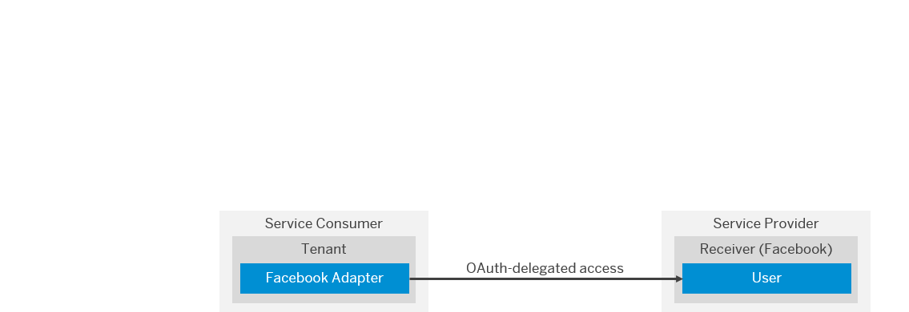

<!-- loio3dcc4080897c4bd4bf55bb8bf1bcac0d -->

# Facebook Receiver Adapter

You use the Facetbook receiver adapter to extract information from Facebook \(which is the receiver platform\) based on certain criteria such as keywords, user data, for example. As one example, you can use this feature in social marketing activities to do social media data analysis based on Facebook content.

> ### Note:  
> In the following cases certain features might not be available for your current integration flow:
> 
> -   You are using a runtime profile other than the one expected. See: [Runtime Profiles](IntegrationSettings/runtime-profiles-8007daa.md).
> 
> -   A feature for a particular adapter or step was released after you created the corresponding shape in your integration flow.
> 
>     To use the latest version of a flow step or adapter – edit your integration flow, delete the flow step or adapter, add the step or adapter, and configure the same. Finally, redeploy the integration flow. See: [Updating your Existing Integration Flow](updating-your-existing-integration-flow-1f9e879.md).

> ### Note:  
> This adapter exchanges data with a remote component that might be outside the scope of SAP. Make sure that the data exchange complies with your company’s policies.

> ### Note:  
> -   Facebook applications that access content of public pages need to request *Page Public Content Access* feature and require review by Facebook.
> 
> -   A user can only query their own comments. Other users' comments are unavailable due to privacy concerns.

The connection works that way that the tenant logs on to Facebook based on an OAuth authentication mechanism and searches for information based on criteria as configured in the adapter at design time. OAuth allows the tenant to access someone else’s resources \(of a specific Facebook user\) on behalf of the tenant.

As illustrated in the figure, the tenant \(through the Facebook receiver adapter\) calls the Facebook API to access resources of a specific Facebook user. For more information on the Facebook API, go to: [https://developers.facebook.com/](https://developers.facebook.com/).

Once you have created a receiver channel and selected the Facebook receiver adapter, you can configure the following attributes. See [Overview of Integration Flow Editor](overview-of-integration-flow-editor-db10beb.md).

Select the *General* tab and provide values in the fields as follows.

**General**

<table>
<tr>
<th valign="top">

Parameter

</th>
<th valign="top">

Description

</th>
</tr>
<tr>
<td valign="top">

*Name*

</td>
<td valign="top">

Enter the name of the channel.

</td>
</tr>
</table>

Select the *Connection* tab and provide values in the fields as follows.

> ### Tip:  
> You can obtain the values required for the Facebook adapter configuration in the [Facebook for Developers](https://developers.facebook.com/) page.
> 
> Login to [Facebook for Developers](https://developers.facebook.com/). Choose *My Apps* \> *<Your Facebook App\>* \> *Roles* \> *Test Users*. In this page, you will get details like *User/Page ID*.
> 
> To get the *Post ID*, you should fetch the posts using *Get Posts* which has the *Post ID*.

> ### Remember:  
> There is a new restriction introdcued by Meta which removes the ability for apps to create new test users. Existing test users aren't affected. For more information, see [Test Users](https://developers.facebook.com/docs/development/build-and-test/test-users/).

**Connection**

<table>
<tr>
<th valign="top">

Parameter

</th>
<th valign="top">

Description

</th>
</tr>
<tr>
<td valign="top">

*Endpoint* 

</td>
<td valign="top">

To access Facebook content, you can choose among the following general options.

-   *Get Posts*

    Allows you to fetch specific Facebook posts.

-   *Get Post Comments*

    Allows you to fetch specific Facebook post comments.

-   *Get Users*

    Allows you to fetch details of a specific user.

-   *Get Feeds*

    Allows you to fetch feeds of a specific user or a page.

</td>
</tr>
<tr>
<td valign="top">

*User/Page ID* 

</td>
<td valign="top">

Specifies the Facebook user from which account the information is to be extracted.

</td>
</tr>
<tr>
<td valign="top">

*Timeout \(ms\)* 

</td>
<td valign="top">

Specifies a timeout \(in miliseconds\) after which the connection to te Facebook platform should be terminated.

</td>
</tr>
<tr>
<td valign="top">

*Application ID* 

</td>
<td valign="top">

An alias by which the consumer \(tenant\) that requests Facebook resources is identified.

</td>
</tr>
<tr>
<td valign="top">

*Application Secret Alias* 

</td>
<td valign="top">

An alias by which the shared secret is identified \(that is used to to define the token of the consumer \(tenant\)\).

</td>
</tr>
<tr>
<td valign="top">

*Access Token* 

</td>
<td valign="top">

An alias by which the access token for the Facebook user is identified.

In order to make authorized calls to the Facebook API, your application must first obtain an OAuth access token on behalf of a Facebook user.

</td>
</tr>
<tr>
<td valign="top">

*Proxy Type*

</td>
<td valign="top">

Select between the two options given:

-   Internet

-   Manual

</td>
</tr>
</table>

> ### Note:  
> You can also use headers to provide values in *Connection* settings of Facebook adapter. You can use both exchange headers \(see [Dynamic Parameters \(Example\)](dynamic-parameters-example-5705f2b.md) for more information\) and Apache Camel headers \(see [Facebook Component in Apache Camel](http://camel.apache.org/facebook.html) for more information \).

The authorization is based on shared secret technology. This method relies on the fact that all parties of a communication share a piece of data that is known only to the parties involved. Using OAuth in the context of this adapter, the Consumer \(that calls the API of the receiver platform on behalf of a specific user of this platform\) identifies itself using its **Consumer Key** and **Consumer Secret**, while the context to the user itself is defined by an **Access Token** and an **Access Token Secret**. These artifacts are to be generated for the receiver platform app \(consumer\) and should be configured that way that they will never expire. This adapter only supports consumer key/secret and access token key/secret artifacts that do not expire.

To finish the configuration of a scenario using this adapter, the generated consumer key/secret and access token key/secret artifacts are to be deployed as Secure Parameter artifact on the related tenant. To do this, use the Integration Operations feature, position the cursor on the tenant and chosen *Deploy Artifact ...*. As artifact type, choose *Secure Parameter*.

