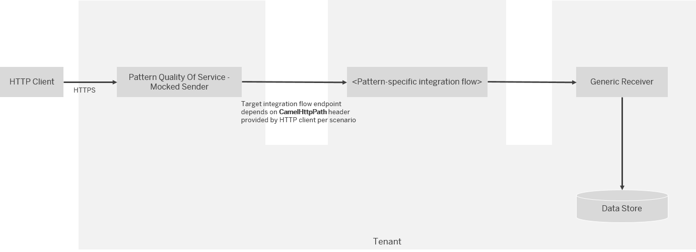

<!-- loio44be68d04e944995b9995d5f8bfa8459 -->

# Interaction of the Involved Integration Flows

To simulate the communication of sender and receiver systems through Cloud Integration for the different scenarios, the integration package comes with multiple integration flows.

-   An integration flow *Pattern Quality Of Service - Mocked Sender* that simulates the sender system.

    You initiate the scenario by calling this integration flow using the predefined Postman request. For each scenario, a separate Postman request is available in the Postman collection that comes with the integration package.

-   A scenario-specific integration flow.

    For more information on the scenarios, see [Quality of Service Exactly Once](quality-of-service-exactly-once-f96cf27.md).

-   An integration flow *Generic Receiver* that simulates the receiver system. This integration flow stores the resulting message as data store entry on the tenant.

The 3 integration flows interact with each other in the following way:

The HTTP client provides a parameter in the dynamic part of the request URL that indicates the pattern or scenario \(for example, scenario [Sender and Receiver with SAP RM Protocol](sender-and-receiver-with-sap-rm-protocol-9f3e2b6.md)\).

Cloud Integration stores this value in the `CamelHttpPath` header.

The integration flow contains different receivers representing the target integration flows \(*Pattern Quality Of Service - Scenario 01*, and so forth\) of the mocked sender. Each receiver adapter's endpoint address is defined by an expression that contains the header `CamelHttpPath`.

The target integration flow's sender adapter address contains the scenario-specific value from the Postman request \(for example, `Scenario01`\).

Based on this design, mocked sender can address the correct target integration flow.

The *Generic Receiver* integration flow simulates the receiver.

Note that, different to the other integration flow design guidelines, the *Pattern Quality of Service ...* integration flows don't address the *Generic Receiver* integration flow through the ProcessDirect adapter. Instead of this, the scenarios use an HTTP-based adapter \(for example, the SOAP adapter\). That means that a tenant-to-tenant communication is involved at this step as indicated in the figure. The *Generic Receiver* integration flow contains multiple, scenario-specific integration processes with a SOAP sender adapter. Which integration process is addressed, depends on the scenario-specific integration flow. For example, the scenario-specific integration flow *Pattern Quality Of Service - Scenario 01* addresses integration process *Integration Process: Idempotent receiver using SAP RM*.

