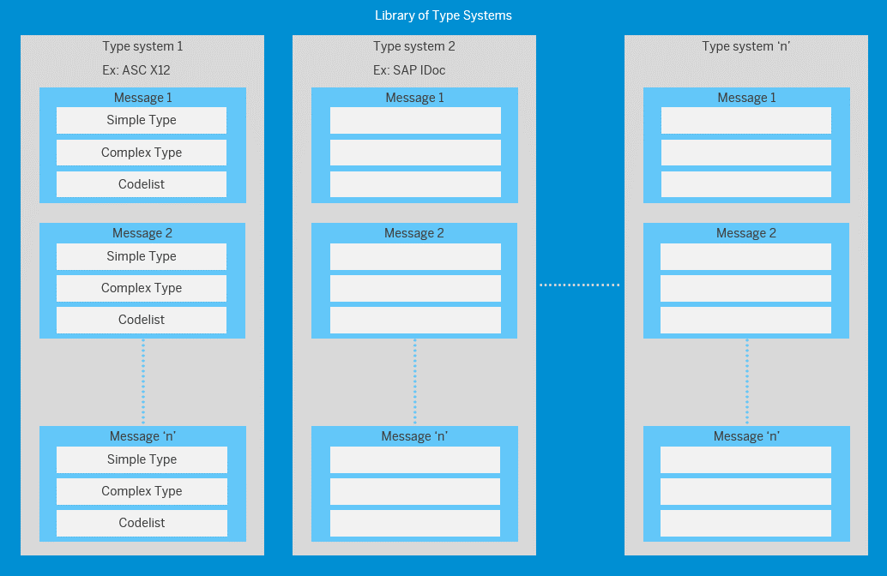

<!-- loio740136bd775a4dcab084a22528123e63 -->

# Library of Type Systems

The library of type systems is a collection of message templates that are provided by agencies that maintain the B2B/A2A/B2G standards. Each of the type system is developed and maintained by the agency that owns it. For example, the type system *SAP IDoc* is developed and maintained by SAP SE. Similarly, the type system ASC X12 is maintained by ANSI ASC X12. This is a very good starting point for implementing your B2B integration provided if you and your business partners are using these industry standards for your business messages.

A typical type system in the library is comprised of a collection of messages, and associated complex types, simple types, and code lists. Refer to [Glossary for SAP Integration Advisor](../glossary-for-sap-integration-advisor-9c221b4.md) to get an understanding of Messages, Complex Types, Simple Types and Codelists.

These agencies provide message templates that you can use as the starting point for creating your own message implementation guideline \(MIG\). You can tailor the MIG to suit your scenario-specific requirements. You can then use the MIG in a mapping guideline \(MAG\) and create a mapping that allows integration with your business partner/s.

For more information on library of type systems, their representation and uses in the application, please refer to this blog:[integration content advisor: Discover B2B/A2A standard libraries](https://blogs.sap.com/2018/02/07/integration-content-advisor-display-and-review-b2ba2a-standard-libraries/).

Here's a short video on YouTube that gives you a quick overview of SAP Integration Suite.

> ### Note:  
> This video was created before our branding changes related to SAP technology were announced in January 2021.

