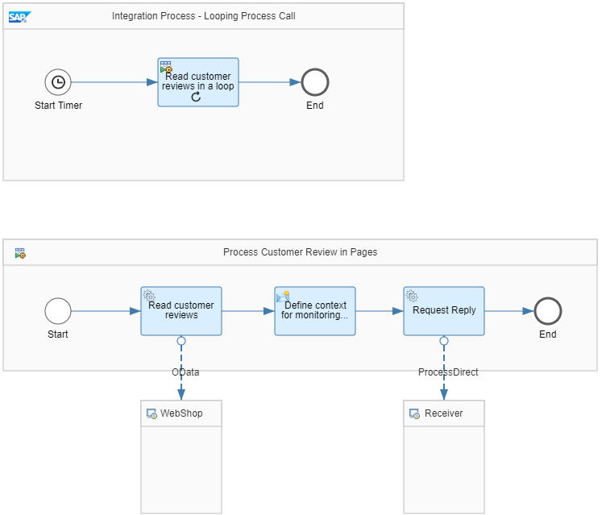

<!-- loio825d2cfe244f4aafa457d251f3f7096c -->

# Manage Large Batch Sizes

Manage batch messages of large sizes accordingly to avoid out of memory issues.

<a name="loio825d2cfe244f4aafa457d251f3f7096c__section_zkm_ykw_ljb"/>

## Implementation

When calling an external source, to avoid messages created by calling the external source from getting too large, the integration flow must be modeled to read and process the data in chunks. Certain adapters \(for example, the OData receiver adapter\) allow you to set the property *Process in Pages* to process the data from the receiver system in pages of a certain size.

For more information, see [Handling Large Data With SAP Cloud Integration OData V2 Adapter](https://blogs.sap.com/2017/08/22/handling-large-data-with-sap-cloud-platform-integration-odata-v2-adapter/).

The reference integration flow *Manage Resources – Process Batch In Chunks* illustrates this rule.

The following figure shows the example integration flow.

Initiated by a Timer start event, the main Integration Process calls a Local Integration Process \(*Process Customer Review in Pages*\) in a loop.

In the Local Integration Process, data is read from an external source through the OData protocol \(using the OData receiver adapter\).

The external data source supports the Open DataProtocol \(OData\). For our scenario, we use the ESPM WebShop, which is based on the Enterprise Sales and Procurement Model \(ESPM\) provided by SAP.

To avoid the message created by the OData adapter from getting too large, the OData connection is designed to read and process the data in chunks. Setting the parameter *Process in Pages* \(tab *Processing*\), the OData adapter allows SAP Integration Suite to process the data from the WebShop system in pages of a certain size. The data volume to be processed can be controlled by reducing the size of each page. In the example, the *Page Size* has been reduced to 5. Each page will be processed first before the next page is read from the WebShop system.

In each loop, the data \(read from the WebShop component\) is sent to the generic receiver where it is stored as Data Store entry. For each loop, a separate Data Store entry is created \(with the loop index taken as *Entry ID*\). To implement this behavior, the Content Modifier \(*Define context for monitoring purposes*\) in the Local Integration Process defines the `receiver` property \(that defines the value of the Data Store Entry ID\) using the dynamic expression `${property.CamelLoopIndex}`.

