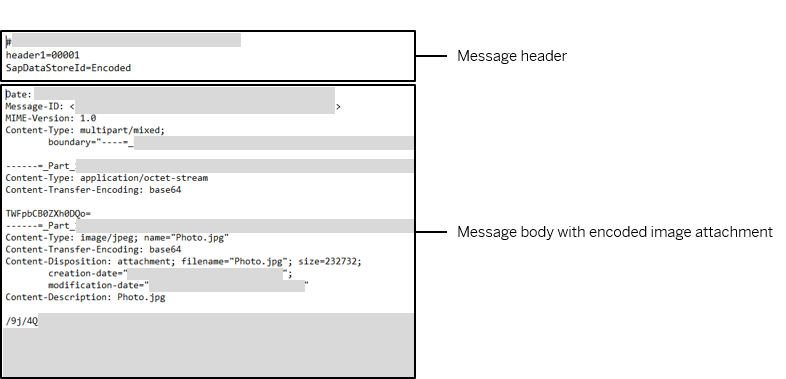
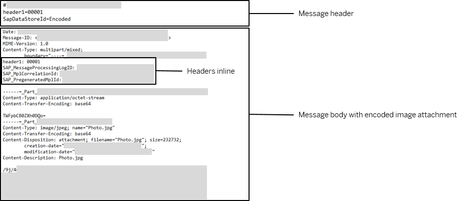

<!-- loiob446281749fd485382f1bd7a092ebf97 -->

# MIME Multipart Encoder: Handling Message Headers \(Examples\)

In the following examples, an email with attachment and a certain header is processed by the MIME Multipart Encoder as described under [Example Scenario with MIME Multipart Encoder/Decoder](example-scenario-with-mime-multipart-encoder-decoder-80baed3.md).

As described for the example scenario, before the Encoder step, a Content Modifier adds a custom header \(`header1=00000001`\) to the message. You can configure how the MIME Multipart Encoder treats headers.

To understand the use case for this feature, there are various cases where message headers can get lost. When SAP Cloud Integration sends a message to a receiver through a protocol that doesn't transfer Camel headers \(for example, when sending a message to an email server through the Mail receiver adapter\). On the other hand, assume that the information contained in the header is required by the receiver to interpret and process the message in the right way. In such a case, you can configure the MIME Multipart Encoder in such a way that Camel headers become part of the message body. Using this feature, you can make sure that the information contained in the header is transferred to the receiver.

You use parameter *Add Multipart Headers Inline* to specify how headers are to be processed.

In the following, the resulting encoded messages are shown depending on different settings for this parameter.

> ### Note:  
> The resulting encoded messages are the same as you get when downloading the Data Store entry created by the example scenario described under [Example Scenario with MIME Multipart Encoder/Decoder](example-scenario-with-mime-multipart-encoder-decoder-80baed3.md).

<a name="loiob446281749fd485382f1bd7a092ebf97__section_q1t_sbz_rkb"/>

## 1. Add Multipart Headers Inline Deselected

When the option *Add Multipart Headers Inline* is deselected, the message is transformed in the following way.

After processing, the body contains the encoded body and attachment of the inbound message.

<a name="loiob446281749fd485382f1bd7a092ebf97__section_yxb_fcz_rkb"/>

## 2. Add Multipart Headers Inline Selected, No Header Specified

In this example, the option *Add Multipart Headers Inline* is selected and field *Include Headers* is left empty \(no regular expression for a header specified\). The message is transformed so that certain header fields are now part of the message body \(for example, the `MIME Type`\). However, the field for the Camel header `header1` is still part of the message header.

<a name="loiob446281749fd485382f1bd7a092ebf97__section_g2z_mcz_rkb"/>

## 3. Add Multipart Headers Inline Selected, Regular Expression for Header Specified

In this example, the option *Add Multipart Headers Inline* is selected and in field *Include Headers* the regular expression ***h.\**** is specified. The message is transformed so that certain header fields are now part of the message body \(for example, the `MIME Type`\). Note that also the field for the Camel header `header1` is now part of the message body. The reason is that with the regular expression the Encoder step was configured to add headers inline that start with character `h`.

<a name="loiob446281749fd485382f1bd7a092ebf97__section_hjw_ls3_xkb"/>

## 4. Add Multipart Headers Inline Selected, Another Regular Expression for Header Specified

In this example, the option *Add Multipart Headers Inline* is selected and in field *Include Headers* the regular expression ***h.\*|S.\**** is specified. The message is transformed so that certain header fields are now part of the message body \(for example, the `MIME Type`\). Note that also the field for the Camel header `header1` as well as for other headers starting with character `S` are now part of the message body. The reason is that with the regular expression the Encoder step was configured to add headers inline that start with character `h` or with character `S`.

> ### Tip:  
> Note that header `header1` is explicit set by the Content Modifier step as designed by the integration developer. On the other hand, headers `SAP_MessageProcessingLogID`, `SAP_MplCorrelationId`, and SAP\_PregeneratedMplId are set during message processing by the framework. You can easily verify this fact by monitoring message processing for this integration flow with *Trace* log level.

**Related Information**  

[MIME Multipart Messages](mime-multipart-messages-3816537.md "")

