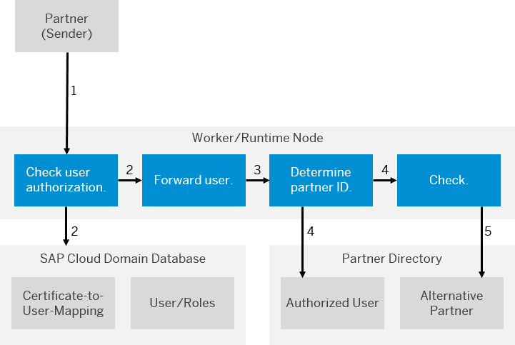

<!-- loioc0c9950003674d198e9e7ceda098053d -->

# Partner Authorization \(Inbound\)

For inbound calls \(when a partner sends a message to the integration platform\), a partner authorization check evaluates whether the logged-in user has permission to execute messages with a particular sender partner ID.

Basic authentication and client certificate authentication using certificate-to-user mappings are both supported.

Note that the authorization check is implemented based on a script contained in the deployed integration flow \(referred to as the *authorization check script* in the following\).

The following figure shows how the partner authorization check works \(the numbers in the figure correspond to those in the numbered list below\).

1.  The partner sends a message to the integration platform \(Cloud Integration\) and the user associated with the sender system is logged in.

    The sender calls the tenant either by basic authentication, client certificate authentication, or OAuth authentication with client certificate grant.

    -   If basic authentication is configured, the user is a user from the SAP ID service.

    -   If client certificate authentication is configured, it is a user defined in a certificate-to-user mapping.

    -   If OAuth authentication is configured, the user name has the form `oauth_client_<client ID>` where `<client ID>` is the client ID of the OAuth client.

2.  Cloud Integration checks whether the role `ESBMessaging.send` is assigned to the logged-in user.

3.  The sender adapter forwards the logged-in user as the subject in the Camel header `SapAuthenticatedUserName`.

4.  From the user \(contained in the Camel header `SapAuthenticatedUserName`, which is read using a *Content Modifier* step\), the authorization check script determines the Partner IDs by checking the list of Authorized Users in the Partner Directory.

5.  The authorization check script reads the Partner ID or the Alternative Partner from the message content. If an Alternative Partner is read from the message content, it is mapped to the Partner ID stored in the Partner Directory.

    The authorization check script compares the Partner ID determined from the Authorized User table with the Partner ID derived from the message. If they are identical, the message has been processed.

Note that for each Authorized User \(provided by a partner\), a user-to-role assignment \(to role `ESBMessaging.send`\) is automatically generated by the system \(using a REST API from SAP BTP\) prior to the execution of the scenario.

