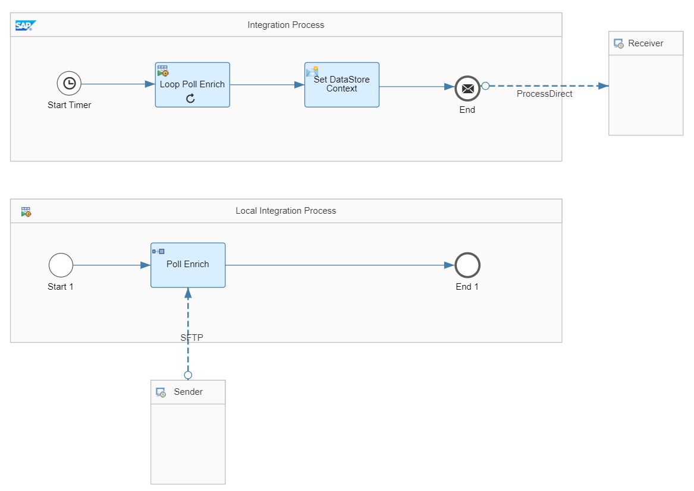
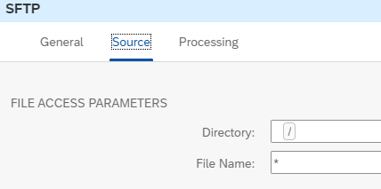
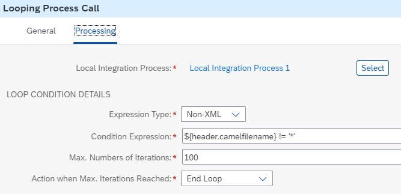
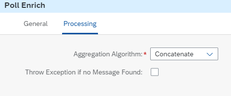

<!-- loio497bf08e0bdb43018e8e861256f4e803 -->

# Poll and Merge Folder

Learn how to poll a complete folder \(all the files of the path\) and merge the content of them.

This section shows you how to configure the SFTP Sender Adapter together with the Poll Enrich step.

For more information about the SFTP adapter, see: [SFTP Adapter](sftp-adapter-e3dce88.md).

For more information about the Poll Enrich step, see: [Define Poll Enrich](define-poll-enrich-f8c8c1d.md).

<a name="loio497bf08e0bdb43018e8e861256f4e803__section_cyv_tpj_vrb"/>

## Implementation

To showcase how to poll a complete folder and merge the content, we use a simple scenario. The example integration flow *File Transfer – Poll and Merge Folder* is designed the following way:

The integration flow is triggered via a timer, but it could be triggered by other means, for example, a done file via an additional *SFTP Sender Adapter*.

As we want to poll several files from a folder, we need to encapsulate a Poll Enrich and an SFTP Sender Adapter in a local integration process, which is called via a *Looping Process Call*.

In order to read all the files, we use the wildcard \* in the File Name of the SFTP Adapter.

After reading a file, the *Poll Enrich* creates a new header `camelfilename` with the name of the last read file. If no file is read, then it returns the file name entered in the SFTP Adapter, in this case \*. We can use this as Condition Expression to finalize the Looping Process Call \(`${header.camelfilename} != ‘*’`\).

As aggregation algorithm in Poll Enrich, you can use concatenate for plain texts or combine for XMLs.

The *Throw Exception if no Message Found* flag is not set, as we want to read files until no more files remain in the folder.

To test the guideline, store any files in your SFTP Server. Configure the externalized parameters of the integration flow, that means, address and port of your SFTP server, the credentials to authenticate at your SFTP server, and the directory where you stored the files. Then deploy the integration flow. Once, all files have been successfully picked up, you find a new entry in the data store *FileTransfer-pollAndMergeFolder* that contains the concatenated file.

