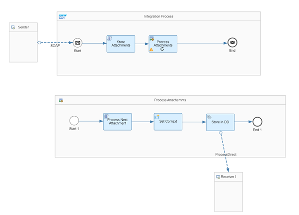

<!-- loio4b2f07f59590414eb597f29959c06248 -->

# Read Multiple Attachments

In this use case, several attachments are sent to the integration flow and all of them are processed.


<a name="loio4b2f07f59590414eb597f29959c06248__section_lr4_hbv_t5b"/>

## Read Multiple Attachments

The *Attachment Handling – Read Multiple Attachments integration flow* illustrates this guideline.



In this example, a SOAP sender adapter is used to receive a message with several attachments.

The groovy script *Store Attachment* gets all the attachments and saves the list in a property to be accessed later. It also saves the attachment count for the following loop.

> ### Sample Code:  
> ```
> def Message saveAttachments(Message message) {
> 
>     // Store attachments in property
>     def attachments = new HashMap<String, DataHandler>(message.getAttachments())
>     message.setProperty('AttachmentsMap', attachments)
>     // Store the number of attachments in property
>     message.setProperty('AttachmentCount', attachments.size())
>     // Clear the attachments
>     message.getAttachments().clear()
>     message.getAttachmentWrapperObjects().clear()
> 
>     return message
> }
> 
> ```

Then the Looping Process Call checks that the attachment count is greater than 0. If it's the case, the script *Process Next Attachment* gets the next attachment from the list saved in the property, sets it as body and removes it from the list. It also updates the attachment count, to be checked in the next iteration.

> ### Sample Code:  
> ```
> def Message getNextAttachment(Message message) {
> 
>     def attachments = message.getProperty('AttachmentsMap')
>     if (attachments.isEmpty()) {
>         throw new AssertionError('No attachments found')
>     }
>     // Get next attachment to be processed
>     def nextAttch = attachments.keySet().iterator().next()
>     // Remove the attachment from the Map
>     def attachment = attachments.remove(nextAttch)
>     // Replace the message with attachment
>     message.setBody(attachment.getContent())
>     // Update the AttachmentCount
>     message.setProperty('AttachmentCount', attachments.size())
>     message.setHeader('receiver', attachment.getName())
> 
>     return message
> }
> 
> ```

The current attachment is then sent to the generic receiver flow.


<a name="loio4b2f07f59590414eb597f29959c06248__section_wbj_gbv_t5b"/>

## Testing the Integration Flow

To test the scenario, perform the following steps:

1.  Set up inbound *Basic* authentication for integration flow endpoints.

    See: [Basic Authentication with clientId and clientsecret for Integration Flow Processing](../40-RemoteSystems/basic-authentication-with-clientid-and-clientsecret-for-integration-flow-processing-647eeb3.md)

2.  Deploy the integration flows *Attachment Handling – Read Multiple Attachments* and *Generic Receiver*.

3.  In the Postman client, open the *HandlingAttachments* folder in the *ModelingBasics* collection, and run the *ReadMultipleAttachments* request. The sample message contains a SOAP message with a body and four attachments \(2 xml, 1 csv, 1 txt\).

    > ### Note:  
    > Optionally, you can use SoapUI to send a sample SOAP message with any attached file in XML format to the integration flow end point. In this case, ensure that the request property Disable Multipart is set to false.

4.  You'll see each attachment in the data store.


