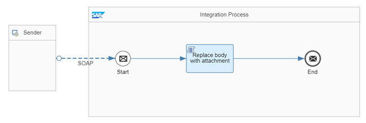

<!-- loio14e68101f5984d8a8f3ac565ba320509 -->

# Replace Body with Content of Attachment

In this use case, the content of a file attached to a message is read to replace the body of the message.

The *Attachment Handling - Replace Body With Attachment Content* integration flow illustrates this guideline.



In this example, a SOAP sender adapter is used to receive a message with one attachment.

The Replace body with attachment Groovy script reads the content of the attachment, overwrites the body of the message with the content of the attachment, and finally deletes the attachment from the message exchange so that the response of the SOAP call contains the content of the attachment only.

> ### Sample Code:  
> ```
> import com.sap.gateway.ip.core.customdev.util.Message
> import java.util.Map
> import java.util.Iterator
> import javax.activation.DataHandler
> 
> def Message processData(Message message) {
>     Map<String, DataHandler> attachments = message.getAttachments()
>     if (attachments.isEmpty()) {
>       // in case of no attachment
>       message.setBody("<warning>Attachment is missing</warning>")
>     } else {
>         // get attachment
>         Iterator<DataHandler> it = attachments.values().iterator()
>         DataHandler attachment = it.next()
>         message.setBody(attachment.getContent())
>         // delete attachment
>         message.getAttachments().clear()
>         message.getAttachmentWrapperObjects().clear()
>     }
>     return message
> }
> 
> ```

> ### Note:  
> SOAP supports multiple files attached to the message exchange. Alternatively, you can apply the script when using any other protocol supporting attachments such as when reading an email with attachments from a mail server.

To test the scenario, perform the following steps:

1.  Set up inbound *Basic* authentication for integration flow endpoints.

    See: [Basic Authentication with clientId and clientsecret for Integration Flow Processing](../40-RemoteSystems/basic-authentication-with-clientid-and-clientsecret-for-integration-flow-processing-647eeb3.md) and [Setting Up Inbound HTTP Connections (with Basic Authentication), Neo Environment](https://help.sap.com/viewer/368c481cd6954bdfa5d0435479fd4eaf/IAT/en-US/391c45cfcd0f4435952ab085283b7f7d.html "") :arrow_upper_right:

2.  Deploy the integration flow *Attachment Handling - Replace Body With Attachment Content*.

3.  In the Postman client, open the *HandlingAttachments* folder in the *ModelingBasics* collection, and run the*ReplaceBodyWithAttachment* request. The sample message contains a SOAP message with a product ID and an attachment containing the corresponding product details.

    > ### Note:  
    > Optionally, you can use SoapUI to send a sample SOAP message with any attached file in XML format to the integration flow end point. In this case, ensure that the request property Disable Multipart is set to false.

4.  You should receive the product details as response.


