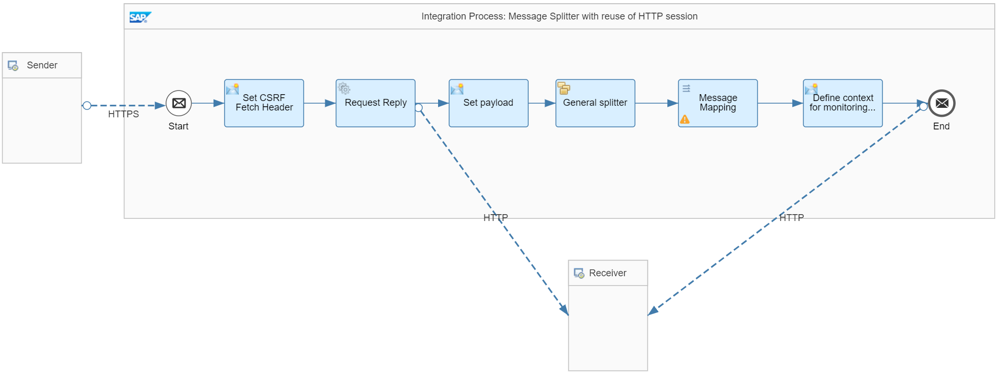

<!-- loio06a28e08177d45619a6bdee8fd180666 -->

# Specify Proper Session Handling

Specify proper session handling in the integration flow, in line with what the connected external component can handle \(see: [Cloud Integration – How to configure Session Handling in Integration Flow](https://blogs.sap.com/2017/07/17/cloud-integration-how-to-configure-session-handling-in-integration-flow/)\).

Developing an integration flow isn’t only about optimizing the resource consumption on the SAP Cloud Integration tenant. Instead, resource limits in connected external components must be considered as well. Optimizing locally within the SAP Integration Suite  tenant often sacrifices the robustness of the overall business process. Connected external components usually have limits regarding the number of calls that they can process within a certain timeframe.

For HTTP-based outbound calls, reusing an HTTP session can help to reduce the overall number of authentications carried out which at the end leads to an improved runtime performance. Check if you can reuse of HTTP sessions. Prerequisite is that the provider server supports sessions. In this case, the server creates a session cookie that is then used for subsequent HTTP requests as long as the session is still valid. So, further authentication for the duration of the session isn't carried out. The reuse of HTTP sessions can be either defined for a specific message exchange or across multiple message exchanges. For more information, see [Specify the Runtime Configuration](specify-the-runtime-configuration-0c1c96e.md).

<a name="loio06a28e08177d45619a6bdee8fd180666__section_zkm_ykw_ljb"/>

## Implementation

In a splitter scenario, the individual split messages are posted to one and the same receiver system. The guideline comprises 2 integration flows:

-   *Manage Resources - Reuse HTTP Session* 

-   *Manage Resources - Reuse HTTP Session - Receiver System* 

Both integration flows communicate to each other via http. By intention, not the ProcessDirect adapter has been chosen to be able to simulate a remote call situation. The integration flow *Manage Resources - Reuse HTTP Session - Receiver System* acts as a receiver system whereas its sender adapter is CSRF protected. All messages that are sent to the receiver system are stored in the data store.

The *Manage Resources - Reuse HTTP Session* integration flow implements the actual guideline. This integration flow splits an order with multiple items and sends the resulting messages to the *Manage Resources - Reuse HTTP Session - Receiver System* integration flow.

> ### Note:  
> As a prerequisite to run the integration flows, perform the following tasks:
> 
> In order to authenticate to the receiving integration flow, you need to configure and deploy a *User Credentials* artifact that contains the credentials of a user that has the `ESBMessaging.send` user role assigned. You can use the same user that is also used to run the Postman collection for the example integration flows. The name of the *User Credentials* artifact must be named `iFlowDesignGuidelineUser`. If you've already run the *Use CSRF Protection* guideline, the user already exists. Otherwise, create it from scratch.

Assume that there is a high message load in a short timeframe. In order to improve the runtime performance, the scenario could be configured to reuse HTTP sessions. The integration process as such is stateless. Therefore, as an option HTTP session reuse *On Integration Flow* can be used. With this setting, a session is reused across multiple message exchanges. However, in the proposed scenario the API that is requested is CSRF-protected. Therefore, in the example integration flow the HTTP session reuse *On Exchange* is configured. With this setting, the session for handling the CSRF protection does not collide with the other sessions.

The following figure shows how the *Manage Resources - Reuse HTTP Session* integration flow is modeled.

With the described settings, the first call to fetch the CSRF token initializes the HTTP session. The token call is executed before the Splitter step. All subsequent calls to the receiver share the same session as long as the session is available on the server. No new authentication is done in this case.

If you switch on tracing when testing the scenario, you can validate that for the call fetching the CSRF token basic authentication is carried out. The response of the token call contains the token as well as a cookie. For all subsequent calls, the cookie is used to log on to the receiving system.

In the General Splitter, parallel processing is enabled. This way, potentially the best performance is achieved. That means, the split messages are processed in parallel and the same session is reused for all messages. Prerequisite is that the called server supports parallel calls in the same session. If not, sequential splitter can be used.

