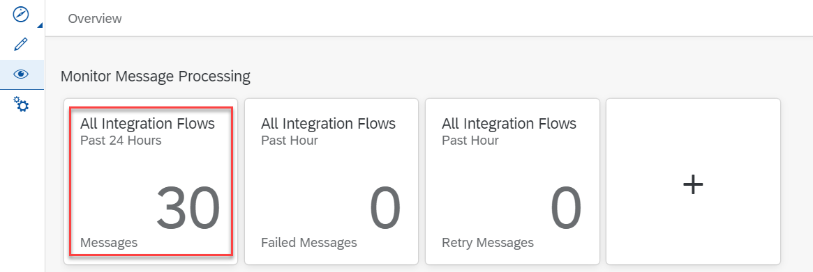
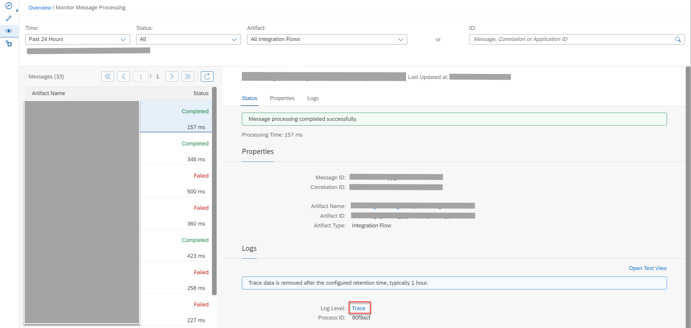
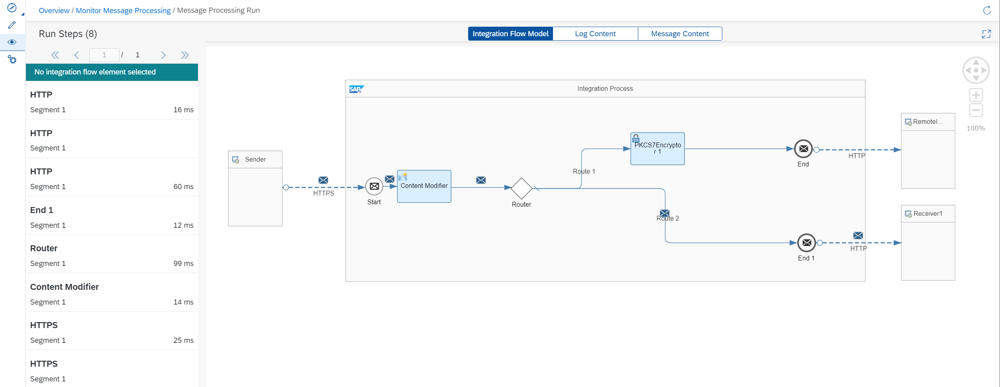

<!-- loio4ec27d358d844c96b3ae11febd440eac -->

# Tracing the Execution of an Integration Flow

If you like to find out in detail how a message is processed and transformed at runtime, you can run the related integration flow with the *Trace* log level.

This is also important if the error information in the message processing log is not sufficient and you like to investigate in more detail where during message processing an error occurred.

Setting this log level for an individual integration flow, you can collect the message content exchanged at runtime. That way, you can understand in more detail the transformation process of a message for an integration flow.

> ### Note:  
> Monitoring an integration flow for which log level *Trace* is configured is also referred to as *tracing*.

Tracing allows you to log the following parts of the message in the processing pipeline at each integration flow step:

-   Payload

-   Header

-   Properties

You \(in the role of an integration developer or tenant administrator\) explicitly need to enable tracing for each integration flow individually.

<a name="loio4ec27d358d844c96b3ae11febd440eac__section_ugq_kwt_rnb"/>

## How to Change Log Level to Trace

Perform the following steps:

1.  Deploy the integration flow.

2.  Open the *Operations* view \(*Monitor* section\) and select tile *All* under *Manage Integration Content*.

3.  On the next screen, select the integration flow that you like to trace.

4.  For *Log Level*, select *Trace*.

    

5.  Select *Change* to confirm your setting.
6.  Trigger the processing of the integration flow.

> ### Note:  
> Log level *Trace* expires after a certain time \(default value: 10 minutes\) and switches back to the log level set before. The trace data is cleared from the tenant storage after 60 min.

<a name="loio4ec27d358d844c96b3ae11febd440eac__section_t3m_5zt_rnb"/>

## How to View the Trace

After the integration flow has been processed again, perform the following steps:

1.  Open the *Operations* view \(*Monitor* section\) and select tile *All Integration Flows \(Past 24 Hours\)* \(or another tile providing access to the monitoring data of the integration flow\) under *Monitor Message Processing*.

    

2.  Select the integration flow and on the right side of the screen click the link *Trace*.

    

3.  The integration flow model and the trace details are shown.

    The names of the integration flow steps \(as specified during design time\) are shown on the left-hand side. They are sorted based on execution in descending order by default: The last executed step is the first entry in the list.

    In case of large integration flows, the list contains multiple pages, again in the same order, the first page containing the last executed steps.

    The integration flow model is displayed on the right-hand side.

    

The envelope icon indicates the message's traversal path:

<table>
<tr>
<th valign="top">

Icon

</th>
<th valign="top">

Description

</th>
</tr>
<tr>
<td valign="top">

</td>
<td valign="top">

Successfully processed step with trace data available.

</td>
</tr>
<tr>
<td valign="top">

</td>
<td valign="top">

Error in processed step with trace data available.

</td>
</tr>
<tr>
<td valign="top">

</td>
<td valign="top">

Successfully processed step with no trace data available \(for log level *Info* or *Debug*, or if the trace retention period \(default 60 min\) is exceeded\).

</td>
</tr>
<tr>
<td valign="top">

</td>
<td valign="top">

Error in processed step with no trace data available.

</td>
</tr>
</table>

The following screenshot shows the tracing data if the message passed the lower route of the integration flow and sending the message to the receiver resulted in an error.

To view the message content, select tab *Message Content* above the integration flow model.

> ### Tip:  
> There is also a log level *Debug* that provides more detailed information on message processing. When configured, it also shows the individual integration flow steps executed during a message processing run. The difference to *Trace* log level is that:
> 
> -   Log level *Debug* expires after a certain time.
> 
> -   Log level *Debug* does **not** provide the message content \(payload, header, and properties\).

> ### Note:  
> It is recommended to set log levels *Trace* or *Debug* only in a development or test environment.

<a name="loio4ec27d358d844c96b3ae11febd440eac__section_pfd_s25_rnb"/>

## More Information

[Setting Log Levels](setting-log-levels-4e6d3fc.md)

[Cloud Integration – Setting the Log Level for Message Processing](https://blogs.sap.com/2017/06/22/cloud-integration-setting-the-log-level-for-message-processing/)

[Troubleshooting Message Processing in the CPI Web Application](https://blogs.sap.com/2018/03/13/troubleshooting-message-processing-in-the-cpi-web-application/)

[Cloud Integration – Audit Log in Web UI Monitor](https://blogs.sap.com/2017/08/21/cloud-integration-audit-log-in-web-ui-monitor/)

[Cloud Integration – Enabling Trace for Message Processing](https://blogs.sap.com/2018/01/21/cloud-integration-enabling-trace-for-message-processing/)

[Enhancements to Message Processing Log Viewer in the Web Application](https://blogs.sap.com/2018/04/10/enhancements-to-message-processing-log-viewer-in-the-web-application/)

[How to analyze runtime issues](https://ga.support.sap.com/dtp/viewer/#/tree/2237/actions/28748:28795:33130)

SAP note [2665258](https://launchpad.support.sap.com/#/notes/2665258)

