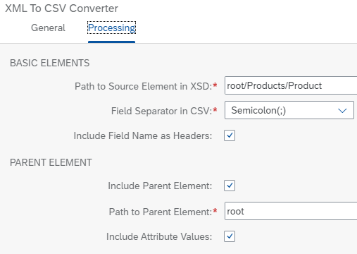

<!-- loiocf0acacd0d9140b3a261f86afcacbc3e -->

# Use the XML to CSV Converter

Learn how to transform an XML document into a CSV format.

This section shows you how you can configure the XML to CSV converter.

For information about the XML to CSV converter, see [Configure XML to CSV Converter](configure-xml-to-csv-converter-9025222.md).


<a name="loiocf0acacd0d9140b3a261f86afcacbc3e__section_ow3_m5h_smb"/>

## Implementation

To showcase the capabilities of the XML to CSV converter, we use a similar integration scenario as shown in [Access Header and Properties in Message Mapping](access-header-and-properties-in-message-mapping-4f2a8c9.md). The sample integration flow has been altered by requesting a list of products for a specific product category, which is then converted into a CSV format.

The example integration flow *Modeling Basics – XML To CSV Converter* is designed the following way:


The example scenario works as follows:

The integration flow receives a message through an HTTPS adapter. In the message body, a product category is provided.

In a content modifier step, an exchange property is defined holding the product category value:


<table>
<tr>
<td valign="top">

**Action**

</td>
<td valign="top">

**Name**

</td>
<td valign="top">

**Type**

</td>
<td valign="top">

**Data Type**

</td>
<td valign="top">

**Value**

</td>
</tr>
<tr>
<td valign="top">

Create

</td>
<td valign="top">

category

</td>
<td valign="top">

XPath

</td>
<td valign="top">

java.lang.String

</td>
<td valign="top">

//category

</td>
</tr>
</table>

In a Request Reply step, product data is read from an external source through the OData protocol \(using the OData receiver adapter\). For our scenario, we use the ESPM WebShop, which is based on the Enterprise Sales and Procurement Model \(ESPM\) provided by SAP. The demo application can be accessed at the following address: [https://refapp-espm-ui-cf.cfapps.eu10.hana.ondemand.com/webshop/index.html](https://refapp-espm-ui-cf.cfapps.eu10.hana.ondemand.com/webshop/index.html).

The query is defined as follows:

```
$select=ProductId,Name,DimensionDepth,DimensionHeight,DimensionUnit,DimensionWidth,Weight,WeightUnit&$filter=Category eq '${property.category}'&$orderby=ProductId
```

The response of the OData request contains a list of products for the specified product category. The following is an example for the product category *Scanners*:

```
<Products>
	<Product>
		<DimensionWidth>0.3400</DimensionWidth>
		<WeightUnit>KG</WeightUnit>
		<ProductId>HT-1080</ProductId>
		<DimensionUnit>m</DimensionUnit>
		<DimensionHeight>0.0500</DimensionHeight>
		<DimensionDepth>0.4800</DimensionDepth>
		<Weight>2.300</Weight>
		<Name>Photo Scan</Name>
	</Product>
	<Product>
		<DimensionWidth>0.3100</DimensionWidth>
		<WeightUnit>KG</WeightUnit>
		<ProductId>HT-1081</ProductId>
		<DimensionUnit>m</DimensionUnit>
		<DimensionHeight>0.0700</DimensionHeight>
		<DimensionDepth>0.4300</DimensionDepth>
		<Weight>2.400</Weight>
		<Name>Power Scan</Name>
	</Product>
	<Product>
		<DimensionWidth>0.3300</DimensionWidth>
		<WeightUnit>KG</WeightUnit>
		<ProductId>HT-1082</ProductId>
		<DimensionUnit>m</DimensionUnit>
		<DimensionHeight>0.1200</DimensionHeight>
		<DimensionDepth>0.4100</DimensionDepth>
		<Weight>3.200</Weight>
		<Name>Jet Scan Professional</Name>
	</Product>
	<Product>
		<DimensionWidth>0.3500</DimensionWidth>
		<WeightUnit>KG</WeightUnit>
		<ProductId>HT-1083</ProductId>
		<DimensionUnit>m</DimensionUnit>
		<DimensionHeight>0.1000</DimensionHeight>
		<DimensionDepth>0.4000</DimensionDepth>
		<Weight>3.200</Weight>
		<Name>Jet Scan Professional</Name>
	</Product>
</Products>

```

Next, in a content modifier step, the response from the OData request is enhanced with the product category information as attribute Category of the node root as well as the elements Type and Source. In the Message Body of the content modifier, the following is maintained:

```
<root Category="${property.category}">
	<Type>Source Data</Type>
	<Source>ERP</Source>
${body}
</root>

```

This message is to be transformed into a CSV format. The XML to CSV Converter flow step is configured as follows.

For each product, a row in the CSV file is to be added. So, as *Path to Source Element in XSD* we have set the XPath *root/Products/Product*.

As *Field Separator in CSV* we select *Semicolon \(;\)*.

In addition, we like to add the XML field names as a header row. So, we select the *Include Field Name as Headers* check box.

Furthermore, the meta data information of the products, that is, category, type, and source, is to be added to the CSV file. So, we select the *Include Parent Element*check box, and set the *Path to Parent* Element as *root*.

Since the Category is defined as attribute of the root node, we need to select the *Include Attribute Values* check box.



After the conversion, the message body looks as follows:

```
Category;Type;Source
Scanners;Source Data;ERP

DimensionWidth;WeightUnit;ProductId;DimensionUnit;DimensionHeight;DimensionDepth;Weight;Name
0.3400;KG;HT-1080;m;0.0500;0.4800;2.300;Photo Scan
0.3100;KG;HT-1081;m;0.0700;0.4300;2.400;Power Scan
0.3300;KG;HT-1082;m;0.1200;0.4100;3.200;Jet Scan Professional
0.3500;KG;HT-1083;m;0.1000;0.4000;3.200;Jet Scan Professional

```

**Related Information**  


[Configure XML to CSV Converter](configure-xml-to-csv-converter-9025222.md "")

