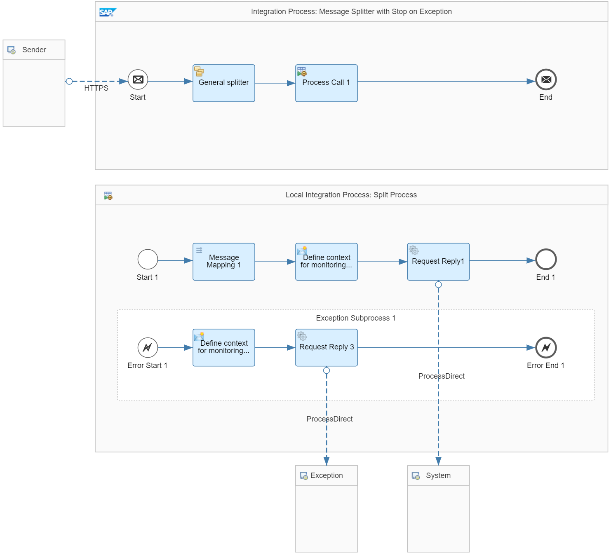

<!-- loiod2445ff19d324aeb99e4f0587a0ff2f1 -->

# Variant 1: Splitter Without Gather with Stop on Exception and with Exception Subprocess

The example integration flow *Handle Errors - Splitter with Stop on Exception* is designed in the following way.

  

This example scenario works in the following way:

1.  SAP Cloud Integration receives a composite \(bulk\) message through an HTTPS adapter.

    The bulk message contains multiple orders with multiple items.

2.  The Splitter step divides the bulk message into as many individual messages as there are order items.

    The following settings have been defined for the Splitter step:

    <table>
    <tr>
    <th valign="top">

    Attribute

    
    </th>
    <th valign="top">

    Value

    
    </th>
    </tr>
    <tr>
    <td valign="top">

    Expression Type

    
    </td>
    <td valign="top">

    XPath

    
    </td>
    </tr>
    <tr>
    <td valign="top">

    XPath Expression

    
    </td>
    <td valign="top">

    /ns0:PurchaseOrder/Items/Item

    
    </td>
    </tr>
    <tr>
    <td valign="top">

    Grouping

    
    </td>
    <td valign="top">

    1

    
    </td>
    </tr>
    <tr>
    <td valign="top">

    Stop on Exception

    
    </td>
    <td valign="top">

    \(Selected\)

    
    </td>
    </tr>
    </table>
    
3.  The individual messages are processed in a separate Local Integration Process. In the example scenario, a simple message mapping transforms the `Item` node of the source structure to the `Item` node of the target structure.

4.  The single message chunks are sent to the receiver.

Dedicated elements in the integration flow model have dedicated tasks:

<table>
<tr>
<th valign="top">

Element

</th>
<th valign="top">

Task

</th>
</tr>
<tr>
<td valign="top">

*Integration Process: Message Splitter with Stop on Exception*

</td>
<td valign="top">

Main integration flow

</td>
</tr>
<tr>
<td valign="top">

*Local Integration Process: Split Process*

</td>
<td valign="top">

Local integration flow encapsulating split logic

</td>
</tr>
<tr>
<td valign="top">

*Exception* \(Receiver shape\)

</td>
<td valign="top">

Generic Receiver integration flow creating a Data Store entry in error case

</td>
</tr>
<tr>
<td valign="top">

*System* \(Receiver shape\)

</td>
<td valign="top">

Generic Receiver integration flow creating a

Data Store entry to represent the receiver system in success case

</td>
</tr>
</table>

Errors occurring in the split processing are handled in an Exception Subprocess in the Local Integration Process.  In the Exception Subprocess, an entry to data store is written as simple error handling. The Exception Subprocess ends with an Error End event. 

If an error occurs, processing ends because of the *Stop on Exception* option in the Splitter. The next split is not executed. The message gets a *Failed* status in the monitoring.

If some splits were executed successfully before the error occurred, their data is already sent to the receiver. No roll-back of the executed calls is possible. This means, parts of the original message have been sent to the receiver, some not.

<a name="loiod2445ff19d324aeb99e4f0587a0ff2f1__section_h34_g3b_hlb"/>

## Executing the Scenario

To run this scenario, open folder *SplitterWithExceptionSubprocess* of the Postman collection.

Select one of the following requests:

-   *SplitterWithStopOnException\_withError*

    To simulate an error situation, run the integration flow with this request. The processing stops because of an invalid price of one of the purchase order items \(in the request payload\). Due to the invalid price, message mapping fails.

    When monitoring the message processing, the integration flow has status *Failed*.

-   *SplitterWithStopOnException\_withoutError*

    To simulate successful message processing, run the integration flow with this request.

<a name="loiod2445ff19d324aeb99e4f0587a0ff2f1__section_nv3_d3f_plb"/>

## Expected Behavior

If message processing is successful, in the Monitor application you find the following entries:

-   5 entries in Data Store *MessageSplitter-successful* \(one for each item\)

    6 new message processing logs in *Completed* state, 1 for integration flow *Handle Errors - Splitter with Stop on Exception* \(related to the guideline\) and 5 of the *GenericReceiver* integration flow.

In the error case, in the Monitor application you find the following entries:

-   3 entries in Data Store *MessageSplitter-successful* \(items 10, 20, and 30\)

-   1 entry in Data Store *MessageSplitter\_exception* \(item 40\)

-   1 message processing log for integration flow *Handle Errors - Splitter with Stop on Exception* \(related to the guideline\) in *Failed* state

-   4 message processing logs in *Completed* state for the *GenericReceiver* integration flow

