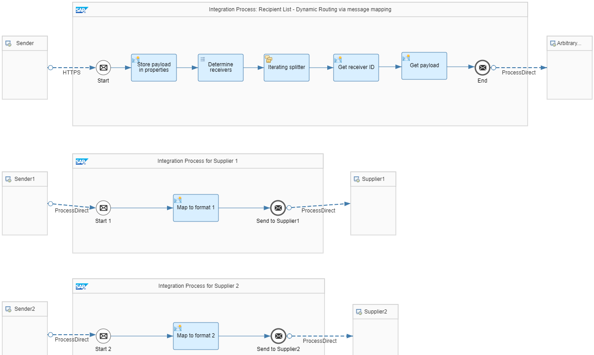

<!-- loiod241c776e0e84368b4e37546377c5ec6 -->

# Variant: Dynamic Routing

The dynamic routing variant uses message mapping to determine the list of receivers.

> ### Tip:  
> The `Receivers` service interface delivered within the `SAP BASIS` Software Component of SAP Process Orchestration is used as the target structure of the message mapping.

> ### Tip:  
> Apply this variant if you want to reuse integration content from SAP Process Orchestration.

Other than for the static routing variant described in [Variant: Static Routing](variant-static-routing-b71529f.md), you don't need to maintain a fixed number of receivers in the integration flow. Instead, the receiver determination part is decoupled from the receiver-specific delivery of the message. Therefore, a main integration process is modeled that contains the receiver determination, and an integration flow is modeled for each potential receiver. The main model and the individual integration flows are coupled via the ProcessDirect adapter. The ProcessDirect address is set dynamically based on the receiver determination.

The model is specified in the *Pattern Recipient List - Dynamic Routing* reference integration flow.

Since the payload is overwritten in the message mapping, it first has to be stored in an exchange property. This task is performed by a Content Modifier that creates an exchange property \(called *payload*\). Its value is given by the expression `${in.body}`.

> ### Tip:  
> In many cases, the payload needs to be stored and you need to make sure that it isn't overwritten. In such cases, it's good practice to use exchange properties and to avoid using the data store. An exchange property keeps the payload in main memory. A Data Store operation results in a database call that is more expensive from a runtime point of view compared to accessing the main memory.

The Message Mapping processes the message in the following way:

-   The list of receivers is determined based on the *Category*. For demo purposes, a custom-mapping function *getReceiverList* is provided that has hard-coded routing rules, as previously described. The output of the function is a result list containing the list of receivers that the message is to be sent to. The *Category* source field is mapped to the *Receiver* target field .

-   Similarly, the *Category* source field is mapped to the *Service* target field below the *Receiver* node. In addition, the standard function *splitByValue* is added to change the context of the mapping queue. After the mapping run, the `Service` field will hold the name of the receiver.

After the mapping step, an Iterating Splitter is added. The *Expression Type* attribute is set to *XPath* and the following XPath expression is specified: `/ns2:Receivers/Receiver`. This step splits up the message into as many messages as there are receivers.

A Content Modifier stores the receiver name in the *receiverID* exchange property \(whose value is given by the */Receiver/Service* expression\). This property is needed in the configuration of the ProcessDirect adapter.

At this step, the payload still holds the receiver message. Therefore, it has to be overwritten with the original message payload \(which is specified by the *$\{property.payload\}* expression\).

For the ProcessDirect receiver adapter, the following address is specified: *$\{property.receiverID\}*.

A separate integration flow is provided for each receiver that contains a ProcessDirect sender adapter. For demo purposes, the receiver-specific integration processes are modeled within the same integration flow.

For the address of the ProcessDirect sender adapter, the corresponding receiver name is entered; in our example: *Supplier\#* with \# from 1 through 5.

> ### Note:  
> The Partner Directory can be used to store the receiver rules instead of using message mapping to determine the receivers. The advantage of this option is that you don't need to change the integration flow if the routing rules need to be updated.

**Related Information**  

[Define Router](define-router-d7fddbd.md "")

[Define Multicast](define-multicast-17de3ea.md "")

[Parameterizing Integration Flows Using the Partner Directory](parameterizing-integration-flows-using-the-partner-directory-b7812a5.md "The Partner Directory is a tenant-specific storage option that allows you to store information on business partners that are connected to the tenant in the context of a larger business network.")

