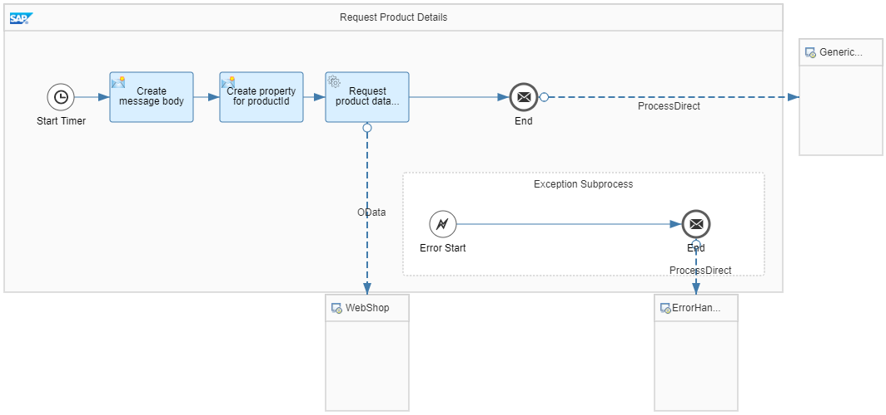

<!-- loioc830df7f4b9f4a11988f503f29e14c96 -->

# Variant: Exception Subprocess with End Message Event

The main integration flow calls the error handling integration flow if an exception occurs. Error handling is then performed in the error handling integration flow.

<a name="loioc830df7f4b9f4a11988f503f29e14c96__section_zcj_lkw_lkb"/>

## Integration Flows

<table>
<tr>
<th valign="top">

Integration Flow

</th>
<th valign="top">

Task

</th>
</tr>
<tr>
<td valign="top">

*Handle Errors - Outsource Error Handling - Main Integration Flow with Message End Event*

</td>
<td valign="top">

Performs the main business-related steps \(calling WebShop component\).

</td>
</tr>
<tr>
<td valign="top">

*Handle Errors - Outsource Error Handling - Error Handling Flow*

</td>
<td valign="top">

Sends an error message to the generic receiver \(error handling-related steps\).

</td>
</tr>
<tr>
<td valign="top">

*Generic Receiver*

</td>
<td valign="top">

Creates a Data Store entry to represent the receiver system \(both in success and error cases\).

</td>
</tr>
</table>

This integration flow reads product data from the WebShop component and sends it to the generic receiver \(as described in [How to Work with the Example Integration Flows](how-to-work-with-the-example-integration-flows-03e6959.md)\). In detail, it performs the following steps:

1.  A Content Modifier creates a simple message body \(that contains a `productId` value\). Additionally, 2 message headers are created to define the Data Store entry created by the generic receiver integration flow.

    -   The header *context* is set to *HandlingErrors-OutsourceErrorHandling* and defines the Data Store name for the guideline.

    -   The header *receiver* is set to *Success* and defines the Data Store entry ID created in the *HandlingErrors-OutsourceErrorHandling* Data Store.

2.  The OData receiver adapter reads product details for the `productId` value given in the message body. The ProcessDirect adapter sends the product details to the generic receiver; as a result a Data Store entry with the ID *Success* is created for the *HandlingErrors-OutsourceErrorHandling* Data Store.

Let's assume that an error occurs, for example, the WebShop component can't be reached. In such a case, the Exception Subprocess calls the *Handle Errors - Outsource Error Handling - Error Handling Flow* integration flow.

This integration flow sends an error message to the same generic receiver \(Data Store name *HandlingErrors-OutsourceErrorHandling*\) but with a different ID. For that purpose, the first Content Modifier creates 2 headers:

-   The header *context* is set to *HandlingErrors-OutsourceErrorHandling* and defines the Data Store name for the guideline.

-   The header *receiver* is set to *Error* and defines the Data Store entry ID created in the *HandlingErrors-OutsourceErrorHandling* Data Store.

To easily simulate an error situation, you can run the integration flow with a wrong address for the WebShop application endpoint.

The corresponding *Address* parameter \(OData receiver adapter, tab *Connection*\) is externalized \(as explained under [Externalize Volatile Configurations](externalize-volatile-configurations-300277d.md)\).

To run the integration flow with a wrong address, perform the following steps:

1.  Open the *Artifacts* tab for the corresponding integration package.

2.  Position the cursor on the integration flow.

3.  In the *Action* column, select *Configure*.

4.  On the subsequent screen, specify the \(wrong\) address and deploy the integration flow.

> ### Tip:  
> You don't need to edit the integration flow for that purpose.

To monitor the message flow, go to the *Monitor* section and click a tile under *Monitor Message Processing*.

The erroneous main integration flow *Handle Errors - Outsource Error Handling - Main Integration Flow with Message End Event* has status *Completed*.

