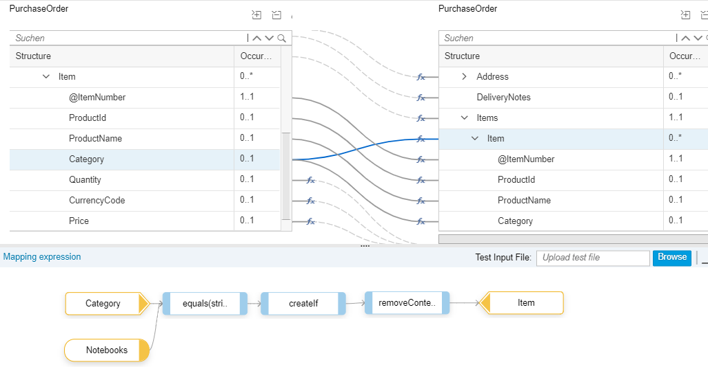

<!-- loio85571e200d514723a9e4b552db2ccf7a -->

# Variant: Message Mapping

In this variant, Message Mapping is used to remove all unnecessary data items from the message, but the message header is kept.

The *Pattern Content Filter - Message Mapping* integration flow illustrates how to implement this variant.

  

The integration flow only contains Message Mapping.

> ### Note:  
> If you migrate your integration scenario from SAP Process Orchestration to SAP Integration Suite , you can connect to your Enterprise Services Repository and upload message mapping, as described in [Importing Content from ES Repository](importing-content-from-es-repository-53db5fb.md). Otherwise, you can create the message mapping from scratch.

The Message Mapping transforms the *Item* node of the source structure to the *Item* node of the target structure and creates the mapping expression as shown in the following figure. For each item, the system checks whether the *category* element meets the condition, in our example, `Category equals Notebooks`.

> ### Note:  
> In variant [Variant: Content Filter Step](variant-content-filter-step-239d8f8.md) the content was filtered for Software.

  

