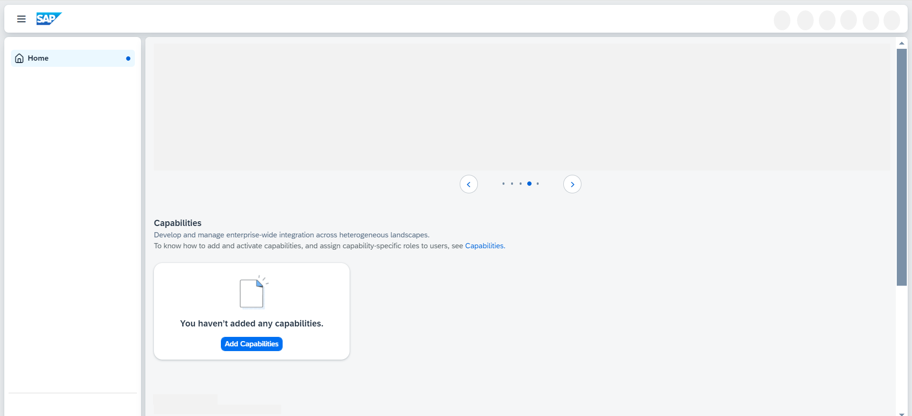
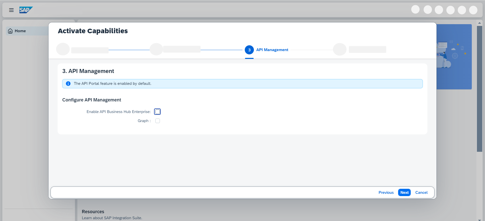
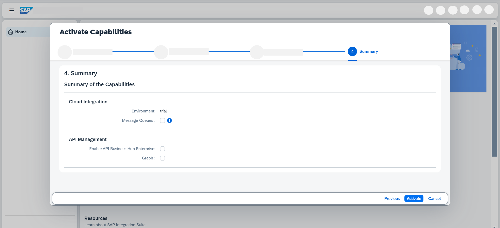

<!-- loio2ffb343c163c48a4b3a90f9f3c487328 -->

<link rel="stylesheet" type="text/css" href="css/sap-icons.css"/>

# Activating and Managing Capabilities

Activate capabilities for the SAP Integration Suite.

<a name="loio2ffb343c163c48a4b3a90f9f3c487328__prereq_ydy_lxj_dmb"/>

## Prerequisites

-   You have access to the Integration Suite home page. See [Working with Integration Suite Home](20-Working_with_SAP_Integration_Suite_Home/working-with-integration-suite-home-a53dce3.md).
-   You have the Integration\_Provisioner role collection assigned to your user. See [Subscribing and Configuring Initial Access to SAP Integration Suite](10-InitialSetup/subscribing-and-configuring-initial-access-to-sap-integration-suite-8a3c8b7.md).

<a name="loio2ffb343c163c48a4b3a90f9f3c487328__context_mpf_myf_dmb"/>

## Context

This topic describes how to add and activate relevant capabilities in Integration Suite. The following capabilities are available:

-   Cloud Integration

-   API Management

    -   Graph

-   Event Mesh

-   Open Connectors

-   Integration Advisor

-   Trading Partner Management

-   Integration Assessment

-   Migration Assessment

## Procedure

1.  On the Integration Suite home page, under the *Capabilities* section, choose either *Add Capabilities* \(if it's your first time accessing the Integration Suite home page\) or  *Manage Capabilities* .

2.  On the *Activate Capabilities* screen, under *Select Capabilities*, select the relevant capabilities as shown in the following table and choose *Next* to configure additional functionality for individual capabilities. 

    <table>
    <tr>
    <th valign="top">

    To Activate...
    
    </th>
    <th valign="top">

    Select...
    
    </th>
    </tr>
    <tr>
    <td valign="top">
    
    Cloud Integration

    
    
    </td>
    <td valign="top">
    
    *Build Integration Scenarios*

    > ### Note:  
    > -   Select the environment based on your operational needs:
    > 
    >     -   *Non-Production* for non-critical business activities like performance testing, testing new integration scenarios.
    >     -   *Production* for critical business activities.
    > 
    >     > ### Recommendation:  
    >     > If you want to activate both API Management and Cloud Integration capabilities within the same tenant, select the same environment for both capabilities. Once you have activated API Management capability, you can set the same environment by using the *Account Type* field on the *Configure the API Management Service* screen. See [Enable API Management Capability](https://help.sap.com/docs/integration-suite/sap-integration-suite/enabling-api-management-capability-from-integration-suite).
    > 
    > -   To support the usage of Java Message Service \(JMS\) queues as temporary storage, select Message Queues. Using JMS message queues allow you to configure asynchronous decoupling of sender and receiver message processing to ensure that in case of an error a retry is done from SAP Integration Suite rather than the sender system. You can use the tenant to manage these queues. See [Managing Message Queues](https://help.sap.com/viewer/368c481cd6954bdfa5d0435479fd4eaf/Cloud/en-US/cdcce24f484a41c08ab46d12ab666451.html).

    
    </td>
    </tr>
    <tr>
    <td valign="top">
    
    API Management

    -   API business hub enterprise

        > ### Note:  
        > You can activate API business hub enterprise by selecting the checkbox.

        -   Graph

            > ### Note:  
            > You must select API business hub enterprise to activate Graph.

    
    
    </td>
    <td valign="top">
    
    *Manage APIs*

    For end-to end instructions on how to activate the API Management capability, see [Enable API Management Capability](https://help.sap.com/docs/integration-suite/sap-integration-suite/enabling-api-management-capability-from-integration-suite). You can also refer to the [Set Up API Management from Integration Suite](https://developers.sap.com/tutorials/api-mgmt-isuite-initial-setup.html) tutorial for visual instructions.
    
    </td>
    </tr>
    <tr>
    <td valign="top">
    
    Event Mesh 
    
    </td>
    <td valign="top">
    
    *Manage Business Events*

    > ### Remember:  
    > If you're an exisitng customer of the standalone SAP Event Mesh service \(default plan\), you can't subscribe to the Event Mesh capability in the same subaccount. In such cases, you must subscribe to SAP Integration Suite in a different subaccount.

    
    </td>
    </tr>
    <tr>
    <td valign="top">
    
    Open Connectors
    
    </td>
    <td valign="top">
    
    *Extend Non-SAP Connectivity* 
    
    </td>
    </tr>
    <tr>
    <td valign="top">
    
    Integration Advisor
    
    </td>
    <td valign="top">
    
    *Implement Interfaces and Mapping* 
    
    </td>
    </tr>
    <tr>
    <td valign="top">
    
    Trading Partner Management

    > ### Note:  
    > Cloud Integration \(with Message Queues\) and Integration Advisor capabilities are prerequisites for activating Trading Partner Management.

    
    </td>
    <td valign="top">
    
    *Manage Trading Partners* 
    
    </td>
    </tr>
    <tr>
    <td valign="top">
    
    Integration Assessment
    
    </td>
    <td valign="top">
    
    *Manage and Provide Integration Technology Guidance* 
    
    </td>
    </tr>
    <tr>
    <td valign="top">
    
    Migration Assessment 
    
    </td>
    <td valign="top">
    
    *Assess Migration Scenarios* 
    
    </td>
    </tr>
    </table>
    
3.  Choose *Activate*. 

    > ### Note:  
    > -   If you face any issues during activation or the activation fails, then refer SAP Note [2904202](https://me.sap.com/notes/2904202) and proceed accordingly.
    > 
    > -   You can choose *Manage Capabilities* to activate additional capabilities at a later point in time.
    > 
    > -   After activation, assign the required role collections to users for accessing the individual capabilities. See [Configuring User Access](configuring-user-access-to-sap-integration-suite-2c6214a.md).

<a name="loio2ffb343c163c48a4b3a90f9f3c487328__result_pph_4z5_plb"/>

## Results

-   Capabilities are displayed on the home page as tiles. To access the functionalities offered by these capabilities, users must have the required role collections assigned. See [Configuring User Access to SAP Integration Suite](configuring-user-access-to-sap-integration-suite-2c6214a.md).
-   After activating Cloud Integration, create a service broker instance. See [Creating Service Instance and Service Key for Inbound Authentication](40-RemoteSystems/creating-service-instance-and-service-key-for-inbound-authentication-19af5e2.md).

-   The API Management capability needs a few more configuration steps before activation. See [Additional Configurations for API Management](additional-configurations-for-api-management-5ac63ab.md).
-   The Event Mesh capability needs an additional configuration step before usage. See: [Initiating the Message Broker](initiating-the-message-broker-61eb5dd.md).

**Related Information**  

[Centralized API business hub enterprise](centralized-api-business-hub-enterprise-38422de.md "The API business hub enterprise is a central API catalog, allowing application developers to consume APIs and other assets, from a common platform.")

