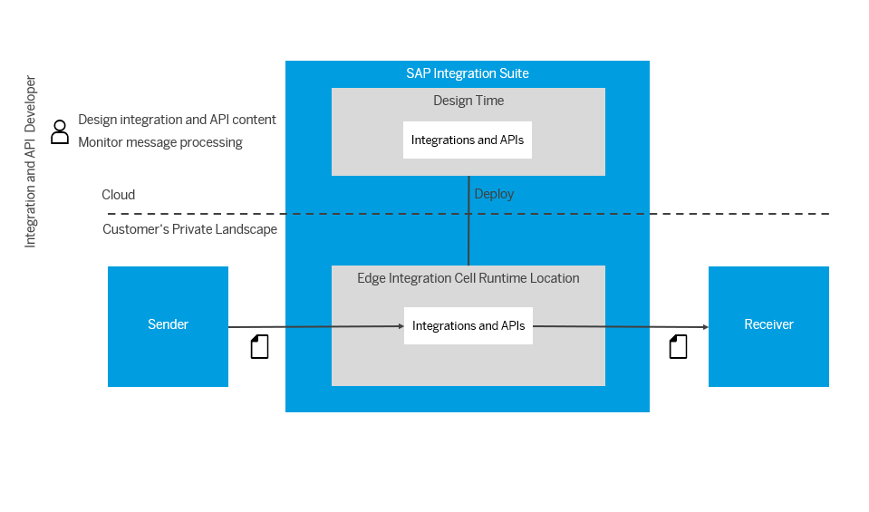

<!-- loio7a6c2678066a4f2aa596009244c57ee2 -->

# Hybrid Deployment Using Edge Integration Cell

If you want to process data within your private landscape, you can achieve the same with Edge Integration Cell. For example, consider a case where you want to have sender and receiver systems exchanging data that are exclusively hosted in an on-premise environment. In this case, passing the data through the Internet isn't always the best option.

To do this, you could still use the cloud-based environment of SAP Integration Suite to design your integration content. But instead of deploying the integration content on your cloud-based Cloud Integration runtime, you can activate a private runtime location \(for example, within the firewall of your organization\) and have this runtime process the messages.

At runtime, the messages exchanged between sender and receiver systems are exclusively passed through your private landscape, as depicted in the following figure.

You must use the Cloud Integration Monitor application to manage your integration artifacts and security content and to monitor the message processing.

> ### Note:  
> In technical terms, the Edge Integration Cell runtime is realized as a Kubernetes container in your private landscape.

As shown in the figure, your Edge Integration Cell runtime processes the integration scenarios. You must connect your Edge Integration Cell runtime to the cloud at regular intervals to synchronize data, such as, deployed artifacts that are required to reliably operate your integration scenarios.

