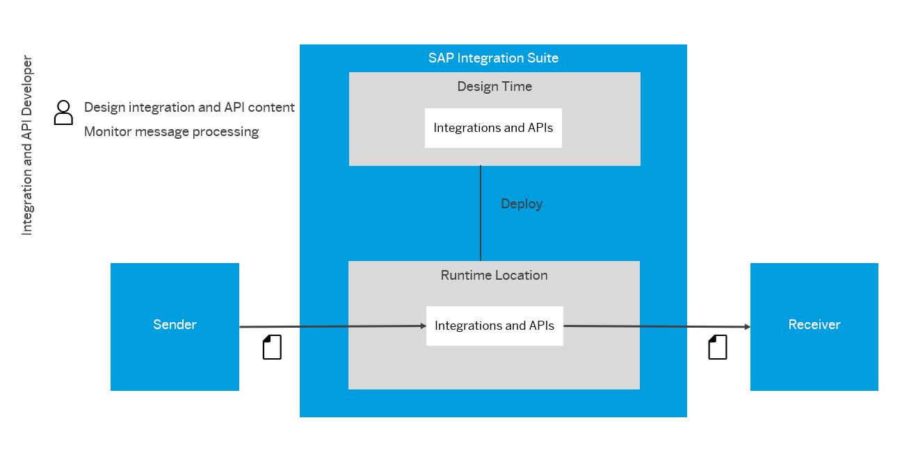

<!-- loioca5b2339a5cf4e86bb78f70f71346614 -->

# Standard Deployment in the Cloud

As a cloud service on top of SAP Business Technology Platform, SAP Integration Suite can exchange data with cloud systems or on-premise applications. Using the standard deployment model, this is the procedure:

1.  An integration developer uses SAP Integration Suite to design content like Integration flows and APIs.

2.  When finished with the design, the integration developer deploys the integration content.

    This step invokes the processing of the integration and API content on the SAP's runtime location.

    To understand SAP's runtime location, see [Technical Landscape](https://help.sap.com/docs/CLOUD_INTEGRATION/368c481cd6954bdfa5d0435479fd4eaf/cc22301edf174cc9bf7337c6c66fb704.html?locale=en-US).

3.  The integration content \(for example, a set of integration flows\) can start to operate and exchange data with connected sender and receiver systems.

In the following setup, the messages exchanged between sender and receiver systems are passed through the cloud.

Note that using this deployment option, the sender and receiver systems can either reside in the cloud or in an on-premise landscape.

