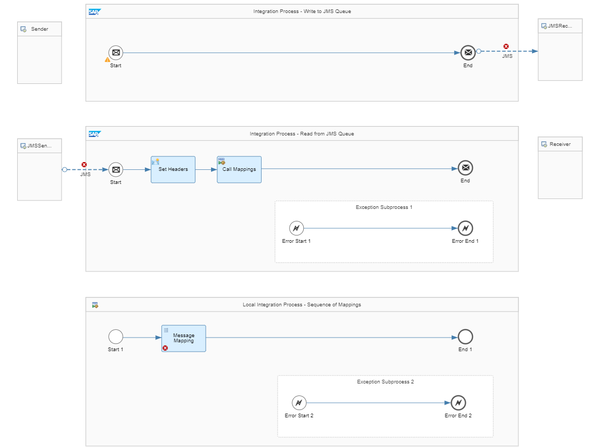
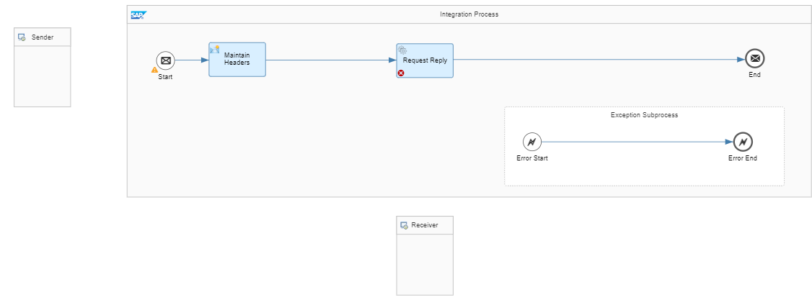
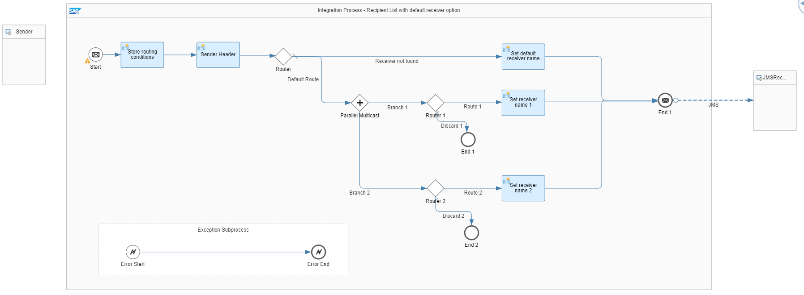

<!-- loioad867aea1fc749a99abc2cf643c94038 -->

# Supported Templates

Learn about the various templates that are available in the migration tooling.

Following are the supported scenarios, their associated template identifier, and equivalent design in Integration Suite.

<a name="loioe8d017d05d5c47f18e47df647da7df4d"/>

<!-- loioe8d017d05d5c47f18e47df647da7df4d -->

## P2P\_ASYNC\_0001

Point-to-Point asynchronous interface between 1 sender and 1 receiver with 1 message mapping

<a name="loio8942adf6a9c84a7697ce2d1fe9a559bb"/>

<!-- loio8942adf6a9c84a7697ce2d1fe9a559bb -->

## P2P\_ASYNC\_0002

Point-to-Point asynchronous interface between 1 sender and 1 receiver

<a name="loio5c1c1d57301c42218937a59c0a17c57c"/>

<!-- loio5c1c1d57301c42218937a59c0a17c57c -->

## P2P\_ASYNC\_0003

Point-to-Point asynchronous interface between 1 sender and 1 receiver with 1 XSLT mapping

<a name="loio7b31c50701c141f2a0b6fd1ecbbe2f22"/>

<!-- loio7b31c50701c141f2a0b6fd1ecbbe2f22 -->

## P2P\_ASYNC\_0004

Point-to-Point asynchronous interface between 1 sender and 1 receiver with 2 message mappings and 1 XSLT mapping

<a name="loio879d9d3493a34d8ca6e71108fc1d4a3f"/>

<!-- loio879d9d3493a34d8ca6e71108fc1d4a3f -->

## P2P\_ASYNC\_0005

Point-to-Point asynchronous interface between 1 sender and 1 receiver with 1 message mapping decoupled using two integration processes

<a name="loio49489bc6838e4421a8c5bf0f1eb3e682"/>

<!-- loio49489bc6838e4421a8c5bf0f1eb3e682 -->

## P2P\_ASYNC\_0006

Point-to-Point asynchronous interface between 1 sender and 1 receiver with 1 message mapping and 1 idempotent process

The integration process receives the messages, transforms the message using message mapping, and executes an Idempotent Process Call to check if an incoming message was already processed. In this case, the processing of this message is skipped. Else, the message is sent to the receiver using the Request Reply step.

<a name="loio3476b56fd6ff4ff4a696e93779f16582"/>

<!-- loio3476b56fd6ff4ff4a696e93779f16582 -->

## P2P\_ASYNC\_0007

Point-to-Point asynchronous interface between 1 sender and 1 receiver with 1 message mapping and 1 idempotent process decoupled using two integration processes

The first integration process stores the incoming messages in the JMS queue, using the JMS receiver adapter.

The second integration process reads the messages from this JMS queue \(using JMS sender adapter\), transforms the message using message mapping, and executes an Idempotent Process Call to check if an incoming message was already processed. In this case, the processing of this message is skipped. Else, the message is sent to the receiver using the Request Reply step.

<a name="loio4a99014687f04ccf904b873b5825b342"/>

<!-- loio4a99014687f04ccf904b873b5825b342 -->

## P2P\_ASYNC\_ATTACH\_0001

Point-to-Point asynchronous interface between 1 sender and 1 receiver with 1 message mapping and exchanging the incoming attachment with the message body.

<a name="loio59ec0b211a784a5eabdb6218cca568b0"/>

<!-- loio59ec0b211a784a5eabdb6218cca568b0 -->

## P2P\_ASYNC\_BRIDGE\_0001

Point-to-Point Async-Sync Bridge between 1 sender supporting asynchronous communication and 1 receiver supporting synchronous communication with message mappings for request and response.

<a name="loio468e43826e1b42549baaf1e0771e3521"/>

<!-- loio468e43826e1b42549baaf1e0771e3521 -->

## P2P\_ASYNC\_CSV\_0001

Point-to-Point asynchronous interface between 1 sender and 1 receiver with 1 XSLT mapping, 1 message mapping and CSV conversion at inbound and outbound

There are limitation while using the template. For more information, see: [Known Limitations](known-limitations-7a552d4.md).

<a name="loiod03185fa66674bec8b258de8352325ce"/>

<!-- loiod03185fa66674bec8b258de8352325ce -->

## P2P\_ASYNC\_CSV\_0002

Point-to-Point asynchronous interface between 1 sender and 1 receiver with 1 message mapping and XML to CSV conversion at outbound

There are limitation while using the template. For more information, see: [Known Limitations](known-limitations-7a552d4.md).

<a name="loio2bb532d7b4b24bb2a34219f6e62e4ede"/>

<!-- loio2bb532d7b4b24bb2a34219f6e62e4ede -->

## P2P\_ASYNC\_CSV\_0003

Point-to-Point asynchronous interface between 1 sender and 1 receiver with 1 message mapping and CSV to XML conversion at inbound

There are limitation while using the template. For more information, see: [Known Limitations](known-limitations-7a552d4.md).

<a name="loio588d1929b5484e8aafffa000f509a58c"/>

<!-- loio588d1929b5484e8aafffa000f509a58c -->

## P2P\_ASYNC\_JSON\_0001

Point-to-Point asynchronous interface between 1 sender and 1 receiver with 1 message mapping exchanging messages in JSON format

<a name="loio9727906919ab46a1b347dfe23482be7d"/>

<!-- loio9727906919ab46a1b347dfe23482be7d -->

## P2P\_ASYNC\_JSON\_REC\_0001

Point-to-Point asynchronous interface between 1 sender and 1 receiver with 1 message mapping and 1 XML to JSON converter

<a name="loio314e955712014bacaf13af1e655d825f"/>

<!-- loio314e955712014bacaf13af1e655d825f -->

## P2P\_ASYNC\_JSON\_SND\_0001

Point-to-Point asynchronous interface between 1 sender and 1 receiver with 1 message mapping and 1 JSON to XML converter. Additionally, two Groovy scripts are used – one for reading the URL path and the other for reading the GET variables.

<a name="loiob6c40c07089e4eb5b64095c016b9a7f3"/>

<!-- loiob6c40c07089e4eb5b64095c016b9a7f3 -->

## P2P\_SYNC\_0001

Point-to-Point synchronous interface between 1 sender and 1 receiver with message mappings for request and response

<a name="loioc61978ac369844919e082a1ad9f485b0"/>

<!-- loioc61978ac369844919e082a1ad9f485b0 -->

## P2P\_SYNC\_0002

Point-to-Point synchronous interface between 1 sender and 1 receiver with XSLT mappings for request and response

<a name="loio424935ae670347449f6ecee9e2087d72"/>

<!-- loio424935ae670347449f6ecee9e2087d72 -->

## P2P\_SYNC\_0003

Point-to-Point synchronous interface between 1 sender and 1 receiver without any mapping

<a name="loiob236bf3e723b46d0a0af0ce220515a90"/>

<!-- loiob236bf3e723b46d0a0af0ce220515a90 -->

## P2P\_SYNC\_JSON\_REC\_0001

Point-to-Point synchronous interface between 1 sender and 1 receiver with message mappings for request and response exchanging JSON messages with the receiver

<a name="loio0033dfdc1c0b40cb81d71151c2c3c34b"/>

<!-- loio0033dfdc1c0b40cb81d71151c2c3c34b -->

## P2P\_SYNC\_JSON\_SND\_0001

Point-to-Point synchronous interface between 1 sender and 1 receiver with message mappings for request and response exchanging JSON messages with sender

<a name="loio2702807ac44d4a28a45069a7c371a2b4"/>

<!-- loio2702807ac44d4a28a45069a7c371a2b4 -->

## CBR\_ASYNC\_0001

Content Based Router with 1 router and a receiver for each router branch raising error in case of receiver not determined

<a name="loiof09058b58304481886657df51c22b8ff"/>

<!-- loiof09058b58304481886657df51c22b8ff -->

## CBR\_ASYNC\_0002

Content Based Router with 1 router and a receiver for each router branch ignoring message in case of receiver not determined

<a name="loio467a2272e10d431688ab36b7f50ba383"/>

<!-- loio467a2272e10d431688ab36b7f50ba383 -->

## CBR\_ASYNC\_0003

Content Based Router with 1 router and a receiver for each router branch sending message to default receiver in case of receiver not determined

<a name="loio157f24c29b3f4f148c8c2d17f7f925b0"/>

<!-- loio157f24c29b3f4f148c8c2d17f7f925b0 -->

## CM\_ASYNC\_0001

Command Message pattern triggered via start timer event with 1 message mapping and 1 receiver for delta sync via timestamp

<a name="loiofc1d4c52c5cd40988b66f5494cee3aca"/>

<!-- loiofc1d4c52c5cd40988b66f5494cee3aca -->

## CM\_ASYNC\_0002

Command Message pattern triggered via start timer event with 1 XSLT mapping and 1 receiver for delta sync by updating source

<a name="loio7979d72f8f094ea28144c68d805f4bae"/>

<!-- loio7979d72f8f094ea28144c68d805f4bae -->

## MF\_ASYNC\_0001

Message Filter asynchronous interface with 1 message mapping, 1 router, and 1 receiver

<a name="loio514734ab903f47ceb4838504d0a50e82"/>

<!-- loio514734ab903f47ceb4838504d0a50e82 -->

## RL\_ASYNC\_0001

Recipient List with option to raise an error if receiver cannot be determined

<a name="loioc8e5653e6ecc41e6a461951152862a55"/>

<!-- loioc8e5653e6ecc41e6a461951152862a55 -->

## RL\_ASYNC\_0002

Recipient List with option to ignore the message if receiver cannot be determined

<a name="loio4a9041be9c344a07bba2d71a96f3844e"/>

<!-- loio4a9041be9c344a07bba2d71a96f3844e -->

## RL\_ASYNC\_0003

Recipient List with option to send message to default receiver in case of receiver not determined

<a name="loio57a9d28514574a30a61751409db4cd12"/>

<!-- loio57a9d28514574a30a61751409db4cd12 -->

## RL\_ASYNC\_0004

Recipient List with NO Condition \(Multicast\)​.

<a name="loio7dc60062b6aa47d0b6d8282171a8d98f"/>

<!-- loio7dc60062b6aa47d0b6d8282171a8d98f -->

## RL\_ASYNC\_0005

Recipient List with Order at Runtime \(Sequential Multicast\)​

