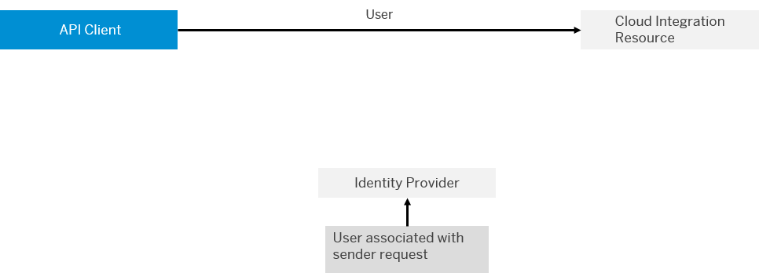

<!-- loio57f104d5b6064720bdca826c6698d34c -->

# Basic Authentication of an IdP User for API Clients

Using this option, the API client is authenticated based on user credentials associated with a user registered at an identity provider \(IdP\).

> ### Note:  
> This information is relevant only when you use SAP Cloud Integration in the Cloud Foundry environment.

> ### Caution:  
> This authentication option is supported for compatibility reasons.
> 
> However, it is not recommended to use this option for API calls in productive environments.
> 
> Therefore, if possible, use one of the other supported authentication options:
> 
> -   [Client Certificate Authentication for API Clients](client-certificate-authentication-for-api-clients-d9ca0ac.md)
> 
> -   [OAuth with Client Credentials Grant for API Clients](oauth-with-client-credentials-grant-for-api-clients-20e26a8.md)

> ### Caution:  
> This authentication option can’t be used when operating SAP Cloud Integration on Alibaba Cloud.
> 
> On Alibaba Cloud, SAP ID service isn't used as default IdP. Therefore, also basic authentication with SAP ID Service can't be used on Alibaba Cloud.

> ### Note:  
> When setting up trust relationships in SAP BTP cockpit, in most cases *SAP ID service* is used as default identity provider. However, you've the option to define a custom IdP as your default IdP.
> 
> If you like to use SAP Identity Authentication Service as custom IdP, you've to make this IdP as your default IdP. To do that, perform the steps described at [Setting Up SAP Identity Authentication Service as Custom IdP for Basic Authentication, Cloud Foundry Environment](setting-up-sap-identity-authentication-service-as-custom-idp-for-basic-authentication-clo-0668507.md).

The following figure shows the components and the involved security artifacts:

Using SAP BTP cockpit, assign to the user a role that is to be used to authorize the API client to call the OData API. Which role you assign, depends on the Cloud Integration resource you like to access through the API. For more information, see [API Details](../Development/api-details-014d6ad.md).

In detail, perform the following steps.

1.  Using SAP BTP cockpit, select your subaccount.

2.  Go to *Security* \> *Role Collections*.

3.  Click the *\+* icon to create a new role collection.

4.  Specify a role collection name \(for example, `MonitoringAPI`\).

    Let's assume that you want to access monitoring information with the OData API \(using the `MessageProcessingLogs` resource\).

5.  Choose *Create*.

6.  Select the newly created role collection.

7.  Click *Edit*.

8.  In the *Role Name* drop down list, select the role you like to assign.

    Assign a role that grants permission to access certain data through the API. In our example, we want to access monitoring data through the API, so we select the predefined *MonitoringDataRead* role.

    For more information about the available predefined roles, see [Tasks and Permissions](../SecurityNeo/tasks-and-permissions-556d557.md).

    > ### Tip:  
    > Make sure you select a role with an application identifier that starts with `it!`.
    > 
    > The *Application Identifier* parameter identifies the SAP BTP application.
    > 
    > Note that remote components can connect to Cloud Integration at different levels, where the level is expressed by different application identifiers.
    > 
    > -   To configure access to Cloud Integration resources as a dialog user \(designing integration flows. for example\) or an API client, you connect the remote system to an application with an *Application Identifier* starting with `it!`.
    > 
    > -   To configure access to Cloud Integration runtime resources \(integration flows\) from a sender, you need to connect the sender to an `it-rt` application.

9.  Choose *Add*.

    Repeat to add more roles to the role collection, if desired.

10. Choose *Save*.

11. Go to *Security* \> *Users*.

12. Select the user for which you like to grant API access.

13. Under *Role Collections*, select *...* \> *Assign Role Collection*.

14. Select the role collection that you've created in the previous steps.

15. Choose *Assign Role Collection*.

You can now call the resource of the OData API from an API client using the credentials of the IdP user. For more information on the address of the API call, see [HTTP Calls and URI Components](../Development/http-calls-and-uri-components-ca75e12.md).

