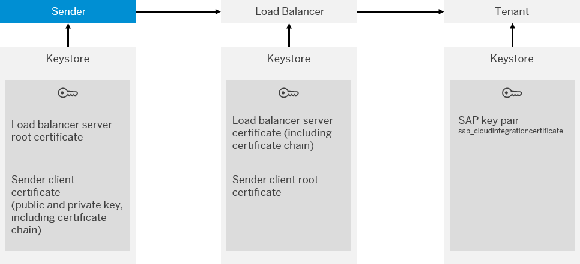

<!-- loio4ec61924d4464473a92eb3e78c8a0ae2 -->

# Client Certificate Authentication \(Inbound\), Cloud Foundry Environment

Authentication of a sender is performed based on a client certificate. At runtime, the system checks if a service key is available that contains the client certificate provided by the sender. If a service key is available, the system then checks if the associated service instance has a role specified that grants permissions to call the integration flow endpoint.

> ### Note:  
> This information is relevant only when you use SAP Cloud Integration in the Cloud Foundry environment.

<a name="loio4ec61924d4464473a92eb3e78c8a0ae2__section_bxj_nvk_zsb"/>

## How it Works

The following figure shows the involved components and digital keys. For more information on the tenant keystore that comes with Cloud Integration, see [Keystore](keystore-b163513.md).

The table provides an overview of the required digital keys and their purpose in the authentication process, and summarizes the required configuration steps. Note that when setting up secure communication of different systems, typically administrators associated with the different systems need to accomplish configuration tasks in a coordinated way and to exchange public keys.

> ### Note:  
> For inbound HTTP connections, a load balancer component connects the remote sender system and the Cloud Integration tenant.
> 
> The load balancer terminates each inbound Transport Layer Security \(TLS\) request and establishes a new one for the connection to the tenant where the message is processed.

<table>
<tr>
<th valign="top">

Security Artifact

</th>
<th valign="top">

Used to ...

</th>
<th valign="top">

Configuration Steps

</th>
</tr>
<tr>
<td valign="top">

Load balancer server root certificate

</td>
<td valign="top">

Make the sender trust the load balancer.

</td>
<td valign="top">

Sender administrator:

Get certificate using the SAP Cloud Integration *Connectivity Test* \(pointing to endpoint address of integration flow\).

</td>
</tr>
<tr>
<td valign="top">

Load balancer server certificate \(including certificate chain\)

</td>
<td valign="top">

Qualify load balancer as trusted component \(for senders that like to connect to it\).

</td>
<td valign="top">

No action required as this artifact is maintained by the operator of the cloud infrastructure.

</td>
</tr>
<tr>
<td valign="top">

Sender client certificate

\(public and private key, including certificate chain\)

</td>
<td valign="top">

Authorize sender to call integration flow.

At runtime, system checks if there's a service key that contains a client certificate that matches client certificate provided with the sender's request.

</td>
<td valign="top">

Tenant administrator:

Create service instance \(using SAP BTP cockpit\) and generate service key.

Add sender client certificate \(provided by sender administrator\) to service key.

This key pair is to be signed by a CA supported by the load balancer. Only root certificates are being imported into the load balancer keystore. Therefore, the whole certificate chain must be assigned to the certificate to enable the connected component to evaluate the chain of trust.

</td>
</tr>
<tr>
<td valign="top">

Sender client root certificate

</td>
<td valign="top">

Sign sender client certificate.

</td>
<td valign="top">

Sender administrator:

Get sender client certificate signed by a certificate authority \(CA\) supported by the load balancer. The root certificates supported by the load balancer are listed at [Load Balancer Root Certificates Supported by SAP](load-balancer-root-certificates-supported-by-sap-4509f60.md).

</td>
</tr>
<tr>
<td valign="top">

SAP key pair \(alias: *sap\_cloudintegrationcertificate*\)

\(not available on trial tenant\)

</td>
<td valign="top">

Enable internal communication between involved SAP BTP microservices.

</td>
<td valign="top">

No action required - this key pair is preinstalled and maintained by SAP.

> ### Note:  
> This key pair is **not** preinstalled when you operate a Cloud Integration trial tenant. Therefore, client certificate inbound authentication is not supported for trial.

</td>
</tr>
</table>

When defining the service key, the tenant administrator also specifies the role to be used to authorize the sender to call integration flow endpoint. You can either specify the predefined role `ESBMessaging.send` or a custom role.

> ### Tip:  
> Based on this setup of keys, the communication is established at runtime in the following way:
> 
> The sender connects to the load balancer and verifies the load balancer certificate. On the other way round, the load balancer verifies if the certificate sent by the sender system is valid. It's important that the client certificate installed on the sender system is signed by a certificate authority that is supported by the load balancer.
> 
> If the check is successful, the system checks if a service key is available that contains the sender’s client certificate. If that is the case, the role specified for the associated service instance is checked. If this role is identical to the one specified in the sender adapter of the integration flow endpoint \(addressed by the request\), the message can be processed.

For more information, check out this SAP Community blog: [Cloud Integration on CF – How to Setup Secure HTTP Inbound Connection with Client Certificates](https://blogs.sap.com/2019/08/14/cloud-integration-on-cf-how-to-setup-secure-http-inbound-connection-with-client-certificates/).

For more information on how to set up this option, see [Client Certificate Authentication for Integration Flow Processing](client-certificate-authentication-for-integration-flow-processing-7f84d16.md).

