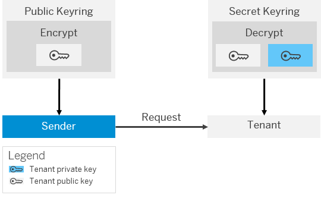

<!-- loiob69f6c65bec24124afef07d394da4fb3 -->

# Creating PGP Keys for Decryption \(Tenant Is Receiver\)

## Prerequisites

You have installed gpg4win, created the tenant-specific directory, and created a key pair.

## Context

For this use case, the following key artifact has to be deployed on the tenant:

A **PGP Secret Keyring** that contains the **tenant's** private key \(required by the tenant to decrypt the payload\)

The following figure shows the required entities to be configured for the tenant \(on the right\).

## Procedure

Start the GPA tool and create a new key.

This action creates a PGP Secret Keyring containing a private/public key pair.

## Next Steps

Deploy the **PGP Secret Keyring** on the tenant.

**Related Information**  

[Installing gpg4win](installing-gpg4win-b55c025.md "We recommend that you use gpg4win to create OpenPGP key material.")

[Creating Tenant-Specific File Directories](creating-tenant-specific-file-directories-8cd3232.md "A PGP Secret Keyring and a PGP Public Keyring have to be maintained for each tenant that uses OpenPGP. The GPA tool cannot maintain several PGP Secret or Public Keyrings at the same time. Therefore, you have to create a separate directory for each tenant, where you have to configure GPA and the launching of GPA separately (otherwise, keys from different tenants will be stored in the same keyring).")

[Starting the GPA Tool](starting-the-gpa-tool-a3e8e13.md "Start the GPA tool to manage keys.")

[Creating a Key Pair](creating-a-key-pair-bb416c5.md "")

[Securely Exchanging Key Material](securely-exchanging-key-material-908d93e.md "In many cases, communication partners need to exchange public keys in order to establish a secure connection.")

