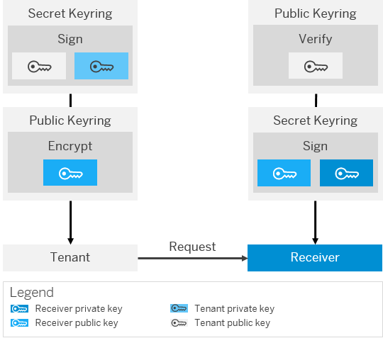

<!-- loioa05a142ac12b4a4fbca5b62a32f967fd -->

# Creating PGP Keys for Encryption and Signing \(Tenant Is Sender\)

## Prerequisites

You have installed gpg4win, created the tenant-specific directory, and created a key pair.

## Context

For this use case, the following key artifacts have to be deployed on the tenant:

-   A **PGP Secret Keyring** that contains the tenant's private key \(required by the tenant to sign the payload\)
-   A **PGP Public Keyring** that contains the **receiver’s** public key \(required by the tenant to encrypt the payload\)

The following figure shows the required entities to be configured for the tenant \(on the left\).

## Procedure

1.  Start the GPA tool and create a new key.

    This action creates a PGP Secret Keyring containing a private/public key pair.

2.  Obtain the public key from the receiver.

    We recommend using a secure channel \(for example, encrypted email\) for this information exchange.

3.  Import the receiver's public key into the PGP Public Keyring.

4.  If a secure channel was not used to obtain the public key from the receiver, verify the fingerprint of the public key.

5.  Export the public key from the tenant's PGP Public Keyring.

6.  Provide the receiver with the public key \(ideally through a secure channel\).

    The receiver has to import the tenant's public key into its PGP Public Keyring.

## Next Steps

Deploy the **PGP Public Keyring** and the **PGP Secret Keyring** on the tenant.

**Related Information**  

[Installing gpg4win](installing-gpg4win-b55c025.md "We recommend that you use gpg4win to create OpenPGP key material.")

[Creating Tenant-Specific File Directories](creating-tenant-specific-file-directories-8cd3232.md "A PGP Secret Keyring and a PGP Public Keyring have to be maintained for each tenant that uses OpenPGP. The GPA tool cannot maintain several PGP Secret or Public Keyrings at the same time. Therefore, you have to create a separate directory for each tenant, where you have to configure GPA and the launching of GPA separately (otherwise, keys from different tenants will be stored in the same keyring).")

[Starting the GPA Tool](starting-the-gpa-tool-a3e8e13.md "Start the GPA tool to manage keys.")

[Creating a Key Pair](creating-a-key-pair-bb416c5.md "")

[Importing a Public Key](importing-a-public-key-651b1c5.md "You can import public keys provided by your communication partner.")

[Exporting the Public Key](exporting-the-public-key-2b39fe1.md "Export a public key in order to make it available for your communication partner (sender or receiver).")

[Securely Exchanging Key Material](securely-exchanging-key-material-908d93e.md "In many cases, communication partners need to exchange public keys in order to establish a secure connection.")

