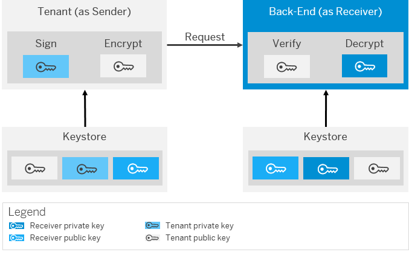
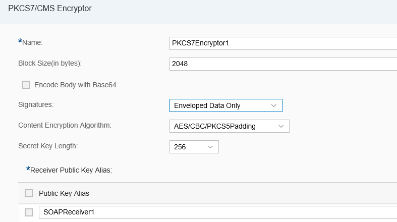

<!-- loio57b2b199a17a49f1844bba06076f4be1 -->

# Outbound: Message-Level Security With PKCS\#7, XML DigitalSignature

On top of a secure transport channel \(for example, based on HTTPS\), you have the option to implement message-level security capabilities. That way, you can protect the message by applying digital signing or encryption. Asymmetric key technology is used in the following way to implement these features:

**Keys for Message-Level Security**

<table>
<tr>
<th valign="top">

Key Type

</th>
<th valign="top">

Usage

</th>
</tr>
<tr>
<td valign="top" rowspan="2">

**Private key** 

</td>
<td valign="top">

Used by a sender to sign a message

</td>
</tr>
<tr>
<td valign="top">

Used by a receiver to decrypt a message \(that has been encrypted by a sender\)

</td>
</tr>
<tr>
<td valign="top" rowspan="2">

**Public key** 

</td>
<td valign="top">

Used by a receiver to verify a message \(signed by a sender\)

</td>
</tr>
<tr>
<td valign="top">

Used by a sender to encrypt a message

</td>
</tr>
</table>

In the outbound case, the tenant acts as sender that either encrypts or signs a message.

To implement message-level security for standards PKCS\#7, WS-Security, and XML Digital Signature, you use X.509 certificates \(the same type of certificates as used for HTTPS-based transport-level security\). However, note that different keys are usually used for message-level security and SSL transport-level security. XML Digital Signature supports only use cases for signing and verifying messages.

## Configuring the Receiver

Configure the receiver keystore in the following way:

-   Generate a key pair \(and get it signed by a CA\).

-   Import the tenant public key into the receiver keystore.

Provide the tenant administrator with the public key \(is used to encrypt messages sent to the receiver\).

<a name="loio57b2b199a17a49f1844bba06076f4be1__section_sqk_d2t_5bb"/>

## Configuring the Integration Flow Steps for Message-Level Security

Depending on the desired option, configure the security-related integration flow steps.

-   Configure the **Encryptor** \(PKCS7\) step.

    Specify the *Public Key Aliases* in order to select the relevant key from the tenant keystore. In case you have selected *Signed and Enveloped Data* \(as *Signatures*\), you also need to specify the *Private Key Alias* to select the relevant private key for signing.

-   Configure the **Signer** \(PKCS7 or XML Digital Signer\) step.

    Make sure that you specify the *Private Key Aliases* to select the desired keys from the keystore.

In general, an alias is a reference to an entry in a keystore. A keystore can contain multiple public keys. You can use an alias to refer to and select a specific key from a keystore \(as shown for the Signer step in the figure below\).

**Related Information**  

[How PKCS\#7 Works](how-pkcs-7-works-21325d5.md "You have the option to sign and encrypt message payloads based on PKCS#7/CMS Enveloped Data and Signed Data (PKCS stands for Public Key Cryptography Standards).")

[How XML Signature Works](how-xml-signature-works-9857d50.md "A digital signature ensures the authenticity of a message that way that it guarantees the identity of the signer and that the message was not altered after signing. You have the option to digitally sign and validate a message based on the XML Signature standard (issued by the W3C consortium). Applying this standard means that the digital signature of a document itself is stored as an XML element.")

[How WS-Security Works](how-ws-security-works-2f9a038.md "Messages can be protected according to the WS-Security standard.")

[Creating Keys for the Usage of PKCS\#7, XML Digital Signature and WS-Security](creating-keys-for-the-usage-of-pkcs-7-xml-digital-signature-and-ws-security-6f43916.md "To set up message level security scenarios based on PKCS#7, XML Digital Signature or WS-Security, the required keys are created in the same way as for transport level security HTTPS.")

[Sign the Message Content with PKCS\#7/CMS Signer](../Development/sign-the-message-content-with-pkcs-7-cms-signer-cc09e03.md "")

[Encrypt and Sign the Message Content with PKCS\#7/CMS Encryptor](../Development/encrypt-and-sign-the-message-content-with-pkcs-7-cms-encryptor-21fd211.md "")

