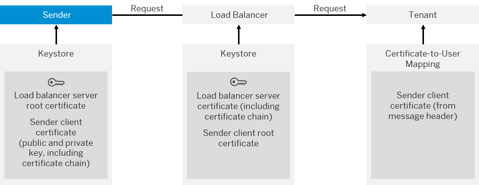

<!-- loio057f4a757c9d4b23b55e3a2310620462 -->

# Setting Up Inbound HTTP Connections \(with Client Certificate Authentication\), Neo Environment

Using this option, authentication of a sender is performed based on a client certificate \(which is specified in the sender channel of the integration flow\).

## Context

> ### Note:  
> This information is relevant only when you use SAP Cloud Integration in the Neo environment.

> ### Note:  
> This option is secure but not recommended when compared to the usage of certificate-to-user mapping \(see [Setting Up Inbound HTTP Connections \(with Certificate-to-User Mapping\), Neo Environment](setting-up-inbound-http-connections-with-certificate-to-user-mapping-neo-environment-9949c61.md)\). The reason: Each certificate change requires downtime because certificate is specified as part of the integration flow.

The following figure shows the involved components and digital keys.

The table summarizes the required security artifacts required to set up this inbound authentication scenario and the configuration steps to be accomplished by the integration developer/tenant administrator and the administrator of the involved sender system.

**Certificates for Inbound Message Processing**

<table>
<tr>
<th valign="top">

Security Artifact

</th>
<th valign="top">

Used at runtime to ...

</th>
<th valign="top">

Configuration Steps

</th>
</tr>
<tr>
<td valign="top">

Load balancer server root certificate

</td>
<td valign="top">

Make the sender trust the load balancer.

</td>
<td valign="top">

Sender administrator:

Get certificate using the Cloud Integration *Connectivity Test* \(pointing to endpoint address of integration flow\).

</td>
</tr>
<tr>
<td valign="top">

Load balancer server certificate \(including certificate chain\)

</td>
<td valign="top">

Qualify load balancer as trusted component \(for senders that like to connect to it\).

</td>
<td valign="top">

No action required as this artifact is maintained by the operator of the cloud infrastructure.

</td>
</tr>
<tr>
<td valign="top">

Sender client certificate

\(public and private key, including certificate chain\)

</td>
<td valign="top">

Authorize sender to call integration flow.

At runtime, system checks if client certificate provided by the sender is associated with integration flow endpoint.

Furthermore, system checks the permissions of the sender by evaluating the certificate's subject/issuer distinguished name.

</td>
<td valign="top">

Tenant administrator:

Specifies the sender client certificate in the sender channel of the integration flow.

This key pair is to be signed by a CA supported by the load balancer. Only root certificates are being imported into the load balancer keystore. Therefore, the whole certificate chain must be assigned to the certificate to enable the connected component to evaluate the chain of trust.

</td>
</tr>
<tr>
<td valign="top">

Sender client root certificate

</td>
<td valign="top">

Sign sender client certificate.

</td>
<td valign="top">

Sender administrator:

Get sender client certificate signed by a certificate authority \(CA\) supported by the load balancer. The root certificates supported by the load balancer are listed at [Load Balancer Root Certificates Supported by SAP](load-balancer-root-certificates-supported-by-sap-4509f60.md).

</td>
</tr>
</table>

## Procedure

1.  Configure the sender system.

    1.  Make sure that the sender keystore contains the root certificate of the load balancer server certificate.

        Get this certificate using the Cloud Integration *Connectivity Test* \(pointing to the integration flow endpoint address\). From downloaded`.zip` file, select the `*.cer` file of the root certificate and import this into the sender system keystore.

        More information: [Using the Connectivity Test to Get the Load Balancer Server Root Certificate](using-the-connectivity-test-to-get-the-load-balancer-server-root-certificate-5d6cbf4.md)

    2.  Make sure that the sender keystore contains a client certificate that is signed by one of the CAs supported by the load balancer.

    More information: [Load Balancer Root Certificates Supported by SAP](load-balancer-root-certificates-supported-by-sap-4509f60.md)

2.  Configure client certificate authorization for the related integration flow endpoint.

    1.  Create a new integration flow or open an existing integration flow.

    2.  Open the integration flow and click the connection for the associated sender adapter.

    3.  Select *Client Certificate* as the *Authorization*.

    4.  Choose *Add*.

    5.  Choose *Select* and browse to the sender client certificate \(for example, `<UserID>.crt`\) from your local file system \(or enter the *Subject DN* \(information used to authorize the sender\) and *Issuer DN* \(information about the Certificate Authority that issues the certificate\) manually\).

**Related Information**  

[Client Certificate Authentication \(Inbound\), Neo Environment](client-certificate-authentication-inbound-neo-environment-c1eeeab.md "This option includes an authentication step based on a digital client certificate.")

[Load Balancer Root Certificates Supported by SAP](load-balancer-root-certificates-supported-by-sap-4509f60.md "The load balancer supports a certain list of root certificates.")

[Blog: Cloud Integration – How to Setup Secure HTTP Inbound Connection with Client Certificates](https://blogs.sap.com/2017/06/05/cloud-integration-how-to-setup-secure-http-inbound-connection-with-client-certificates/)

