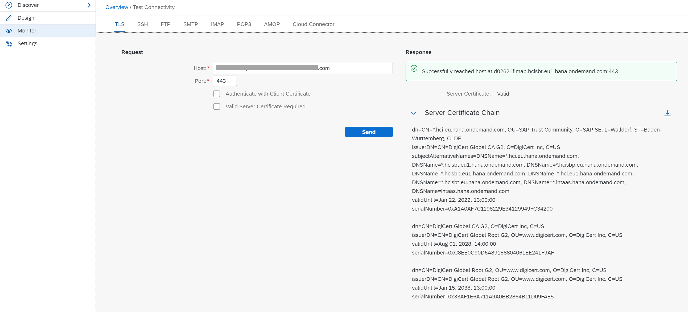

<!-- loio5d6cbf43cd9c4a0a8f9503152c8cc2c5 -->

# Using the Connectivity Test to Get the Load Balancer Server Root Certificate

You can use the outbound connectivity test to get the load balancer server root certificate \(which maybe required to set up inbound HTTP communication\).

1.  Open the SAP Cloud Integration *Monitor* section.
2.  Under *Manage Security* select the *Connectivity Tests* tile.

3.  Choose *TLS*.

4.  As *Host* enter the address of the worker node.

    You need to enter the worker node URL, as the sender system is supposed to connect to the worker node \(through the load balancer component\).

    > ### Note:  
    > To get this address, open the *Monitor* section and click a tile under *Manage Integration Content*. Select a deployed integration flow that has an HTTP-based sender adapter \(for example, an HTTPS sender adapter\) and copy the URL displayed under *Endpoints*.
    > 
    > Delete the part after the backslash \(/\). The worker node URL has the following form \(example\):
    > 
    > `mytenant-iflmap.hcisbt.eu1.hana.ondemand.com`

5.  Deselect the option *Validate Server Certificate* and run the test.

    

6.  Choose the *Downoad server certificates* icon.

    A `.zip` file is created and stored on your computer.

7.  Extract the `.zip` file.

    From the extracted files \(with file extension `.cer`\) you need to use the root certificate.

