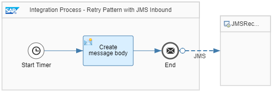
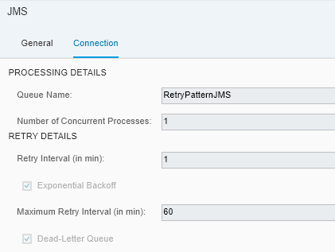

<!-- loioda17d2d9ef1e4387b31787cd2b454f63 -->

# Apply the Retry Pattern with JMS Queue

SAP Cloud Integration offers storage to persist data in transit during message processing, namely the message queue storage used by the JMS adapter. Use this storage to persist the message at the beginning of the processing sequence. That way, processing is executed faster for the sender, who immediately receives a response with HTTP code 202 \(Accepted\), and the subsequent processing steps are executed asynchronously.

> ### Note:  
> Note that this option is only available if you have purchased the Enterprise Edition.

With this storage option, a retry mechanism is also in place that works as follows: If message processing fails due to a temporary error when calling an external component, the storage can be used to persist the failed messages. The JMS adapter polls the storage regularly for content, and triggers the reprocessing of the respective messages.

The integration flows *Relax Dependencies - Apply Retry Pattern - JMS Outbound* and *Relax Dependencies - Apply Retry Pattern - JMS Inbound* illustrate a simple retry scenario with a JMS queue.

In this scenario, the sending of the asynchronous inbound message is simulated by a Timer start event that triggers the first inbound integration flow on deployment.

A Content Modifier step creates a simple message with only 1 element for the productId:

*<root\><productId\>HT-8002</productId\></root\>*

The inbound integration flow then stores this message in a JMS queue using the JMS receiver adapter:

An associated 2nd outbound integration flow has the following structure:

This outbound integration flow performs the following steps:

1.  It reads the message from the JMS queue through the JMS sender adapter. The name of the JMS queue is identical to the name configured in the JMS receiver adapter of the inbound integration flow.

2.  A Content Modifier step \(in the *Exchange Property* tab\) creates a property for the `productId` value provided with the message body.

    In the *Header* tab, a *context* header is created that defines the context for the generic receiver \(as a constant: `RelaxDependencies-RetryJMS`\). Based on this setting, a data store with this name is created that simulates the receiver of this scenario.

3.  The OData receiver channel calls the WebShop component and reads details for the product with the provided `productId` value.

4.  The ProcessDirect receiver adapter sends the message to the generic receiver integration flow \(*GenericReceiver* as described in [How to Work with the Example Integration Flows](how-to-work-with-the-example-integration-flows-03e6959.md)\).

In the *Runtime Configuration* tab, the *context* header is specified to make sure it's propagated to the *GenericReceiver* integration flow.

If no error occurs during message processing, the inbound message is stored in the JMS queue and consumed from there.

To showcase the retry in error situations, you can proceed as follows:

1.  Incorporate an error, for example by editing the outbound integration flow and entering a wrong address for WebShop \(in the OData receiver adapter\). Then deploy the outbound integration flow again.

2.  Deploy the inbound integration flow to simulate sending the inbound message.

3.  Check what happens during message processing:

    -   If an error occurs, Cloud Integration retries the message from the JMS queue. When you open the *Operations* view, and select the *Monitor Message Processing* section. The status of the corresponding integration flow is *Retry*.

    -   You can also check the content of the message queue by clicking the *Message Queues* tile under *Manage Stores*. As long as the problem isn't fixed, the entry of the queue \(configured in the JMS sender and receiver adapter\) is in status *Failed*.

4.  After some time, simulate the fix of the error by editing the outbound integration flow and entering the correct settings in the outbound integration flow. Deploy the outbound integration flow. You don't need to redeploy the inbound integration flow \(you don't need to retrigger the inbound message processing\).

5.  Check the entries in the *Monitor Message Processing* section to find the message in status *Completed*. You can also find the expected message in the data store.

To configure the retry behavior, the JMS sender adapter provides a set of attributes:

-   *Retry Interval*

    The time after which the first retry is executed

-   *Exponential Backoff*

    Allows you to avoid too many retries in a short time by doubling the retry interval after each unsuccessful retry.

-   *Maximum Retry Interval*

    Allows you to specify the maximum amount of time to wait before retrying message delivery \(to avoid an uncontrolled increase of the retry interval in case *Exponential Backoff* is activated\).

-   *Dead-Letter Queue* 

    Enables Cloud Integration to take a message out of processing and mark it as *Blocked* in the queue if the respective message caused two worker node crashes.

**Related Information**  

[JMS Adapter](jms-adapter-0993f2a.md "You configure the JMS adapter to enable asynchronous messaging using message queues.")

