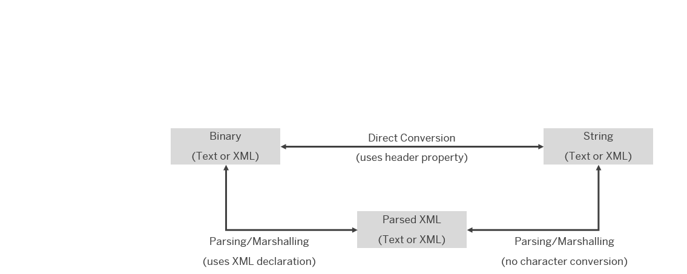

<!-- loio083c971d418c44848d45b865eafe5b4c -->

# Character Encodings: Background Information

When configuring integration flows, you are usually dealing with the following kinds of data representations:

## Binary Data

There is always some loss of data when binary data is converted into strings. You should therefore avoid converting pure binary data to strings.

## Text Data

Text data can be represented in binary or string form. In order to convert string representation to binary representation and the other way round,, the desired \(or existing\) binary encoding needs to be known.

The integration framework uses the following scheme to determine the type of character encoding:

1.  If the header `CamelCharsetName` is set, the value of this header is used as the character encoding.

2.  If the exchange property `CamelCharsetName` is set, the value of this exchange property is used as the character encoding.

3.  If neither the header nor the exchange property are defined, **UTF-8** is used as the character encoding.

There is no universal way to determine the correct encoding for the data. However, for some communication protocols \(such as mail or HTTP\) this information may be transferred via the protocol header.

The integration developer needs to make sure that the character encoding that is defined by the header or exchange property and the binary content encoding are in sync. Otherwise, subtle, hard-to-solve issues can occur. These issues often aren't revealed by testing, as they usually only occur with non-ASCII characters.

## XML Data Conversions

There are three type of representation for XML data:

-   Serialized binary representation of the XML document

-   Serialized string representation of the XML document

-   Parsed \(binary\) representation of the XML document

    This representation is used for operations such as XPath or XSLT processing.

XML documents usually contain information about the character encoding in serialized form within the XML declaration \(at the beginning of the XML document\).

However, note that this XML declaration is irrelevant if string representation is used for the document. If the XML document is parsed from or marshaled \(serialized\) to binary representation, the charset definition \(and the byte order marker \(BOM\)\) are used to determine the content encoding.

If no encoding is defined, **UTF-8** is assumed \(unless a BOM is present when it is UTF-16\).

> ### Caution:  
> The conversion between the parsed and the serialized form works fine without any configuration and has a mechanism to determine and use the correct character set for the conversion. However, issues can occur when converting directly between the two serialized forms \(binary and string\). This conversion is not XML-specific and uses the scheme for text data. This conversion will actually damage the content of the document if the character encoding used in Camel does not match the character encoding used in the XML document.
> 
> The following figure illustrates this.

If a conversion between binary XML and parsed XML takes place, the encoding that is defined in the XML declaration is used as the character encoding in the XML document. If it is converted to a string first, the encoding defined in the `CamelCharsetName` header or property is used. If these values do not match, conversion via a string might break the document.

Conversions between binary and string \(highlighted in the figure\) generally require attention from the integration developer because there is no generic way to determine the character encoding of the binary text or XML content \(and the integration developer must be sure to set the correct value there\).

XSLT sheets can change the content encoding of the XML document if they convert XML to XML. In this case, the output encoding will either be defined by the XSLT or it will be UTF-8, even if the input document has a different encoding. If direct binary-to-string conversion takes place before and after the XSLT, the integration developer has to make sure that the `CamelCharsetName` property or header is defined appropriately.

