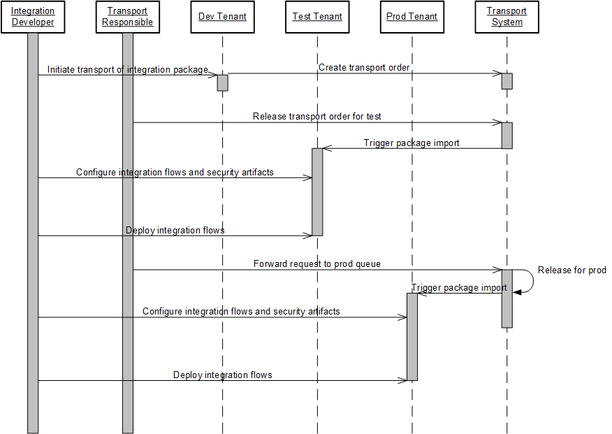

<!-- loio1ca3d1e0b6ba4b84a27bb99a83b06101 -->

# Content Transport - Sequence of Steps \(Example\)

There are the following prerequisites:

-   The tenant administrator of the source system has configured the transport mode \(SAP Cloud Integration under *Settings*\).

-   The integration developer has granted the required transport permissions \(see [Guidelines on Role Assignments](guidelines-on-role-assignments-fc409e8.md)\).

The following diagram shows a typical sequence of steps when transporting integration content. We assume that content is transported first from a dev tenant to a test tenant and from there to the prod tenant.

1.  The integration developer initiates transport of the desired integration package by creating a transport order in the transport system.

2.  The transport responsible logs in to the transport system and releases the request in the test node queue.

3.  Once the package is imported on the test tenant, the integration developer configures the integration flows and deploys them on the test tenant. If necessary, the integration developer also configures and deploys the associated security artifacts.

4.  If the request is to go to production, the transport responsible forwards transport to production node queue.

5.  Either manually or by means of a job, the request is imported in the production node.

6.  The integration developer configures the integration flows and deploys them \(on the prod tenant\). If necessary, the integration developer also configures and deploys the associated security artifacts.

