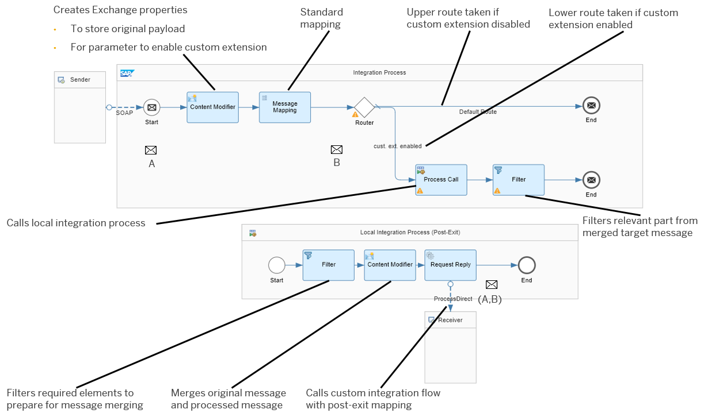

<!-- loio4da82ad0af254282bf380fb0b69df521 -->

# Creating the Standard Integration Flow

> ### Note:  
> This section is targeted at the content publisher at SAP or an SAP partner organization.

The standard integration flow is depicted in the following figure, where the key elements are highlighted.

This is a summary of the elements of the integration flow. Check out the detailed topics below to find out how to design these shapes.

-   Sender and SOAP sender adapter

    The sender is simulated by using a SOAP client that calls the integration flow endpoint using the SOAP 1.x sender adapter. The SOAP client sends message A to SAP Cloud Integration.

-   Content Modifier

    This step performs the following tasks:

    -   Stores the body of the inbound message in an exchange property \(`originalpayload`\).

    -   Creates another exchange property `custom_extension_enabled`, which is used in the subsequent routing step to separate message processing depending on whether the custom extension is activated or not.

        We show how to externalize this parameter so that you can easily specify its value during the integration flow configuration without having to redesign the integration flow.

-   Message Mapping

    This step defines the standard mapping according to [Standard Mapping](standard-mapping-56c3bf5.md).

-   Router

    The Router step leads to two different message processing paths. The routing conditions are expressed using the exchange property `custom_extension_enabled` in the following way:

    -   Default route: Ends message processing without any further message processing.

    -   Route taken if the following condition is met: `custom_extension_enabled=true`

        This message processing path contains a Process Call step, which calls the local integration process \(post-exit\).

        After the Process Call step, a filter is added. This step filters the relevant parts from the message that is received from the post-exit integration flow.

The local integration process has the following elements:

-   Filter

    This step filters the elements from message B \(which is the result of the standard mapping step\) that are needed in the merged message \(A,B\), which is to be sent to the post-exit integration flow. This step is used to prepare the content of message B before it is merged with the original message A in the subsequent Content Modifier step.

-   Content Modifier

    Merges message A and message B by constructing a new message body using dynamic expressions for the original message A and the processed message B.

-   Request-Reply step connected through ProcessDirect adapter with receiver

    Uses the ProcessDirect receiver adapter to call the custom integration flow.

    At runtime, the target integration flow is called based on the endpoint address configured in the adapter. You will learn how to externalize this parameter.

The integration flow does not have a receiver component. The result of the mapping can be analyzed in the response that is sent back to the SOAP client.

**Related Information**  

[Configure the SOAP \(SOAP 1.x\) Sender Adapter](configure-the-soap-soap-1-x-sender-adapter-a178913.md "The SOAP (SOAP 1.x) sender adapter enables a SAP BTP tenant to exchange messages with a sender system that supports Simple Object Access Protocol (SOAP) 1.1 and 1.2.")

[Defining the Content Modifier](defining-the-content-modifier-a51751f.md "")

[Defining the Standard Message Mapping](defining-the-standard-message-mapping-c0e0f6d.md "")

[Defining the Local Integration Process](defining-the-local-integration-process-88faa5c.md "")

[Defining the Router, Process Call, and Filter Steps](defining-the-router-process-call-and-filter-steps-6e5b9f6.md "")

