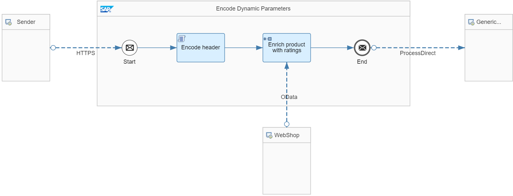

<!-- loiod2783509c0d24e5caaa443f024573410 -->

# Encode Dynamic Parameters

Make sure that dynamic parameters using external data are encoded.


<a name="loiod2783509c0d24e5caaa443f024573410__section_wf2_54l_yjb"/>

## Use Case

SAP Cloud Integration expects external data \(for example, in the payload or the header of the inbound message\). This data is used to specify a dynamic parameter \(for example, to define a query in a subsequent HTTP request\).

If not encoded, such data can potentially be used as a gateway for attackers who try to break out of the intended scope of the parameter.

> ### Note:  
> The same caution has to be observed in all adapters and integration flow steps that support dynamic configuration.
> 
> More information: [Parameters That Support Dynamic Configuration](parameters-that-support-dynamic-configuration-c9bba0e.md)
> 
> Depending on the usage of the dynamic parameter, other encoding methods can become necessary.
> 
> For general considerations on injection prevention, see:
> 
> -   [https://cheatsheetseries.owasp.org/cheatsheets/Injection\_Prevention\_Cheat\_Sheet.html](https://cheatsheetseries.owasp.org/cheatsheets/Injection_Prevention_Cheat_Sheet.html)
> 
> -   [https://cheatsheetseries.owasp.org/cheatsheets/Injection\_Prevention\_Cheat\_Sheet\_in\_Java.html](https://cheatsheetseries.owasp.org/cheatsheets/Injection_Prevention_Cheat_Sheet_in_Java.html)
> 
> 
> In particular, for encoding URL parameters also see:
> 
> -   [https://www.w3schools.com/tags/ref\_urlencode.asp](https://www.w3schools.com/tags/ref_urlencode.asp)
> 
> -   [https://cheatsheetseries.owasp.org/cheatsheets/Cross\_Site\_Scripting\_Prevention\_Cheat\_Sheet.html\#rule-5---url-escape-before-inserting-untrusted-data-into-html-url-parameter-values](https://cheatsheetseries.owasp.org/cheatsheets/Cross_Site_Scripting_Prevention_Cheat_Sheet.html#rule-5---url-escape-before-inserting-untrusted-data-into-html-url-parameter-values)


<a name="loiod2783509c0d24e5caaa443f024573410__section_eh3_v4l_yjb"/>

## Implementation

To avoid such misuse, encode the data when received from a sender.

You can encode data using JavaScript or Groovy Script defined in a Script step.

The *Apply Security - Encode Dynamic Parameters* integration flow shows how to implement this guideline.



The integration flow expects an inbound message with the header *rating*.

The Script step contains a Groovy Script with the following content:

> ### Sample Code:  
> ```
> import com.sap.gateway.ip.core.customdev.util.Message
> import java.nio.charset.StandardCharsets
> 
> def Message processData(Message message) {
>        //Headers 
>        def map = message.getHeaders()
>        def rating = map.get("rating")
>        // encode header, which shall be used in OData query as parameter
>        if (rating!=null) {
>            rating = URLEncoder.encode(rating,StandardCharsets.UTF_8.name())
>            message.setHeader("rating", rating)
>        }
>        return message
> }
> ```

This script encodes the header *rating*.

In the subsequent OData call to the WebShop component, the value of this header is used to filter the result of the request.

In the OData receiver channel, the following filter criteria is specified in order to get entries for ratings less than or equal to the rating given in the header of the HTTP request:

`$filter=Rating le ${header.rating}`

> ### Note:  
> The Postman collection contains an example request *EncodeDynamicParameters\_OffensiveHeader*, where the rating header is set to*5&$expand=Product*. Without encoding, this header reveals the content of the product entity, which isn't intended. With encoding, this request results in an error, because *5&$expand* isn't a valid number.

