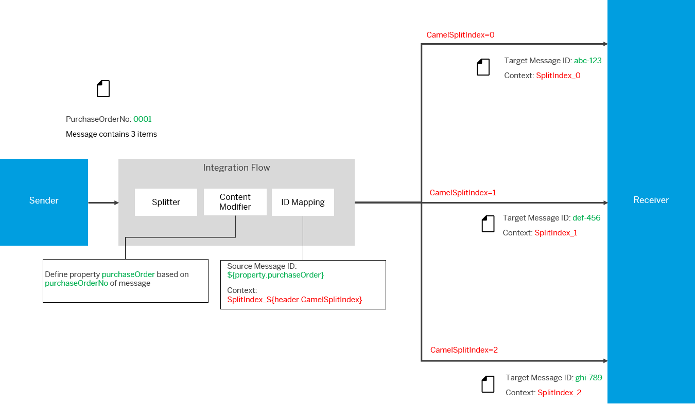

<!-- loio581ecfcb530848b9bc58c70a887553dc -->

# ID Mapping Example

Assume that your integration scenario splits a message associated with a dedicated purchase order number. Furthermore, each message contains multiple items. A *Splitter* step decomposes the inbound message into individual split messages. The integration flow, finally, sends all split messages to the same receiver system.

There's the requirement to enable the receiver to process an individual split message \(for a purchase order\) only once.

You can set up the scenario in the following way:

To map an individual split message for a purchase order uniquely to a target message ID, configure the ID Mapping step in the following way.

-   Define the *Source Message ID* parameter dynamically based on the purchase order number. Note that the purchase order is associated with the inbound message.

    You can use a *Content Modifier* before the *ID Mapping* step to create a property \(say: `purchaseOrder`\) using an XPath expression that points to the purchase order number in the payload.

    In the *ID Mapping* step define the *Source Message ID* parameter using the following expression: `${property.purchaseOrder}`.

-   Define the *Context* parameter dynamically using the predefined header `CamelSplitIndex`.

    This header uniquely identifies the individual message split, starting with 0 \(see [Headers and Exchange Properties Provided by the Integration Framework](headers-and-exchange-properties-provided-by-the-integration-framework-d0fcb09.md)\).

    > ### Note:  
    > As the *Context* parameter must not start with a number, it is defined by the expression: `SplitIndex_${header.CamelSplitIndex}`. That way, a prefix is added to the split index.

As a result, each outbound message contains a target message ID that is uniquely associated with the purchase order \(inbound message\) and the individual message split.

> ### Note:  
> The configuration setting for the *Context* parameter results in generic values \(`SplitIndex_0`, `SplitIndex_1`, and `SplitIndex_2` in the example\). If the integration flow contains another split-ID mapping sequence with an analog handling of split messages, there's the risk of conflicts. To uniquely define target message IDs also in such a scenario, you can adapt the integration design in the following way: Create a property or header \(say: `context`\) before the ID Mapping step \(for example, using a *Content Modifier*\). To define its value, use an expression such like: `Mapper1_SplitIndex_${property.CamelSplitIndex}` before the 1st *ID Mapping* step and `Mapper2_SplitIndex_${property.CamelSplitIndex}` before the 2nd *ID Mapping* step. When you specify the *Context* value as `${property.context}`, at runtime you get more specific values such like: `Mapper1_SplitIndex_0`, `Mapper1_SplitIndex_1`, …, `Mapper2_SplitIndex_2`, and so forth.

