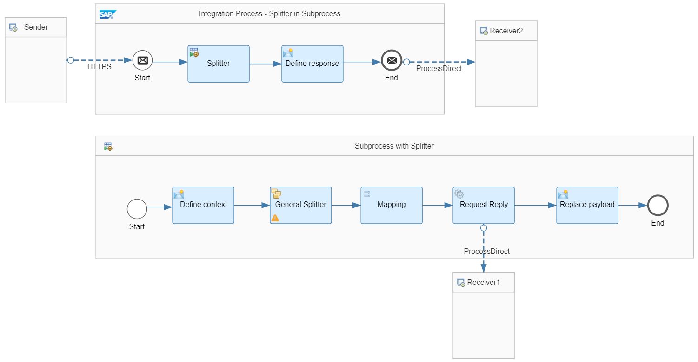

<!-- loiode974b877c3949edac3b075b0afe44e5 -->

# Reduce the Memory Consumption for Splitter Scenarios

This guideline shows how to implement a Splitter-step in a sub process to avoid the Gather-step in the main process. The aim is to lower the memory requirements of the integration flow processing during memory-intensive transformations of large message payloads and thus to prevent out of memory-issues.

The Splitter-step is often used during the processing of large messages to break a message into smaller chunks and to process each chunk individually. After that, all chunks are collected and combined again into one large message using a Gather-step for further processing.

This aggregation is a complex and expensive process in terms of memory consumption, as it uses certain sorting algorithms to put all chunks together. While processing large messages, it can lead to high memory consumption and to out of memory-errors.

However, in some cases, it's possible to use the splitter scenario without Gather, for example:

-   After the split process has been completed, you don't need the result of the split items any further. For example, after the split process, you only want to send out email notifications or status updates.

-   You want to continue message processing with the original payload \(as it was before the split process\). For example, changes in the splitter process aren’t relevant for any further steps in the integration flow.

<a name="loiode974b877c3949edac3b075b0afe44e5__section_fww_hpl_mpb"/>

## Implementation

Let’s assume you want to save individual message items in the data store and then send a status update with the number of items sent.

The reference integration flow *Manage Resources – Splitter without Gather* illustrates this scenario:

The first step in the model is a *Local Process* call. The called subprocess contains the general splitter and the complete splitter logic that is performed by the split elements. The message is split by 'Item':

<table>
<tr>
<td valign="top">

Expression Type

</td>
<td valign="top">

XPath

</td>
</tr>
<tr>
<td valign="top">

XPath Expression

</td>
<td valign="top">

/root/Items/Item

</td>
</tr>
</table>

In the step *Mapping*, each split element is mapped to the target format and later sent to the receiver.

All steps following the Splitter-step are executed per split element until the*End event* is reached. Each split item allocates memory while the memory usage increases with every additional split element. Occupied memory is only released when the entire integration flow is finished.

Since in our case, the split elements aren't important for further message processing, the memory footprint can be reduced by replacing the original item payload with a payload much smaller in size. Here, we simply overwrite the original payload with the term 'Small payload' at the end of the subprocess.

The content modifier step *Replace payload* is defined as follows:

**Message Body**

<table>
<tr>
<td valign="top">

Type

</td>
<td valign="top">

Constant

</td>
</tr>
<tr>
<td valign="top">

Body

</td>
<td valign="top">

'Small payload'

</td>
</tr>
</table>

By doing so, allocated memory is released before the complete splitter process is finished and you keep memory usage at a lower level. It's important in those cases in which the main process runs for a while after the splitter step or if the payload contains many split elements.

As the split processing is wrapped by the subprocess, it ends automatically when the subprocess ends. You don't need the Gather-step anymore.

When the split process finishes without a Gather-step, the main flow continues with the original payload. Therefore, in the last step of the main process, *Define response* in our example, the number of dispatched items can be determined. This practice could also have been done before the split process.

<table>
<tr>
<td valign="top">

Name

</td>
<td valign="top">

numberOfItems

</td>
</tr>
<tr>
<td valign="top">

Type

</td>
<td valign="top">

XPath

</td>
</tr>
<tr>
<td valign="top">

Data Type

</td>
<td valign="top">

java.lang.Integer

</td>
</tr>
<tr>
<td valign="top">

Value

</td>
<td valign="top">

count\(/root/Items/Item\)

</td>
</tr>
</table>

Via the same content modifier, a notification message with the number of dispatched items replaces the payload.

**Message Body**

<table>
<tr>
<td valign="top">

Type

</td>
<td valign="top">

Expression

</td>
</tr>
<tr>
<td valign="top">

Body

</td>
<td valign="top">

Notification message: The original payload was split by Item ID,`${property.numberOfItems}` messages were stored in the data store 'ManageResources-SplitterSubprocess'.

</td>
</tr>
</table>

**Related Information**  

[Splitter](splitter-4b475ea.md "If a message contains multiple elements but each element needs to be processed in a different way, you can use the Splitter pattern to break up the message into multiple individual messages according to the number of elements.")

