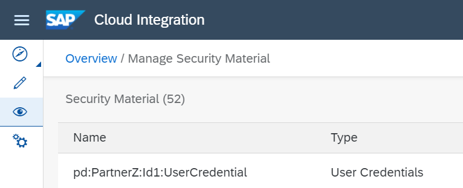

<!-- loio79c06dd1be3e4f5d941f94cb0fadd4e5 -->

# Requests for UserCredentialParameter

> ### Caution:  
> The charset encoding of the JSON documents in the requests must be UTF-8. The charset encoding of the JSON documents of the responses is also UTF-8.


<a name="loio79c06dd1be3e4f5d941f94cb0fadd4e5__section_o5q_3r1_z4b"/>

## Create or Update a User Credentials Parameter


<table>
<tr>
<th valign="top">

Method


</th>
<th valign="top">

Resource Path


</th>
</tr>
<tr>
<td valign="top">

POST

PUT


</td>
<td valign="top">

`/UserCredentialParameters` 


</td>
</tr>
</table>

Assume that you like to create a User Credentials parameter with Pid `PartnerZ` and Id `Id1`.

Perform a POST request to the following address:

`https://<host address>/api/v1/UserCredentialParameters`

The part `https://<host address>/api/v1` is also referred to as service root URI of the API call. For more information on the address of an API call, see [HTTP Calls and URI Components](http-calls-and-uri-components-ca75e12.md).

Provide the following request body \(example\):

```
{
  "Pid": "PartnerZ",
  "Id": "Id1",
  "User": "myUser",
  "Password": "Abcd1234"
}
```

As a response, you get a message that contains the following part:

```
<content type="application/xml">
    <m:properties>
            <d:Pid>PartnerZ</d:Pid>
            <d:Id>Id1</d:Id>
            <d:LastModifiedBy>P12345678</d:LastModifiedBy>
            <d:LastModifiedTime>2021-03-17T10:28:31.026</d:LastModifiedTime>
            <d:CreatedBy>P12345678</d:CreatedBy>
            <d:CreatedTime>2021-03-17T10:28:31.026</d:CreatedTime>
            <d:User>myUser</d:User>
            <d:Password m:null="true"/>
     </m:properties>
</content>
```

You can find a new User Credentials artifact in the *Monitor* section \(*Security Material* tile under *Manage Security*\). The newlly created artifact has the name *pd:PartnerZ:Id1:UserCredential*.



> ### Note:  
> The specification of a user query option `User` \(such as `?user=aribaUser`\) has no effect. It is always the logged in technical user \(in the above example `P12345678` that appears in the properties `LastModifiedBy` and `CreatedBy`.
> 
> You can also use the POST request to update a User Credentials parameter with the same values for `PID` and `Id`.
> 
> There is no difference between the properties `LastModifiedTime` and `CreatedTime`. They always contain the time of the last POST request or the tuple `PID` and `Id`.
> 
> There is no difference between the properties `LastModifiedB` and `CreatedBy`. Both fields contain the logged in user of the last POST request for the tuple `PID` and `Id`.

> ### Caution:  
> PUT requests are not supported.


<a name="loio79c06dd1be3e4f5d941f94cb0fadd4e5__section_cfc_bph_z4b"/>

## Get User Credentials Parameters


<table>
<tr>
<th valign="top">

Method


</th>
<th valign="top">

Resource Path


</th>
</tr>
<tr>
<td valign="top">

GET


</td>
<td valign="top">

`/UserCredentialParameters` 


</td>
</tr>
</table>

Assume that you like to get the User Credentials parameter with Pid `PartnerZ`.

Perform a GET request to the following address:

`https://<host address>/api/v1/UserCredentialParameters?user=AnyUser&$filter=Pid eq 'PartnerZ'`

If there are two User Credentials parameters with Pid `PartnerZ`, you get the following response:

```
<feed ...>
...
<entry>
        <id>https://d0262-tmn.hci.eu1.hana.ondemand.com:443/api/v1/UserCredentialParameters(Pid='PartnerZ',Id='Id1')</id>
        <title type="text">UserCredentialParameters</title>
        <updated>2021-03-17T10:42:46.843Z</updated>
        <category term="com.sap.hci.api.UserCredentialParameter" scheme="http://schemas.microsoft.com/ado/2007/08/dataservices/scheme"/>
        <link href="UserCredentialParameters(Pid='PartnerZ',Id='Id1')" rel="edit" title="UserCredentialParameter"/>
        <content type="application/xml">
            <m:properties>
                <d:Pid>PartnerZ</d:Pid>
                <d:Id>Id1</d:Id>
                <d:LastModifiedBy>P12345678</d:LastModifiedBy>
                <d:LastModifiedTime>2021-03-17T10:28:31.101</d:LastModifiedTime>
                <d:CreatedBy>P12345678</d:CreatedBy>
                <d:CreatedTime>2021-03-17T10:28:31.101</d:CreatedTime>
                <d:User>myUser</d:User>
                <d:Password m:null="true"/>
            </m:properties>
        </content>
</entry><entry>
        <id>https://d0262-tmn.hci.eu1.hana.ondemand.com:443/api/v1/UserCredentialParameters(Pid='PartnerZ',Id='Id2')</id>
        <title type="text">UserCredentialParameters</title>
        <updated>2021-03-17T10:42:46.843Z</updated>
        <category term="com.sap.hci.api.UserCredentialParameter" scheme="http://schemas.microsoft.com/ado/2007/08/dataservices/scheme"/>
        <link href="UserCredentialParameters(Pid='PartnerZ',Id='Id2')" rel="edit" title="UserCredentialParameter"/>
        <content type="application/xml">
            <m:properties>
                <d:Pid>PartnerZ</d:Pid>
                <d:Id>Id2</d:Id>
                <d:LastModifiedBy>P12345678</d:LastModifiedBy>
                <d:LastModifiedTime>2021-03-17T10:42:20.822</d:LastModifiedTime>
                <d:CreatedBy>P12345678</d:CreatedBy>
                <d:CreatedTime>2021-03-17T10:42:20.822</d:CreatedTime>
                <d:User>myUser</d:User>
                <d:Password m:null="true"/>
            </m:properties>
        </content>
</entry>
</feed>
```

> ### Note:  
> The returned value for the `Passwor` property is always null.
> 
> You need to specify a filter for property `Pid`. If you don't specify a filter for this property, you get an error.
> 
> If you specify a `User` in the query options \(such as `?user=AnyUser` in the example request\), this user appears in the audit log.

Assume that you like to get the User Credentials parameter with Pid `PartnerZ` and select only the properties `Id` and `CreatedBy`.

Perform a GET request to the following address:

`https://<host address>/api/v1/UserCredentialParameters?user=AnyUser&$filter=Pid eq 'PartnerZ'&$select=Id,CreatedBy`

If there are two User Credentials parameters with Pid `PartnerZ`, you get the following response:

```
<feed ...>
...
<entry>
        <id>https://d0262-tmn.hci.eu1.hana.ondemand.com:443/api/v1/UserCredentialParameters(Pid='PartnerZ',Id='Id1')</id>
        <title type="text">UserCredentialParameters</title>
        <updated>2021-03-17T10:50:15.729Z</updated>
        <category term="com.sap.hci.api.UserCredentialParameter" scheme="http://schemas.microsoft.com/ado/2007/08/dataservices/scheme"/>
        <link href="UserCredentialParameters(Pid='PartnerZ',Id='Id1')" rel="edit" title="UserCredentialParameter"/>
        <content type="application/xml">
            <m:properties>
                <d:Id>Id1</d:Id>
                <d:CreatedBy>P12345678</d:CreatedBy>
            </m:properties>
        </content>
</entry>
<entry>
        <id>https://d0262-tmn.hci.eu1.hana.ondemand.com:443/api/v1/UserCredentialParameters(Pid='PartnerZ',Id='Id2')</id>
        <title type="text">UserCredentialParameters</title>
        <updated>2021-03-17T10:50:15.731Z</updated>
        <category term="com.sap.hci.api.UserCredentialParameter" scheme="http://schemas.microsoft.com/ado/2007/08/dataservices/scheme"/>
        <link href="UserCredentialParameters(Pid='PartnerZ',Id='Id2')" rel="edit" title="UserCredentialParameter"/>
        <content type="application/xml">
            <m:properties>
                <d:Id>Id2</d:Id>
                <d:CreatedBy>P12345678</d:CreatedBy>
            </m:properties>
        </content>
    </entry>
</feed>
```

Assume that you like to get the User Credentials parameter with Pid `PartnerZ` and Id `Id1` and select only the properties `User` and `CreatedBy`.

Perform a GET request to the following address:

`https://<host address>/api/v1/UserCredentialParameters(Pid='PartnerZ',Id='Id1')?user=AnyUser&$select=User,CreatedBy`

You get the following response:

```
<entry ...>
...
    <content type="application/xml">
        <m:properties>
            <d:User>myUser</d:User>
            <d:CreatedBy>P12345678</d:CreatedBy>
        </m:properties>
    </content>
</entry>
```


<a name="loio79c06dd1be3e4f5d941f94cb0fadd4e5__section_oyt_3zg_ccb"/>

## Use Custom Query Option to Get Password in Hash Format

You can use the query option `returnHashedPassword=SHA256` to request that the password is returned in hash format. You get a value in the password property with the following format:

`SAHA256.<SHA256 hash value of the password in HEX>` 

If you do not use this option, you get a null value for the password.

For example, perform the following GET request:

`https://<host address>/api/v1/UserCredentialParameters(Pid='PartnerZ',Id='Id1')?user=AnyUser&returnHashedPassword=SHA256`

You get the following response:

```
<entry ...>
...
    <content type="application/xml">
        <m:properties>
            <d:Pid>PartnerZ</d:Pid>
            <d:Id>Id1</d:Id>
            <d:LastModifiedBy>P12345678</d:LastModifiedBy>
            <d:LastModifiedTime>2021-03-17T10:28:31.101</d:LastModifiedTime>
            <d:CreatedBy>P12345678</d:CreatedBy>
            <d:CreatedTime>2021-03-17T10:28:31.101</d:CreatedTime>
            <d:User>myUser</d:User>
            <d:Password>SHA256.3f21a8490cef2bfb60a9702e9d2ddb7a805c9bd1a263557dfd51a7d0e9dfa93e</d:Password>
        </m:properties>
    </content>
</entry>
```


<a name="loio79c06dd1be3e4f5d941f94cb0fadd4e5__section_jf1_1lc_p1b"/>

## Performing Batch Operations

There are restrictions for change sets in batch:

-   A change set can only contain exactly one request with the `UserCredentialParameter` entity type.

-   If a change set contains a `UserCredentialParameter` request, it cannot contain other requests with different entity types.


`POST https://<host address>/api/v1/$batch:`

```
--batch_06a89345-8056-41c4-91c2-55636fc844fe
Content-Type: multipart/mixed; boundary=changeset_d8938fea-cd05-464a-a7c8-4522e5e7b1e4
--changeset_d8938fea-cd05-464a-a7c8-4522e5e7b1e4
Content-Type: application/http
Content-Transfer-Encoding: binary
POST UserCredentialParameters?user=AribaUser HTTP/1.1
Content-Length: 83
Accept: application/json
Content-Type: application/json
{"Pid":"pid_batch","Id":"id_batch","User":"user_batch","Password":"password_batch"}
--changeset_d8938fea-cd05-464a-a7c8-4522e5e7b1e4--
--batch_06a89345-8056-41c4-91c2-55636fc844fe--
Batch response
--batch_6264c4f6-6117-4159-87e7-82d2e370850e
Content-Type: multipart/mixed; boundary=changeset_0033d380-2e75-4284-8fb1-d7333a40dc9a
--changeset_0033d380-2e75-4284-8fb1-d7333a40dc9a

Content-Type: application/http
Content-Transfer-Encoding: binary
 
Response:
--batch_6264c4f6-6117-4159-87e7-82d2e370850e
Content-Type: multipart/mixed; boundary=changeset_0033d380-2e75-4284-8fb1-d7333a40dc9a
--changeset_0033d380-2e75-4284-8fb1-d7333a40dc9a
Content-Type: application/http
Content-Transfer-Encoding: binary
HTTP/1.1 201 Created
DataServiceVersion: 2.0
Location: https://appl-tmn.avt.hana.ondemand.com:443/api/v1/UserCredentialParameters(Pid='pid_batch',Id='id_batch')
Content-Type: application/json
Content-Length: 527
{"d":{
    "__metadata":{
        "id":"https://appl-tmn.avt.hana.ondemand.com:443/api/v1/UserCredentialParameters(Pid='pid_batch',Id='id_batch')",
        "uri":"https://appl-tmn.avt.hana.ondemand.com:443/api/v1/UserCredentialParameters(Pid='pid_batch',Id='id_batch')",
        "type":"com.sap.hci.api.pd.model.UserCredentialParameter"},
        "Pid":"pid_batch",
        "Id":"id_batch",
        "LastModifiedBy":"P12345678",
        "LastModifiedTime":"\/Date(1453721123280)\/",
        "CreatedBy":"P12345678",
        "CreatedTime":"\/Date(1453721123280)\/",
        "User":"user_batch","Password":null}}
--changeset_0033d380-2e75-4284-8fb1-d7333a40dc9a--
--batch_6264c4f6-6117-4159-87e7-82d2e370850e--
```

